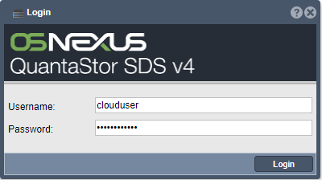

---

copyright:
  years:  2019
lastupdated: "2019-12-11"

keywords: device user interface, access device, log in to device

subcollection: mass-data-migration

---

{:shortdesc: .shortdesc}
{:screen: .screen}
{:pre: .pre}
{:table: .aria-labeledby="caption"}
{:external: target="_blank" .external}
{:codeblock: .codeblock}
{:tip: .tip}
{:note: .note}
{:important: .important}
{:preview: .preview}
{:term: .term}

# Logging in to the device
{: #access-ui}

After you configure the {{site.data.keyword.mdms_full}} device for Ethernet connectivity, you can access the device user interface.
{: shortdesc}

## Step 1. Retrieve your device credentials
{: #retrieve-device-credentials}

When you submit a {{site.data.keyword.mdms_short}} request, the service auto-generates credentials on your behalf that you can use to access the local web UI for the device. 

To retrieve your device credentials:

1. [Log in to the {{site.data.keyword.cloud_notm}} console](https://{DomainName}/){: external}.
2. Go to **Menu** &gt; **Resource List** to view a list of your resources.
3. From your {{site.data.keyword.cloud_notm}} resource list, select your provisioned instance of {{site.data.keyword.mdms_short}}.
4. In the _Device credentials_ section, copy the **Username** and **Password** values.

## Step 2. Log in to the device UI
{: #log-in-ui}

Use the device credentials that you retrieved in the previous step to log in to the local web UI and interact with the {{site.data.keyword.mdms_short}} device.

1. Open a web browser, and navigate to the static IP address that you provided in the order form.

   ```
   https://<device_management_IP_address>
   ```
   {: codeblock}

   Replace `<device_management_IP_address>` with the IP address that is configured for your Eth1 or Eth2 network ports. Accept the certificate exception.

2. Log in to the device UI by using the username and password that you retrieved in the previous step. 

   
   
   The Common Tasks wizard is displayed. Use the options from left to right to begin importing your data.

   

   You can reopen the Common Tasks wizard by using the **Workflow Manager** in the upper-left area of the interface.
   {:tip}

## Next steps
{: #access-ui-next-steps}

- To prepare for the data copy, start by [unlocking the storage pool on the device](/docs/mass-data-migration?topic=mass-data-migration-unlock-storage-pool).