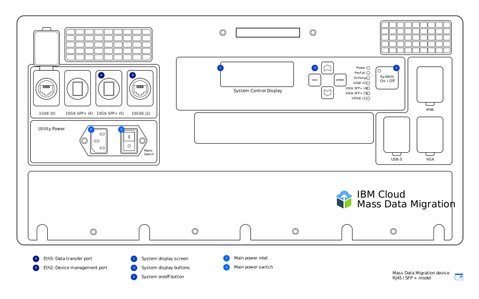

---

copyright:
  years:  2019
lastupdated: "2019-05-14"

keywords:

subcollection: mass-data-migration

---

{:shortdesc: .shortdesc}
{:screen: .screen}
{:pre: .pre}
{:table: .aria-labeledby="caption"}
{:external: target="_blank" .external}
{:codeblock: .codeblock}
{:tip: .tip}
{:note: .note}
{:important: .important}
{:download: .download}

# Connecting the device
{: #connect-device}

{{site.data.keyword.mdms_full}} devices arrive pre-configured and ready to connect to your network.
{: shortdesc}

Before you power on the {{site.data.keyword.mdms_short}} device:

- Ensure that the device is at room temperature.
- Ensure that there is no condensation on the device.
- Verify that you've received the cables that correspond to your [device model](/docs/infrastructure/mass-data-migration?topic=mass-data-migration-device-overview) by reviewing the inventory list that is located under the transport case lid.
- To avoid inadvertent damage to the device, keep the device in its portable case while the device is in use.

## Powering on the device
{: #power-on-device}

After you position the device, use the supplied power cord to power on the device.

1. Retrieve the power cord that is located under the transport case lid.
2. Attach the power cord to the inlet on the device, and then connect the plug to a power socket.
3. Set the **Mains Switch** to **On**.
4. Power on the device by using the **System On / Off** button.

   When a System ID value displays on the _System Control Display_ screen, the device is powered on and ready for the next step.

## Reviewing your network settings
{: #review-network-settings}

You can review the network configuration on the device before you connect it to your network. View and manage the IP settings for your network ports by using the _System Control Display_ screen on the device. 

To interact with the _System Control Display_ screen, move the cursor by using the **△**, **▽**, **esc**, and **enter** buttons. **Enter** takes you into a menu and **esc** takes you out.
{: tip}

To edit an IP address or subnet mask:

1. From the Network Config menu, use the **△** and **▽** buttons to select the port that you want to modify. Press **enter**.
2. Select **IP Address**, and then use the **△** and **▽** buttons to set the new IP address.

   Press **enter** to move forward one character at a time. Press **esc** to move backwards one character at a time.
3. Press **esc** to return to the previous menu.
4. Go to **Update...** and press **enter** to save the setting.

## Connecting the device to your network
{: #connect-device}

To connect the device to your network, you need to configure two Ethernet connections. The first connection is for managing the device through a browser, and the second connection is for moving data across the same subnet where the source data is located.

Configure Ethernet connectivity for your device depending on the [{{site.data.keyword.mdms_short}} device model](/docs/infrastructure/mass-data-migration?topic=mass-data-migration-device-overview#mass-data-migration-device-models) that you receive. 

### Setting up the RJ45 model
{: #set-up-RJ45-model}

The RJ45 device model natively supports Ethernet connectivity by using RJ45 connectors.

<a href="https://{DomainName}/docs/api/content/mass-data-migration/images/mdms-device-rj45.svg">
  
</a>

You can use the supplied CAT6A Ethernet cables to connect your storage system to the RJ45 network ports on the device. If you need to enable SFP+ copper support, use the supplied adapters. The adapters are compatible with all switch manufacturers. You can find the adapters in a pocket on the underside of the shipping container lid.

The following table shows how the physical ports on the device map to the ports that are displayed in the UI.

| Device port | Ethernet type  | UI display |  Description |
| --- | --- | --- | --- |
| Eth1 | 1GbE | `eno2` | The Eth1 port is used to manage the device and make the web-based UI available outside the data subnet. You can view the gateway information by using the _System Control Display_ screen after the device is powered on. |
| Eth3 | 10GbE | `eno4` | The Eth3 port is used to transfer data from your storage system onto the {{site.data.keyword.mdms_short}}. The connection must either be on the same subnet as the source data or directly connected to the server. |
{: caption="Table 2. Describes how {{site.data.keyword.mdms_short}} device ports map to the UI display" caption-side="top"}

To connect the RJ45 device model to your network:

1. Retrieve the CAT6A cable from the transport case lid.
2. Connect the CAT6A cable to the Eth3 (`10GbE-B`) port on the device.
3. Connect the CAT6A cable to the SFP+ adapter.
4. Connect the CAT6A cable to your 10Gb Ethernet switch.
5. Open a web browser, and navigate to the following URL.

   ```
   https://<your_Eth3_IP_address>
   ```
   {: codeblock}

   Replace `<your_Eth3_IP_address>` with the IP address that is configured for the Eth3 network port. To view the IP address, check the _System Control Display_ screen on the device.

6. Optional: If you can't reach the IP address, connect the CAT6A cable to the Eth1 (`1GbE-B`) port on the device and try again by navigating to the following URL.
   
   ```
   https://<your_Eth1_IP_address>
   ```
   {: codeblock}

   Replace `<your_Eth1_IP_address>` with the IP address that is configured for the Eth1 network port. To view the IP address, check the _System Control Display_ screen on the device.

   If you need to modify the IP settings for Eth3 or Eth1, see [Reviewing your network settings](#review-network-settings).
   {: tip}

### Setting up the RJ45 / SFP+ model
{: #set-up-SFP+-model}

The RJ45 / SFP+ device model natively supports both RJ45 and SFP+ copper connections. 

<a href="https://{DomainName}/docs/api/content/mass-data-migration/images/mdms-device-sfp.svg">
  
</a>

You can use the supplied CAT6A and SFP+ cables to connect your storage system to the network ports on the device. 
The following table shows how the physical ports on the device map to the ports that are displayed in the UI.

| Device port | Ethernet type  | UI display |  Description |
| --- | --- | --- | --- |
| Eth5 | 10GbE (SFP+) | `eno3` | Th Eth5 port is used to transfer data from your storage system onto the {{site.data.keyword.mdms_short}}. This port can also be used to manage the device. The port runs only at 10GbE speed. |
| Eth2 | 10GbE | `eno6` | The Eth2 port is used to manage the device and make the web-based UI available outside the data subnet. This port can also be used for data transfer. The connection must either be on the same subnet as the source data or directly connected to the server. The port can run at speeds of either 1GbE or 10GbE. |
{: caption="Table 3. Describes how {{site.data.keyword.mdms_short}} device ports map to the UI display" caption-side="top"}

To connect the RJ45 / SFP+ device model to your network:

1. Retrieve the SFP+ copper cable from the transport case lid.
2. Connect the SFP+ cable to the Eth5 (`10GbE (5)`) port on the device.
3. Connect the SFP+ cable to your 10Gb Ethernet switch.
4. Open a web browser, and navigate to the following URL.

   ```
   https://<your_Eth5_IP_address>
   ```
   {: codeblock}

   Replace `<your_Eth5_IP_address>` with the IP address that is configured for the Eth5 network port. To view the IP address, check the _System Control Display_ screen on the device.

5. Optional: If you can't reach the IP address, connect the SFP+ cable to the Eth2 (`10GbE-B` or `1GbE-B`) port on the device and try again by navigating to the following URL.
   
   ```
   https://<your_Eth2_IP_address>
   ```
   {: codeblock}

   Replace `<your_Eth2_IP_address>` with the IP address that is configured for the Eth2 network port. To view the IP address, check the _System Control Display_ screen on the device.

   If you need to alter any IP settings for Eth3 or Eth1, see the [Reviewing your network settings](/docs/infrastructure/mass-data-migration?topic=mass-data-migration-connect-device#review-network-settings).
   {: tip}

## Next steps
{: #set-up-device-next-steps}

- Interact with the device by [running the web-based UI](/docs/infrastructure/mass-data-migration?topic=mass-data-migration-access-ui).
- To begin the data ingestion process, start by [unlocking the storage pool on the device](/docs/infrastructure/mass-data-migration?topic=mass-data-migration-unlock-storage-pool).
