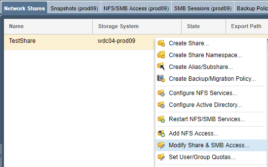

---

copyright:
  years:  2019
lastupdated: "2019-06-14"

keywords:

subcollection: mass-data-migration

---

{:shortdesc: .shortdesc}
{:screen: .screen}
{:pre: .pre}
{:table: .aria-labeledby="caption"}
{:external: target="_blank" .external}
{:codeblock: .codeblock}
{:tip: .tip}
{:note: .note}
{:important: .important}
{:download: .download}

# Connecting to the network share
{: #connect-network-share}

To prepare for data copy, connect to the network share on the {{site.data.keyword.mdms_full}} device by using the Network File System (NFS) or Server Message Block (SMB) protocols.

Use this page to learn how to manage access to the share, and then mount the share to your source server.

## Managing access to the share
{: #manage-share-access}

By default, the network share is set to have public access. Before you mount the share to your server, you can add NFS or SMB access rules on the share to match your environment or security needs. 

For detailed information about controlling access to NFS shares on the storage device, see the [OSNEXUS QuantaStor documentation](https://wiki.osnexus.com/index.php?title=Network_Shares){:external}.
{: tip}

### Managing NFS share access
{: #manage-nfs-share-access}

You can manage NFS share access for an IP address, a range of IP addresses, or specific networks by using the {{site.data.keyword.mdms_short}} device user interface.

To modify NFS share access:

1. In the Common Tasks wizard, click **View Network Shares** to display the network shares view.
2. Close the Common Tasks wizard, and then right-click the network share name to view a list of options. 
3. Click **Add NFS Access...** to modify access for the NFS share.

    
   
### Managing SMB share access
{: #manage-smb-share-access}

You can manage SMB share access by using the {{site.data.keyword.mdms_short}} device user interface.

To modify SMB share access:

1. In the Common Tasks wizard, click **View Network Shares** to display the network shares view.
2. Close the Common Tasks wizard, and then right-click the network share name to view a list of options. 
3. Click **Modify Share & SMB Access...** to modify access for your SMB share.

    

### Joining the device to Active Directory
{: #join-device-active-directory}

If you're using SMB on a Windows server, you can manage access permissions, file ownership, and file attributes for your data by joining the {{site.data.keyword.mdms_short}} device to Active Directory. Joining the device to an Active Directory domain enables SMB access for specific AD users and AD groups. 

For detailed information about joining the device to Active Directory, see the [OSNEXUS QuantaStor documentation](https://wiki.osnexus.com/index.php?title=Network_Shares#Joining_an_AD_Domain){:external}.

## Mounting the network share
{: #mount-network-share}

After you unlock and activate the storage pool on the device, you can mount the network share on your source server.

Before you mount the share, keep in mind the following environment configuration requirements:

- If you're mounting the NFS share to a Unix-based server, ensure that you have NFS software, such as `nfs-common`, installed on the client server.
- If you're mounting the SMB share to a Windows-based server that is joined to Active Directory, you must also [join the {{site.data.keyword.mdms_short}} device to the Active Directory domain](#join-device-active-directory) before you can connect to the share.
- Joining the {{site.data.keyword.mdms_short}} device to the Active Directory enables SMB signing by default. If your environment does not need SMB signing, you can [disable SMB signing on the client](#disable-smb-signing) to avoid connection issues and increase the performance of your data transfer.

### Mounting the NFS share by using a Unix system
{: #mount-nfs-share}

You can connect to the NFS share by using the {{site.data.keyword.mdms_short}} device user interface.

To mount the network share: 

1. In the Common Tasks wizard, click **View Network Shares** to display the network shares view.
2. Close the Common Tasks wizard, and then right-click the network share name to view a list of options. 
3. Click **View Mount Command** to review mount information for the share.
4. Ping the IP address that is listed in the dialog box to test network connectivity between your computer and the {{site.data.keyword.mdms_short}} device.

   Ensure that the IP address corresponds to the [10GbE data transfer port](/docs/infrastructure/mass-data-migration?topic=mass-data-migration-device-overview#network-settings) on the device. 
5. Mount the share on your source server by using the specified commands.

   

### Mounting the SMB share by using a Windows system
{: #mount-smb-share}

You can connect to the SMB share by using the **Map Network Drive** dialog on your Windows computer.

To mount the network share:

1. [Join the {{site.data.keyword.mdms_short}} device to Active Directory](#join-device-active-directory) if you're mounting the share to a Windows server that is joined to an AD domain.
2. Test the network connectivity between your computer and the {{site.data.keyword.mdms_short}} device by pinging the IP address that corresponds to the [10GbE data transfer port](/docs/infrastructure/mass-data-migration?topic=mass-data-migration-device-overview#network-settings) on the device.
3. From the File Explorer, right-click **Network** and then select **Map network drive...** to open the Map Network Drive dialog.

   
4. Enter the IP address that you tested in step 1, and click **Browse**.

   
5. From the list of network folders, select the {{site.data.keyword.mdms_short}} share. Click **OK** to confirm.
6. Click **Finish** to mount the share on your source server.

    If you're able to ping the IP address but you're unable to mount the share, it's likely that SMB signing is enabled for your Windows server. Consider [disabling SMB signing](#disable-smb-signing) on the client and try again.
    {: tip} 

### Disabling SMB signing
{: #disable-smb-signing}

SMB signing adds extra security during a network communication by eliminating the possibility for man-in-the-middle attacks. To learn more about SMB signing, see [Overview of Server Message Block signing](https://support.microsoft.com/en-us/help/887429/overview-of-server-message-block-signing){: external}. 

When you join a {{site.data.keyword.mdms_short}} device to Active Directory, the system enables SMB signing by default. However, SMB signing can impact network performance for your data transfer or cause issues when mounting the share to your server. If you do not use or require SMB signing for your environment, you can disable SMB signing on the client to avoid connection issues and increase the performance of your data transfer.

To disable SMB signing on a Windows server, set the following registry keys to zero:

```
HKEY_LOCAL_MACHINE\SYSTEM\CurrentControlSet\Services\LanmanServer\Parameters\"requiresecuritysignature"=dword:00000000
HKEY_LOCAL_MACHINE\SYSTEM\CurrentControlSet\Services\Lanmanworkstation\Parameters\"requiresecuritysignature"=dword:00000000 
```
{: screen}

## Next steps
{: #connect-share-next-steps}

