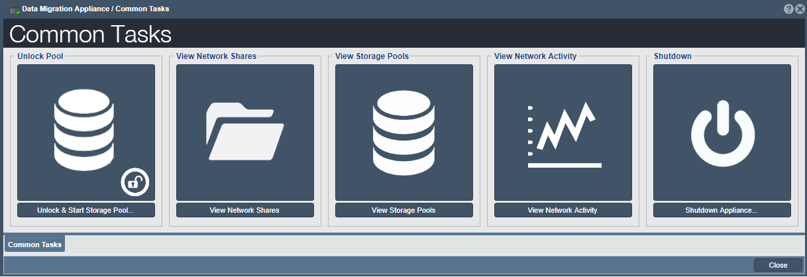
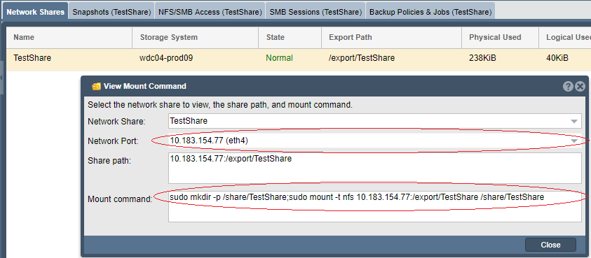

---

copyright:
  years:  2019
lastupdated: "2019-06-17"

keywords:

subcollection: mass-data-migration

---

{:shortdesc: .shortdesc}
{:screen: .screen}
{:pre: .pre}
{:table: .aria-labeledby="caption"}
{:external: target="_blank" .external}
{:codeblock: .codeblock}
{:tip: .tip}
{:note: .note}
{:important: .important}
{:download: .download}

# Connecting to the NFS share
{: #connect-nfs-share}

To prepare for data copy, you can access the network share on the {{site.data.keyword.mdms_full}} device by using the Network File System (NFS) file transfer protocol on your Unix system.

With NFS, you can share files to the {{site.data.keyword.mdms_short}} device over a network. Before you connect to the share:

- Ensure that you have NFS software, such as `nfs-common`, installed on your client. To install the `nfs-common` package, run by running the `sudo apt install nfs-common` in your terminal.

## Managing access to the NFS share
{: #manage-nfs-share-access}

By default, the network share is set to have public access. Before you mount the share to your server, you can add NFS access rules on the share to match your environment or security requirements. 

For detailed information about controlling access to shares on the storage device, see the [OSNEXUS QuantaStor documentation](https://wiki.osnexus.com/index.php?title=Network_Shares){:external}.
{: tip}

To modify NFS share access:

1. [Log in to the device user interface](/docs/infrastructure/mass-data-migration?topic=mass-data-migration-access-ui#log-in-ui).
2. In the Common Tasks wizard, click **View Network Shares** to display the network shares view.

   {: caption="Figure 1. Displays workflow icons for using the storage device." caption-side="bottom"}
3. Close the Common Tasks wizard, and then right-click the network share name to view a list of options. 
4. Click **Add NFS Access** to modify access for the NFS share.

    {: caption="Figure 2. Displays the list of options that are associated with the network share." caption-side="bottom"}

## Mounting the NFS share on a Unix system
{: #mount-nfs-share}

After you unlock and activate the storage pool on the device, you can connect to the NFS share on a Unix-based system by using the {{site.data.keyword.mdms_short}} device user interface.

To mount the network share: 

1. [Log in to the device user interface](/docs/infrastructure/mass-data-migration?topic=mass-data-migration-access-ui#log-in-ui).
2. In the Common Tasks wizard, click **View Network Shares** to display the network shares view.
3. Close the Common Tasks wizard, and then right-click the network share name to view a list of options. 
4. Click **View Mount Command** to review mount information for the share.

    The following image shows the View Mount Command dialog box with example values.

    {: caption="Figure 3. Displays the mount information that is required for accessing the network share." caption-side="bottom"}

    The _Network Port_ value corresponds to the data transfer port on the {{site.data.keyword.mdms_short}} device. The _Mount command_ value specifies the command that is used to mount and connect to the share.
5. Ping the IP address that is listed in the dialog box to test network connectivity between your computer and the {{site.data.keyword.mdms_short}} device.

   Ensure that the IP address corresponds to the [10GbE data transfer port](/docs/infrastructure/mass-data-migration?topic=mass-data-migration-device-overview#network-settings) on the device. 
6. Copy the mount command that is listed in the dialog box and paste the command into a terminal session on your computer.
7. Run the command to mount the share to your server.

## Next steps
{: #connect-nfs-share-next-steps}

