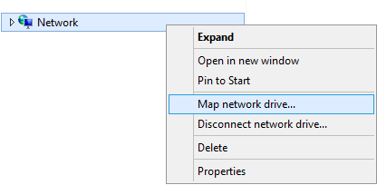

---

copyright:
  years:  2019
lastupdated: "2019-07-10"

keywords: mount SMB share, SMB, Active Directory, AD, access network share, connect to network share

subcollection: mass-data-migration

---

{:shortdesc: .shortdesc}
{:screen: .screen}
{:pre: .pre}
{:table: .aria-labeledby="caption"}
{:external: target="_blank" .external}
{:codeblock: .codeblock}
{:tip: .tip}
{:note: .note}
{:important: .important}
{:preview: .preview}
{:term: .term}

# Connecting to the network share by using SMB
{: #connect-smb-share}

To prepare for data copy, you can access the network share on the {{site.data.keyword.mdms_full}} device by using the Server Message Block (SMB) protocol.
{: shortdesc}

Before you connect to the share:

- Determine if you need to join the {{site.data.keyword.mdms_short}} device to Active Directory. If you're mounting the network share to a Windows server that is joined to Active Directory, you must also [join the device to the Active Directory domain](#use-active-directory) before you can connect to the share.
- Determine if your environment requires SMB signing. Joining the {{site.data.keyword.mdms_short}} device to Active Directory enables SMB signing by default. If your environment does not need SMB signing, you can [disable SMB signing on the client](/docs/infrastructure/mass-data-migration?topic=mass-data-migration-troubleshooting#unable-to-mount-smb-share) to avoid connection issues and increase the performance of your data transfer.

## Managing SMB share access
{: #manage-smb-share-access}

By default, the network share is set to have public access. Before you mount the share to your server, you can add SMB access rules on the share to match your environment or security requirements. 

For detailed information about controlling access to shares on the storage device, see the [OSNEXUS QuantaStor documentation](https://wiki.osnexus.com/index.php?title=Network_Shares){:external}.
{: tip}

To modify SMB share access:

1. [Log in to the device user interface](/docs/infrastructure/mass-data-migration?topic=mass-data-migration-access-ui#log-in-ui).
2. In the Common Tasks wizard, click **View Network Shares** to display the network shares view.

   
3. Close the Common Tasks wizard, and then right-click the network share name to view a list of options. 
4. Click **Modify Share & SMB Access** to modify access for the SMB share.

    

## Using Active Directory
{: #use-active-directory}

If you're using SMB on a Windows server, you can manage access permissions, file ownership, and file attributes for your data by joining the {{site.data.keyword.mdms_short}} device to Active Directory. Joining the device to an Active Directory domain enables SMB access for specific AD users and AD groups. 

To learn more about joining the device to Active Directory, see the [OSNEXUS QuantaStor documentation](https://wiki.osnexus.com/index.php?title=Network_Shares#Joining_an_AD_Domain){:external}.

## Mounting the SMB share on a Windows system
{: #mount-smb-share}

After you unlock and activate the storage pool on the device, connect to the SMB share by using the **Map Network Drive** dialog on your Windows computer.

To mount the network share:

1. [Log in to the device user interface](/docs/infrastructure/mass-data-migration?topic=mass-data-migration-access-ui#log-in-ui).
2. In the Common Tasks wizard, click **View Network Shares** to display the network shares view.
3. Close the Common Tasks wizard, and then right-click the network share name to view a list of options. 
4. Click **View Mount Command** to review mount information for the share.
5. Ping the IP address that is listed in the dialog box to test network connectivity between your computer and the {{site.data.keyword.mdms_short}} device.

   Ensure that the IP address corresponds to the [10GbE data transfer port](/docs/infrastructure/mass-data-migration?topic=mass-data-migration-device-overview#network-settings) on the device.
   {: note} 
6. From the File Explorer, right-click **Network** and then select **Map network drive** to open the Map Network Drive dialog.

   
7. Enter the IP address that you tested in step 1, and click **Browse**.

   
8. From the list of network folders, select the {{site.data.keyword.mdms_short}} share. Click **OK** to confirm.
9. Click **Finish** to mount the share on your source server.

    If you're able to ping the IP address but you're unable to mount the share, it's likely that SMB signing is enabled for your Windows client. Consider [disabling SMB signing](/docs/infrastructure/mass-data-migration?topic=mass-data-migration-troubleshooting#unable-to-mount-smb-share) on the client and try again.
    {: tip} 

## Next steps
{: #connect-smb-share-next-steps}

- Start the [data copy process](/docs/infrastructure/mass-data-migration?topic=mass-data-migration-copy-data).