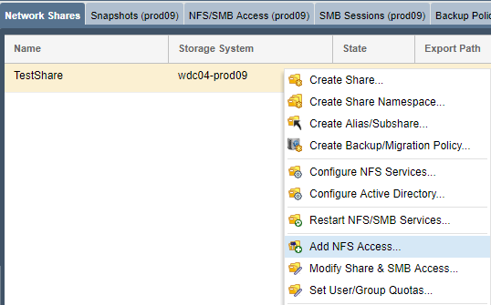
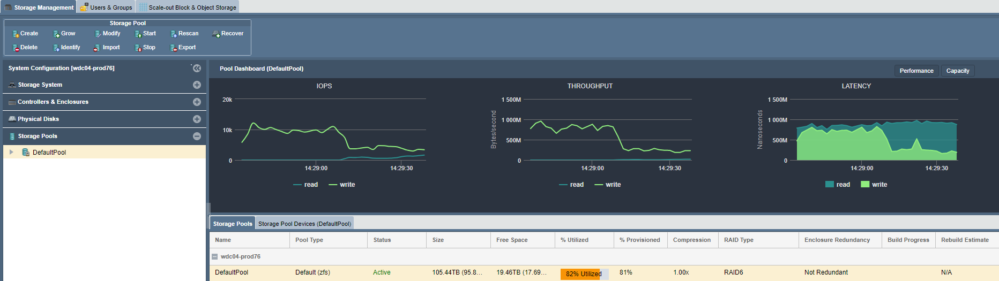

---

copyright:
  years:  2019
lastupdated: "2019-06-14"

keywords:

subcollection: mass-data-migration

---

{:shortdesc: .shortdesc}
{:screen: .screen}
{:pre: .pre}
{:table: .aria-labeledby="caption"}
{:external: target="_blank" .external}
{:codeblock: .codeblock}
{:tip: .tip}
{:note: .note}
{:important: .important}
{:download: .download}

# Copying data by using NFS
{: #copy-data-nfs}

You can copy data from a Unix-based system onto a {{site.data.keyword.mdms_full}} device by using the Network File System (NFS) protocol.

## Managing NFS share access
{: #manage-nfs-access}

By default, the network share is set to have public access. Before you mount the share to your server, you can add NFS access rules on the share to match your environment or security needs. 

You can manage NFS share access for an IP address, a range of IP addresses, or specific networks by using the {{site.data.keyword.mdms_short}} device user interface.

To modify NFS share access:

1. In the Common Tasks wizard, click **View Network Shares** to display the network shares view.
2. Close the Common Tasks wizard, and then right-click the network share name to view a list of options. 
3. Click **Add NFS Access...** to modify access for the NFS share.

    
   
     For detailed information about controlling access to NFS shares on the storage device, see the [OSNEXUS QuantaStor documentation](https://wiki.osnexus.com/index.php?title=Network_Shares){:external}.
     {: tip}

## Mounting the NFS share on a Unix system
{: #mount-nfs-share}

After you unlock and activate the storage pool, you can mount the NFS share on your source server.

If you're using a Unix-based system, ensure that you have NFS software, such as `nfs-common`, installed on the client server.
{: note}

To mount the network share: 

1. In the Common Tasks wizard, click **View Network Shares** to display the network shares view.
2. Close the Common Tasks wizard, and then right-click the network share name to view a list of options. 
3. Click **View Mount Command** to review mount information for the share.
4. Ping the IP address that is listed in the dialog box to test network connectivity between your computer and the {{site.data.keyword.mdms_short}} device.

   Ensure that the IP address corresponds to the [10GbE data transfer port](/docs/infrastructure/mass-data-migration?topic=mass-data-migration-device-overview#network-settings) on the device. 
5. Mount the share on your source server by using the specified commands.

   

## Copying data onto the NFS share
{: #copy-data-nfs}

Now that you're connected to the NFS share, you can start and monitor the data copy to the device.

1. Copy data onto the network share by using a file copy tool that is compatible with your host computer.
2. In the Common Tasks wizard, click **View Network Activity** to show inbound Ethernet load as data is transferred to the device on the 10Gb link.
   
    
3. Click **View Storage pool** to monitor storage usage and IOPS on the device.
   
    

## Next steps
{: #import-data-next-steps}

- Gracefully [power down the device](/docs/infrastructure/mass-data-migration?topic=mass-data-migration-disconnect-device).
- Print a shipping label and [return the device to {{site.data.keyword.cloud_notm}}](/docs/infrastructure/mass-data-migration?topic=mass-data-migration-ship-device).