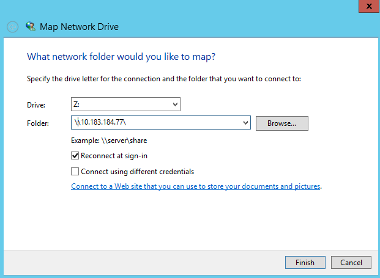
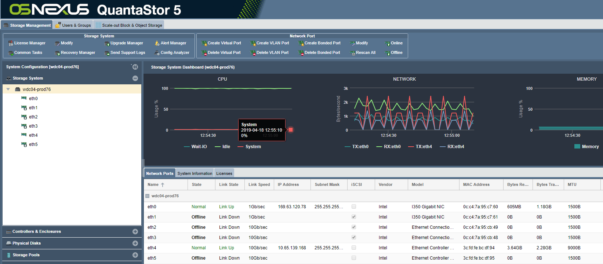

---

copyright:
  years:  2019
lastupdated: "2019-06-14"

keywords:

subcollection: mass-data-migration

---

{:shortdesc: .shortdesc}
{:screen: .screen}
{:pre: .pre}
{:table: .aria-labeledby="caption"}
{:external: target="_blank" .external}
{:codeblock: .codeblock}
{:tip: .tip}
{:note: .note}
{:important: .important}
{:download: .download}

# Copying data by using SMB
{: #copy-data-smb}

You can copy data from your Windows-based system onto a {{site.data.keyword.mdms_full}} device by using the Server Message Block (SMB) protocol.

## Managing SMB share access
{: #manage-smb-access}

By default, the network share is set to have public access. Before you mount the share to your server, you can add SMB access rules on the share to match your environment or security needs. 

You can manage SMB share access for an IP address, a range of IP addresses, or specific networks by using the {{site.data.keyword.mdms_short}} device user interface.

To modify SMB share access:

1. In the Common Tasks wizard, click **View Network Shares** to display the network shares view.
2. Close the Common Tasks wizard, and then right-click the network share name to view a list of options. 
3. Click **Modify Share & SMB Access...** to modify access for your SMB share.

    
   
    For detailed information about controlling access to SMB shares on the storage device, see the [OSNEXUS QuantaStor documentation](https://wiki.osnexus.com/index.php?title=Network_Shares){:external}.
    {:tip}

### Joining the device to Active Directory
{: #join-device-active-directory}

If you're using SMB on a Windows server, you can manage access permissions, file ownership, and file attributes for your data by joining the {{site.data.keyword.mdms_short}} device to Active Directory. Joining the device to an Active Directory domain enables SMB access for specific AD users and AD groups. 


For detailed information about joining the device to Active Directory, see the [OSNEXUS QuantaStor documentation](https://wiki.osnexus.com/index.php?title=Network_Shares#Joining_an_AD_Domain){:external}.

When you join the device to Active Directory, the system enables [SMB packet signing](#disable-smb-signing) by default. 
{: note}

## Mounting the SMB share on a Windows system
{: #mount-smb-share}

After you unlock and activate the storage pool, you can mount the SMB share on your source server.

Before you mount the SMB share to your Windows server:

- **Understand if your Windows server is joined to Active Directory.** If you're mounting the share to a Windows server that is joined to Active Directory, you must [join the {{site.data.keyword.mdms_short}} device to the Active Directory domain](#join-device-active-directory) before you can proceed with the following steps.
- **Understand if your environment requires SMB packet signing.** SMB packet signing adds extra security features to your network communications that can cause connection issues when mounting the device to your server. If your environment does not need SMB packet signing, you can [disable signing on the client](#disable-smb-signing) to avoid connection issues and increase the performance of your data transfer.

### Mounting the share using a Windows client
{: #mount-smb-share-windows-client}

If you need to mount the network share onto a Windows client that isn't joined to Active Directory, use the following steps.

1. [Join the {{site.data.keyword.mdms_short}} device to Active Directory](#join-device-active-directory) if you're mounting the share to a Windows server that is joined to an AD domain.
2. Test the network connectivity between your computer and the {{site.data.keyword.mdms_short}} device by pinging the IP address that corresponds to the 10GbE data transfer port on the device.
3. From the File Explorer, right-click **Network** and then select **Map network drive...** to open the Map Network Drive dialog.

   
4. Enter the IP address that you tested in step 1, and click **Browse**.

   
5. From the list of network folders, select the {{site.data.keyword.mdms_short}} share. Click **OK** to confirm.
6. Click **Finish** to mount the share on your source server.

    If you're able to ping the IP address but you're unable to mount the share, it's likely that SMB packet signing is enabled for your Windows server. Consider [disabling SMB signing](#disable-smb-signing) on the client and try again.
    {: tip} 

### Disabling SMB packet signing
{: #disable-smb-signing}

SMB packet signing adds extra security during a network communication by eliminating the possibility for man-in-the-middle attacks. 

When you join a {{site.data.keyword.mdms_short}} device to Active Directory, the system enables SMB signing by default. However, SMB signing can impact network performance for your data transfer or cause issues when mounting the share to your server. If you do not use or require SMB signing for your environment, you can disable SMB signing on the client to avoid connection issues and increase the performance of your data transfer.

To disable SMB signing on a Windows server, set the following registry keys to zero:

```[HKEY_LOCAL_MACHINE\SYSTEM\CurrentControlSet\Services\LanmanServer\Parameters\"requiresecuritysignature"=dword:00000000][HKEY_LOCAL_MACHINE\SYSTEM\CurrentControlSet\Services\Lanmanworkstation\Parameters\"requiresecuritysignature"=dword:00000000] 
```
{: screen}

## Copying data onto the SMB share
{: #copy-data-smb}

Now that you're connected to the SMB share, you can start and monitor the data copy to the device.

1. Copy data onto the network share by using a file copy tool that is compatible with your host computer.
2. In the Common Tasks wizard, click **View Network Activity** to show inbound Ethernet load as data is transferred to the device on the 10Gb link.
   
    
3. Click **View Storage pool** to monitor storage usage and IOPS on the device.
   
    

## Next steps
{: #import-data-next-steps}

- Gracefully [power down the device](/docs/infrastructure/mass-data-migration?topic=mass-data-migration-disconnect-device).
- Print a shipping label and [return the device to {{site.data.keyword.cloud_notm}}](/docs/infrastructure/mass-data-migration?topic=mass-data-migration-ship-device).