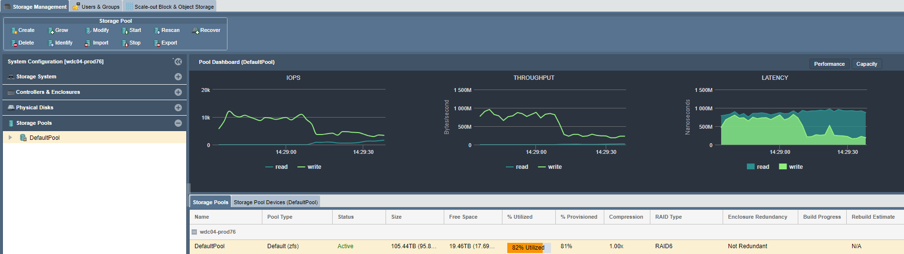

---

copyright:
  years:  2019
lastupdated: "2019-07-10"

keywords: copy data to device, move data to device, 

subcollection: mass-data-migration

---

{:shortdesc: .shortdesc}
{:screen: .screen}
{:pre: .pre}
{:table: .aria-labeledby="caption"}
{:external: target="_blank" .external}
{:codeblock: .codeblock}
{:tip: .tip}
{:note: .note}
{:important: .important}
{:download: .download}

# Copying data to the device
{: #copy-data}

You can copy data to an {{site.data.keyword.mdms_full}} device by using the device user interface.

## Copying data to the device
{: #copy-data-to-device}

After you connect your server to the network share, you can start and monitor the data copy to the device.

1. Copy data onto the network share by using a file copy tool that is compatible with your host computer.
2. In the Common Tasks wizard, click **View Network Activity** to show inbound Ethernet load as data is transferred to the device on the 10Gb link.
   
    
3. Click **View Storage pool** to monitor storage usage and IOPS on the device.
   
    

## Next steps
{: #import-data-next-steps}

- Gracefully [power down the device](/docs/infrastructure/mass-data-migration?topic=mass-data-migration-disconnect-device).
- Prepare the shipping label and [return the device to {{site.data.keyword.cloud_notm}}](/docs/infrastructure/mass-data-migration?topic=mass-data-migration-ship-device).