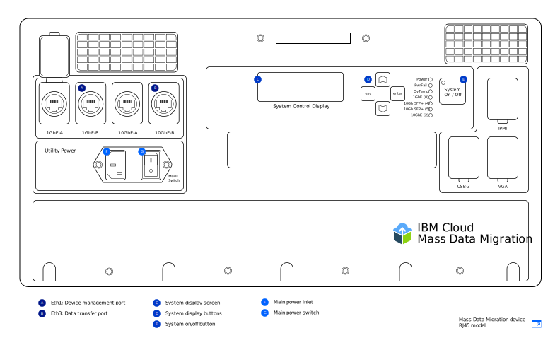

---

copyright:
  years:  2019
lastupdated: "2019-07-10"

keywords: device models, device ports, network settings, configure network  

subcollection: mass-data-migration

---

{:new_window: target="_blank"}
{:shortdesc: .shortdesc}
{:screen: .screen}
{:pre: .pre}
{:external: target="_blank" .external}
{:table: .aria-labeledby="caption"}
{:codeblock: .codeblock}
{:tip: .tip}
{:note: .note}
{:important: .important}
{:download: .download}

# Device overview
{: #device-overview}

{{site.data.keyword.mdms_full}} provides a portable, pre-configured storage device that is shipped to your location for easy migration of your data.
{: shortdesc}

Use this page to learn about network configuration options for your {{site.data.keyword.mdms_short}} device.

## Device models
{: #device-models}

Your {{site.data.keyword.mdms_short}} device arrives pre-configured and ready to connect to your network. 

The following image shows the main areas of the device.

{{site.data.keyword.cloud_notm}} provides two {{site.data.keyword.mdms_short}} device models. Each model comes packaged with [optics and adapters](/docs/infrastructure/mass-data-migration?topic=mass-data-migration-inventory-checklists) that support both RJ45 and SFP+ copper connections. 

<table>
  <tr>
    <th>Device model</th>
    <th>Description</th>
  </tr>
  <tr>
    <td>
<a href="/docs/infrastructure/mass-data-migration?topic=mass-data-migration-connect-device#set-up-RJ45-model">RJ45</a>
</td>
    <td>
      <ul>
        <li>Natively supports Ethernet connectivity by using RJ45 connectors.</li>
        <li>Includes adapters and optics that enable SFP+ copper support.</li>
      </ul>
    </td>
  </tr>
  <tr>
    <td><a href="/docs/infrastructure/mass-data-migration?topic=mass-data-migration-connect-device#set-up-SFP+-model">RJ45 / SFP+</a></td>
    <td>
      <ul>
        <li>Natively supports both RJ45 and SFP+ copper connections.</li>
      </ul>
    </td>
  </tr>
  <caption style="caption-side:bottom;">Table 1. Describes the supported {{site.data.keyword.mdms_short}} device models</caption>
</table>

Both device models offer the same functionality, but the cabling instructions are different for each model. When you receive your {{site.data.keyword.mdms_short}} device, be sure to identify the device model so that you follow the instructions that correspond to your device type.  

{{site.data.keyword.mdms_short}} devices use a [C13 power cord](https://en.wikipedia.org/wiki/IEC_60320){: external}. If you're using the device outside of the United States, you might need an additional power adapter that accommodates the plug and socket system that is used in your country. {{site.data.keyword.mdms_short}} devices are compatible with all standard power ranges.
{: note}

## Device ports 
{: #network-settings}

{{site.data.keyword.mdms_short}} devices are configured for two Ethernet connections. The first connection handles device management by running a web-based user interface, and the second connection handles data movement between the device and your source server.

<dl>
    <dt>Device management port</dt>
        <dd>You can manage the {{site.data.keyword.mdms_short}} device by using a local, web-based device interface that you serve on your remote computer. The device management port on the {{site.data.keyword.mdms_short}} device provides administrative access to the UI. To run the user interface, you connect your computer to the device management port on the device, and then reference the corresponding IP address in your browser.</dd>
    <dt>Data transfer port</dt>
        <dd>The data transfer port handles data movement from your storage system onto the {{site.data.keyword.mdms_short}} device. The port runs at 10GbE speed.</dd>
<dl>

    Configuring a gateway on both the device management port and the data transfer port is not supported. If you need to configure routing on the data transfer port by adding a gateway (not recommended), you must also be able to reach the IP address for the data transfer port from your browser to run the device user interface.
    {: note}

## Network settings
{: #network-settings}

{{site.data.keyword.mdms_short}} devices are configured for your network according to settings that you specify when you request the device. When you request a device, you can specify your network configuration according to the following scenarios:

<dl>
    <dt>Common configuration</dt>
        <dd>In most cases, {{site.data.keyword.mdms_short}} devices are configured by designating the 1GbE port on the device for device management and using the 10GbE port for data transfer. For the device management port, you specify the static IP address, the netmask, and the default gateway for your remote computer. For the data transfer port, you provide the static IP address and netmask for the server with a gateway and a 10GbE data port on the same subnet as the data source. This is represented on the order form.</dd>
    <dt>Optional configuration</dt>
        <dd>You can also use only the 10GbE port on the device for both data movement and device management connections. When you request a {{site.data.keyword.mdms_short}} device, you can specify this configuration in the order form by providing the same static IP address, netmask, and gateway address for both the management and data ports. The device arrives with the 10GbE port that is configured with your IP information, including a gateway.</dd>
<dl>
