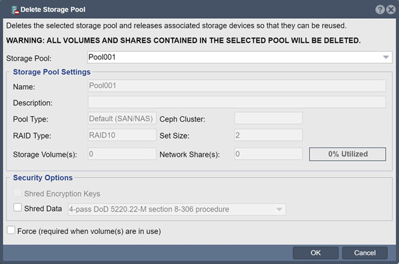

---

copyright:
  years: 2017, 2021
lastupdated: "2021-03-29"

keywords: erase data

subcollection: mass-data-migration

---

{:shortdesc: .shortdesc}
{:screen: .screen}
{:pre: .pre}
{:table: .aria-labeledby="caption"}
{:external: target="_blank" .external}
{:codeblock: .codeblock}
{:tip: .tip}
{:note: .note}
{:important: .important}
{:preview: .preview}
{:term: .term}

# Erase data from device 
{: #erase-data}

Do the following to erase your data from the device.

1. [Log in to the device UI](/docs/mass-data-migration?topic=mass-data-migration-access-interface#access-ui) 

2. In the **Storage Management** tab, navigate to **Storage Pools --> Storage Pool --> Delete**.

   

The **Shred Data** option is not recommended because {{site.data.keyword.mdms_short}} performs a cryptographic erase. Further, using the **Shred Data** option may increase the duration of the erase process by several days.
{: note}

When you delete a storage pool, all of the storage volumes and network shares which reside in the storage pool **will be deleted**. 
{: important} 

3. After selecting your options, click **OK**.

As a precaution, upon receiving the device back from you, IBM will erase all traces of your data using NIST 800-88 data wipe standards. This consists of a multiple-pass operation where every byte on the disk is zeroed to ensure your data is completely erased from the device and cannot be reconstructed. 
