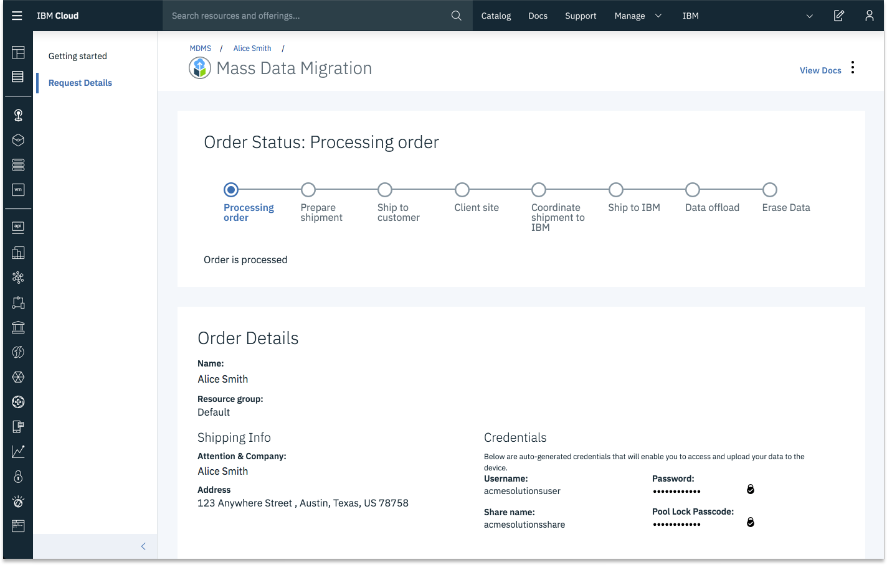

---

copyright:
  years:  2019
lastupdated: "2019-05-16"

keywords:

subcollection: mass-data-migration

---

{:new_window: target="_blank"}
{:shortdesc: .shortdesc}
{:screen: .screen}
{:pre: .pre}
{:table: .aria-labeledby="caption"}
{:codeblock: .codeblock}
{:tip: .tip}
{:note: .note}
{:important: .important}
{:download: .download}

# Managing your request
{: #manage-request}

Manage and track the status of your {{site.data.keyword.mdms_full}} order by using the {{site.data.keyword.cloud_notm}} console.
{: shortdesc}

## Tracking your order
{: #track-order}

After you request a device, you can track the progress of your order by using the {{site.data.keyword.mdms_short}} dashboard. 

{: caption="Figure 1. Mass Data Migration dashboard in the IBM Cloud console" caption-side="top"}

To access tracking information about your order, select **{{site.data.keyword.mdms_short}}** from your {{site.data.keyword.cloud_notm}} resource list, and then click the _Request details_ tab from the application details page.

The following table shows how the order status changes as {{site.data.keyword.cloud_notm}} processes the request.

| Status | Description |
| --- | --- |
| Processing order | {{site.data.keyword.mdms_short}} is processing your order.  |
| Prepare shipment | After your order is approved, the request status changes to _Prepare shipment_. {{site.data.keyword.mdms_short}} prepares and configures the next available device.  |
| Ship to customer | Your pre-configured {{site.data.keyword.mdms_short}} is shipped to your location. |
| Client site | After the device is delivered, the request status changes to _Client site_. |
| Coordinate shipment to IBM | `TBU` |
| Ship to IBM | The device is in transit to IBM. |
| Data offload | When the device is returned to IBM, the request status changes to _Data offload_. Your data is offloaded into the Cloud Object Storage destination that you specified in the intitial request. |
| Erase data | When the offload process is complete, your data is available in Cloud Object Storage. {{site.data.keyword.mdms_short}} permanently erases data from the device by using NIST data wipe standards. |

<!--After you submit the request, you receive an e-mail to confirm your order. Orders that are submitted during normal business hours are approved `the following business day`, and then shipped overnight to the specified location.-->

<!--When {{site.data.keyword.cloud_notm}} receives your {{site.data.keyword.mdms_short}} device, the order status in the {{site.data.keyword.mdms_short}} dashboard is updated to **Data offload**. The device is connected to the network in the {{site.data.keyword.cloud_notm}} data center, and the data copy starts automatically. 

Depending on the data size, the copy process can take from a few hours to days to complete. You can monitor the migration progress by navigating to the _Request details_ tab in the {{site.data.keyword.mdms_short}} dashboard. 

After the data copy is completed, the order status changes to **Erase data**.-->
