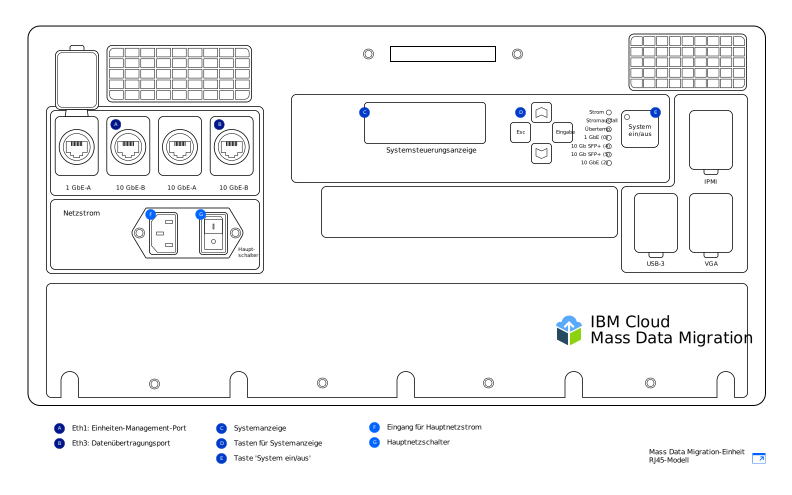
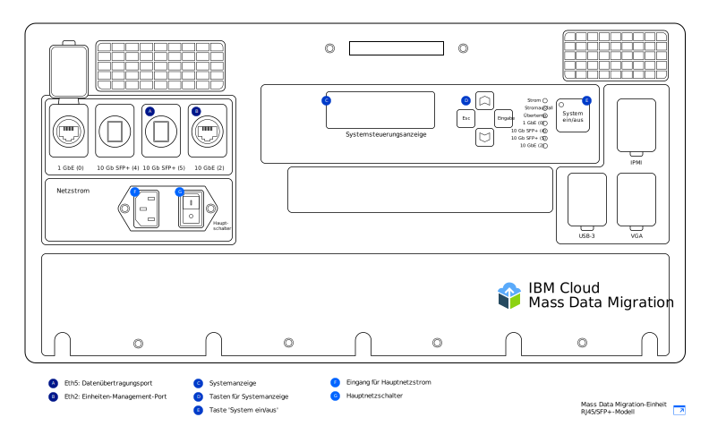

---

copyright:
  years:  2019
lastupdated: "2019-07-10"

keywords: set up device, connect device, cable device

subcollection: mass-data-migration

---

{:shortdesc: .shortdesc}
{:screen: .screen}
{:pre: .pre}
{:table: .aria-labeledby="caption"}
{:external: target="_blank" .external}
{:codeblock: .codeblock}
{:tip: .tip}
{:note: .note}
{:important: .important}
{:download: .download}

# Einheit anschließen
{: #connect-device}

{{site.data.keyword.mdms_full}}-Einheiten sind bei ihrer Ankunft bereits vorkonfiguriert und für die Verbindung mit Ihrem Netz bereit.
{: shortdesc}

Bevor Sie die {{site.data.keyword.mdms_short}}-Einheit einschalten: 

- Stellen Sie sicher, dass die Einheit Raumtemperatur hat. 
- Stellen Sie sicher, dass keine Kondensation auf der Einheit vorhanden ist. 
- Prüfen Sie, ob Sie die richtigen Kabel für Ihr [Einheitenmodell](/docs/infrastructure/mass-data-migration?topic=mass-data-migration-device-overview) erhalten haben. Überprüfen Sie dazu die Bestandsliste, die sich unter der Abdeckung des Transportbehälters befindet. 
- Um unbeabsichtigte Beschädigungen der Einheit zu vermeiden, entnehmen Sie die Einheit nicht aus ihrem tragbaren Behälter, während sie im Gebrauch ist. 

## Einheit einschalten
{: #power-on-device}

Wenn die Einheit sich am vorgesehenen Standort befindet, schließen Sie sie mit dem bereitgestellten Netzkabel an die Stromversorgung an und schalten sie ein. 

1. Entnehmen Sie das Netzkabel aus der Tasche unter der Abdeckung des Transportbehälters. 
2. Stecken Sie das Netzkabel in den Eingang der Einheit und anschließend den anderen Stecker in eine Netzsteckdose ein. 
3. Bringen Sie den **Hauptschalter** in die Position **Ein**. 
4. Schalten Sie die Einheit über die Taste **System ein/aus** ein. 

   Wenn ein System-ID-Wert auf der _Systemsteuerungsanzeige_ angezeigt wird, ist die Einheit eingeschaltet und für den nächsten Schritt bereit. 

## Netzeinstellungen überprüfen
{: #review-network-settings}

Sie können die Netzkonfiguration der Einheit überprüfen, bevor Sie sie mit Ihrem Netz verbinden. Verwenden Sie die _Systemsteuerungsanzeige_ an der Einheit, um die IP-Einstellungen für Ihre Netzports anzuzeigen und zu verwalten.  

Für die Interaktion mit der _Systemsteuerungsanzeige_ bewegen Sie den Cursor mit den Tasten **△**, **▽**, **Esc** und **Eingabe**. Mit **Eingabe** rufen Sie ein Menü auf und mit **Esc** verlassen Sie es.
{: tip}

Gehen Sie wie folgt vor, um eine IP-Adresse oder Teilnetzmaske zu bearbeiten: 

1. Im Netzkonfigurationsmenü wählen Sie mithilfe der Tasten **△** und **▽** den Port aus, der geändert werden soll. Drücken Sie **Eingabe**. 
2. Wählen Sie **IP-Adresse** aus und verwenden Sie anschließend die Tasten **△** und **▽**, um die neue IP-Adresse festzulegen. 

   Drücken Sie **Eingabe**, um den Cursor auf das nächste Zeichen zu bewegen. Drücken Sie **Esc**, um den Cursor auf das vorherige Zeichen zu bewegen. 
3. Drücken Sie **Esc**, um zum vorherigen Menü zurückzukehren. 
4. Wechseln Sie zu **Aktualisieren...** und drücken Sie **Eingabe**, um die Einstellung zu speichern. 

## Einheit mit Ihrem Netz verbinden
{: #connect-device}

Um die Einheit mit Ihrem Netz zu verbinden, müssen Sie zwei Ethernet-Verbindungen konfigurieren. Die erste Verbindung ist für das Einheitenmanagement über einen Browser, die zweite Verbindung für die Datenübertragung über das Teilnetz, in dem sich die Quellendaten befinden. 

Konfigurieren Sie die Ethernet-Konnektivität für Ihre Einheit. Führen Sie dabei die Anweisungen für das jeweilige [{{site.data.keyword.mdms_short}}-Einheitenmodell](/docs/infrastructure/mass-data-migration?topic=mass-data-migration-device-overview#mass-data-migration-device-models) aus, das Sie erhalten haben.  

### RJ45-Modell einrichten
{: #set-up-RJ45-model}

Das RJ45-Einheitenmodell unterstützt nativ Ethernet-Konnektivität über RJ45-Anschlüsse. 

<a href="https://{DomainName}/docs/api/content/mass-data-migration/images/mdms-device-rj45.svg">
  
</a>

Sie können die mitgelieferten CAT6A-Ethernet-Kabel verwenden, um Ihr Speichersystem mit den RJ45-Netzports an der Einheit zu verbinden. Wenn Sie die SFP+-Kupferunterstützung aktivieren müssen, verwenden Sie die bereitgestellten Adapter. Die Adapter sind mit Switches aller Hersteller kompatibel. Sie finden die Adapter in einer Tasche an der Unterseite der Abdeckung des Versandbehälters. 

Die folgende Tabelle zeigt die Zuordnung der physischen Ports an der Einheit zu den in der Benutzerschnittstelle angezeigten Ports. 

| Einheitenport | Ethernet-Typ  |  Beschreibung |
| --- | --- | --- | --- |
| Eth1 | 1 GbE | Der Port 'Eth1' wird verwendet, um die Einheit zu verwalten und die webbasierte Benutzerschnittstelle außerhalb des Datenteilnetzes verfügbar zu machen. Sie können die Gateway-Informationen nach dem Einschalten der Einheit über die _Systemsteuerungsanzeige_ anzeigen. |
| Eth3 | 10 GbE | Der Port 'Eth3' wird zur Übertragung von Daten von Ihrem Speichersystem auf die {{site.data.keyword.mdms_short}}-Einheit verwendet. Die Verbindung muss sich entweder in demselben Teilnetz wie die Quellendaten befinden oder direkt an den Server angeschlossen sein. |
{: caption="Tabelle 2. Beschreibung der Zuordnung der {{site.data.keyword.mdms_short}}-Einheitenports zur Anzeige in der Benutzerschnittstelle" caption-side="top"}

Gehen Sie wie folgt vor, um das RJ45-Einheitenmodell mit Ihrem Netz zu verbinden: 

1. Entnehmen Sie das CAT6A-Kabel aus der Tasche unterhalb der Abdeckung des Transportbehälters. 
2. Schließen Sie das CAT6A-Kabel an den Port 'Eth3' (`10GbE-B`) der Einheit an. 
3. Schließen Sie das CAT6A-Kabel an den SFP+-Adapter an. 
4. Schließen Sie das CAT6A-Kabel an Ihren 10-Gb-Ethernet-Switch an. 
5. Öffnen Sie einen Web-Browser und navigieren Sie zu der folgenden URL. 

   ```
   https://<your_Eth3_IP_address>
   ```
   {: codeblock}

   Ersetzen Sie `<your_Eth3_IP_address>` durch die IP-Adresse, die für den Netzport 'Eth3' konfiguriert ist. Um die IP-Adresse anzuzeigen, überprüfen Sie die _Systemsteuerungsanzeige_ auf der Einheit. 
6. Optional: Wenn Sie die IP-Adresse nicht erreichen können, schließen Sie das CAT6A-Kabel an den Port 'Eth1' (`1GbE-B`) an der Einheit an und versuchen Sie es erneut, indem Sie zu der folgenden URL navigieren. 
   
   ```
   https://<your_Eth1_IP_address>
   ```
   {: codeblock}

   Ersetzen Sie `<your_Eth1_IP_address>` durch die IP-Adresse, die für den Netzport 'Eth1' konfiguriert ist. Um die IP-Adresse anzuzeigen, überprüfen Sie die _Systemsteuerungsanzeige_ auf der Einheit. 

   Wenn Sie die IP-Einstellungen für 'Eth3' oder 'Eth1' ändern müssen, finden Sie weitere Informationen in [Netzeinstellungen überprüfen](#review-network-settings).
   {: tip}

### RJ45/SFP+-Modell einrichten
{: #set-up-SFP+-model}

Das RJ45/SFP+-Einheitenmodell unterstützt nativ sowohl RJ45- als auch SFP+-Kupferverbindungen.  

<a href="https://{DomainName}/docs/api/content/mass-data-migration/images/mdms-device-sfp.svg">
  
</a>

Sie können die mitgelieferten CAT6A- und SFP+-Kabel verwenden, um Ihr Speichersystem mit den Netzports an der Einheit zu verbinden. Die folgende Tabelle zeigt die Zuordnung der physischen Ports an der Einheit zu den in der Benutzerschnittstelle angezeigten Ports. 

| Einheitenport | Ethernet-Typ  |  Beschreibung |
| --- | --- | --- | --- |
| Eth5 | 10 GbE (SFP+) | Der Port 'Eth5' wird zur Übertragung von Daten von Ihrem Speichersystem auf die {{site.data.keyword.mdms_short}}-Einheit verwendet. Dieser Port kann auch zum Verwalten der Einheit verwendet werden. Der Port kann nur mit 10 GbE betrieben werden. |
| Eth2 | 10 GbE | Der Port 'Eth2' wird verwendet, um die Einheit zu verwalten und die webbasierte Benutzerschnittstelle außerhalb des Datenteilnetzes verfügbar zu machen. Dieser Port kann auch für die Datenübertragung verwendet werden. Die Verbindung muss sich entweder in demselben Teilnetz wie die Quellendaten befinden oder direkt an den Server angeschlossen sein. Der Port kann mit der Geschwindigkeit 1 GbE oder 10 GbE betrieben werden. |
{: caption="Tabelle 3. Beschreibung der Zuordnung der {{site.data.keyword.mdms_short}}-Einheitenports zur Anzeige in der Benutzerschnittstelle" caption-side="top"}

Gehen Sie wie folgt vor, um das RJ45/SFP+-Einheitenmodell mit Ihrem Netz zu verbinden: 

1. Entnehmen Sie das SFP+-Kupferkabel aus der Tasche unterhalb der Abdeckung des Transportbehälters. 
2. Schließen Sie das SFP+-Kabel an den Port 'Eth5' (`10GbE (5)`) an der Einheit an. 
3. Schließen Sie das SFP+-Kabel an Ihren 10-Gb-Ethernet-Switch an. 
4. Öffnen Sie einen Web-Browser und navigieren Sie zu der folgenden URL. 

   ```
   https://<your_Eth5_IP_address>
   ```
   {: codeblock}

   Ersetzen Sie `<your_Eth5_IP_address>` durch die IP-Adresse, die für den Netzport 'Eth5' konfiguriert ist. Um die IP-Adresse anzuzeigen, überprüfen Sie die _Systemsteuerungsanzeige_ auf der Einheit. 
5. Optional: Wenn Sie die IP-Adresse nicht erreichen können, schließen Sie das SFP+-Kabel an den Port 'Eth2' (`10GbE-B` oder `1GbE-B`) an der Einheit an und versuchen Sie es erneut, indem Sie zu der folgenden URL navigieren. 
   
   ```
   https://<your_Eth2_IP_address>
   ```
   {: codeblock}

   Ersetzen Sie `<your_Eth2_IP_address>` durch die IP-Adresse, die für den Netzport 'Eth2' konfiguriert ist. Um die IP-Adresse anzuzeigen, überprüfen Sie die _Systemsteuerungsanzeige_ auf der Einheit. 

   Wenn Sie IP-Einstellungen für 'Eth3' oder 'Eth1' ändern müssen, finden Sie weitere Informationen in [Netzeinstellungen überprüfen](/docs/infrastructure/mass-data-migration?topic=mass-data-migration-connect-device#review-network-settings).
   {: tip}

## Nächste Schritte
{: #set-up-device-next-steps}

- Interagieren Sie mit der Einheit, indem Sie [die webbasierte Benutzerschnittstelle ausführen](/docs/infrastructure/mass-data-migration?topic=mass-data-migration-access-ui). 
- Beginnen Sie mit der [Entsperrung des Speicherpools auf der Einheit](/docs/infrastructure/mass-data-migration?topic=mass-data-migration-unlock-storage-pool), um den Datenkopierprozess vorzubereiten. 
