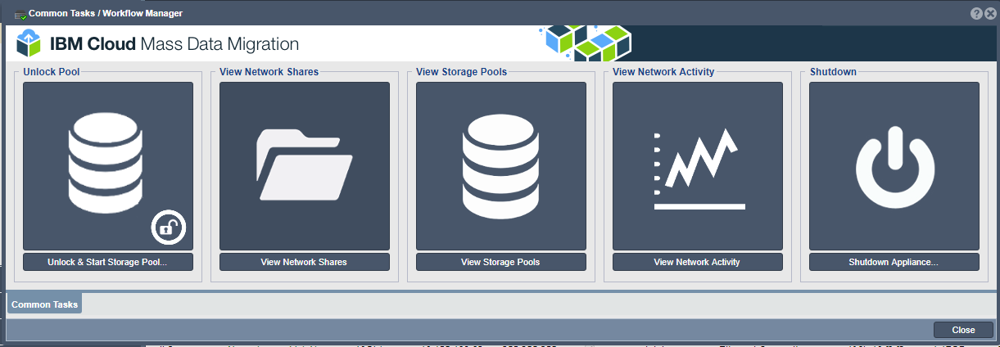

---

copyright:
  years:  2019
lastupdated: "2019-07-10"

keywords: mount NFS share, NFS, access network share, connect to network share

subcollection: mass-data-migration

---

{:shortdesc: .shortdesc}
{:screen: .screen}
{:pre: .pre}
{:table: .aria-labeledby="caption"}
{:external: target="_blank" .external}
{:codeblock: .codeblock}
{:tip: .tip}
{:note: .note}
{:important: .important}
{:download: .download}

# Verbindung zu dem gemeinsam genutzten Netzbereich über NFS herstellen
{: #connect-nfs-share}

Zur Vorbereitung des Datenkopierprozesses können Sie über das NFS-Protokoll (Network File System) auf den gemeinsam genutzten Netzbereich auf der {{site.data.keyword.mdms_full}}-Einheit zugreifen.
{: shortdesc}

Bevor Sie eine Verbindung zu der gemeinsam genutzten Ressource herstellen: 

- Stellen Sie sicher, dass NFS-Software wie `nfs-common` auf Ihrem Client installiert ist. Sie können das Paket `nfs-common` installieren, indem Sie den Befehl `sudo apt install nfs-common` in Ihrer Terminalsitzung ausführen. 

## Zugriff auf die gemeinsam genutzte NFS-Ressource verwalten
{: #manage-nfs-share-access}

Standardmäßig ist für den gemeinsam genutzten Netzbereich der öffentliche Zugriff festgelegt. Bevor Sie die gemeinsam genutzte Ressource auf Ihrem Server anhängen, können Sie der Ressource geeignete NFS-Zugriffsregeln für Ihre Umgebung oder Ihre Sicherheitsanforderungen hinzufügen.  

Ausführliche Informationen zur Steuerung des Zugriffs auf gemeinsam genutzte Ressourcen auf der Speichereinheit finden Sie in der [Dokumentation zu OSNEXUS QuantaStor](https://wiki.osnexus.com/index.php?title=Network_Shares){:external}.
{: tip}

Gehen Sie wie folgt vor, um den Zugriff auf die gemeinsam genutzte NFS-Ressource zu ändern: 

1. [Melden Sie sich bei der Benutzerschnittstelle der Einheit an](/docs/infrastructure/mass-data-migration?topic=mass-data-migration-access-ui#log-in-ui). 
2. Klicken Sie im Assistenten für allgemeine Tasks auf **Gemeinsam genutzte Netzbereiche anzeigen**, um die gemeinsam genutzten Netzbereiche anzuzeigen. 

   
3. Schließen Sie den Assistenten für allgemeine Tasks und klicken Sie dann mit der rechten Maustaste auf den Namen des gemeinsam genutzten Netzbereichs, um eine Liste mit Optionen anzuzeigen.  
4. Klicken Sie auf **NFS-Zugriff hinzufügen**, um den Zugriff für die gemeinsam genutzte NFS-Ressource zu ändern. 

    

## Gemeinsam genutzte NFS-Ressource auf einem UNIX-System anhängen
{: #mount-nfs-share}

Nachdem Sie den Speicherpool auf der Einheit entsperrt und aktiviert haben, können Sie über die Benutzerschnittstelle der {{site.data.keyword.mdms_short}}-Einheit auf einem Unix-basierten System eine Verbindung zu der gemeinsam genutzten NFS-Ressource herstellen. 

Gehen Sie wie folgt vor, um den gemeinsam genutzten Netzbereich anzuhängen:  

1. [Melden Sie sich bei der Benutzerschnittstelle der Einheit an](/docs/infrastructure/mass-data-migration?topic=mass-data-migration-access-ui#log-in-ui). 
2. Klicken Sie im Assistenten für allgemeine Tasks auf **Gemeinsam genutzte Netzbereiche anzeigen**, um die gemeinsam genutzten Netzbereiche anzuzeigen. 
3. Schließen Sie den Assistenten für allgemeine Tasks und klicken Sie dann mit der rechten Maustaste auf den Namen des gemeinsam genutzten Netzbereichs, um eine Liste mit Optionen anzuzeigen.  
4. Klicken Sie auf **Mountbefehl anzeigen**, um die Mountinformationen für die gemeinsam genutzte Ressource zu überprüfen. 

    Die folgende Abbildung zeigt das Dialogfenster "Mountbefehl anzeigen" mit Beispielwerten. 

    

Der Wert für _Netzport_ entspricht dem Datenübertragungsport an der {{site.data.keyword.mdms_short}}-Einheit. Der Wert für _Mountbefehl_ gibt den Befehl an, der verwendet wird, um die gemeinsam genutzte Ressource anzuhängen und eine Verbindung zu ihr herzustellen.
5. Setzen Sie ein Pingsignal an die im Dialogfenster aufgelistete IP-Adresse ab, um die Netzkonnektivität zwischen Ihrem Computer und der {{site.data.keyword.mdms_short}}-Einheit zu testen. 

   Stellen Sie sicher, dass die IP-Adresse dem [10-GbE-Datenübertragungsport](/docs/infrastructure/mass-data-migration?topic=mass-data-migration-device-overview#network-settings) an der Einheit entspricht.
   {: note}  
6. Kopieren Sie den Mountbefehl, der im Dialogfenster aufgelistet ist, und fügen Sie den Befehl in eine Terminalsitzung auf Ihrem Computer ein. 
7. Führen Sie den Befehl aus, um die gemeinsam genutzte Ressource auf Ihrem Server anzuhängen. 

## Nächste Schritte
{: #connect-nfs-share-next-steps}

- Starten Sie den [Datenkopierprozess](/docs/infrastructure/mass-data-migration?topic=mass-data-migration-copy-data). 
