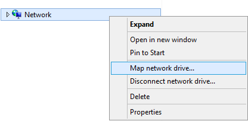

---

copyright:
  years:  2019
lastupdated: "2019-07-10"

keywords: mount SMB share, SMB, Active Directory, AD, access network share, connect to network share

subcollection: mass-data-migration

---

{:shortdesc: .shortdesc}
{:screen: .screen}
{:pre: .pre}
{:table: .aria-labeledby="caption"}
{:external: target="_blank" .external}
{:codeblock: .codeblock}
{:tip: .tip}
{:note: .note}
{:important: .important}
{:download: .download}

# Verbindung zu dem gemeinsam genutzten Netzbereich über SMB herstellen
{: #connect-smb-share}

Zur Vorbereitung des Datenkopierprozesses können Sie über das SMB-Protokoll (Server Message Block) auf den gemeinsam genutzten Netzbereich auf der {{site.data.keyword.mdms_full}}-Einheit zugreifen.
{: shortdesc}

Bevor Sie eine Verbindung zu der gemeinsam genutzten Ressource herstellen: 

- Bestimmen Sie, ob Sie die {{site.data.keyword.mdms_short}}-Einheit mit Active Directory verbinden müssen. Wenn Sie den gemeinsam genutzten Netzbereich auf einem Windows-Server anhängen, der mit Active Directory verbunden ist, müssen Sie auch [die Einheit mit Active Directory verbinden](#use-active-directory), bevor Sie eine Verbindung zu der gemeinsam genutzten Ressource herstellen können. 
- Bestimmen Sie, ob Ihre Umgebung SMB-Signierung erfordert. Durch die Verbindung der {{site.data.keyword.mdms_short}}-Einheit mit Active Directory wird die SMB-Signierung standardmäßig aktiviert. Wenn für Ihre Umgebung SMB-Signierung nicht erforderlich ist, können Sie [SMB-Signierung auf dem Client inaktivieren](/docs/infrastructure/mass-data-migration?topic=mass-data-migration-troubleshooting#unable-to-mount-smb-share), um Verbindungsprobleme zu vermeiden und die Leistung Ihrer Datenübertragung zu erhöhen. 

## Zugriff auf die gemeinsam genutzte SMB-Ressource verwalten
{: #manage-smb-share-access}

Standardmäßig ist für den gemeinsam genutzten Netzbereich der öffentliche Zugriff festgelegt. Bevor Sie die gemeinsam genutzte Ressource auf Ihrem Server anhängen, können Sie der Ressource geeignete SMB-Zugriffsregeln für Ihre Umgebung oder Ihre Sicherheitsanforderungen hinzufügen.  

Ausführliche Informationen zur Steuerung des Zugriffs auf gemeinsam genutzte Ressourcen auf der Speichereinheit finden Sie in der [Dokumentation zu OSNEXUS QuantaStor](https://wiki.osnexus.com/index.php?title=Network_Shares){:external}.
{: tip}

Gehen Sie wie folgt vor, um den Zugriff auf die gemeinsam genutzte SMB-Ressource zu ändern: 

1. [Melden Sie sich bei der Benutzerschnittstelle der Einheit an](/docs/infrastructure/mass-data-migration?topic=mass-data-migration-access-ui#log-in-ui). 
2. Klicken Sie im Assistenten für allgemeine Tasks auf **Gemeinsam genutzte Netzbereiche anzeigen**, um die gemeinsam genutzten Netzbereiche anzuzeigen. 

   
3. Schließen Sie den Assistenten für allgemeine Tasks und klicken Sie dann mit der rechten Maustaste auf den Namen des gemeinsam genutzten Netzbereichs, um eine Liste mit Optionen anzuzeigen.  
4. Klicken Sie auf **Zugriff auf gemeinsam genutzte Ressource & SMB-Zugriff ändern**, um den Zugriff für die gemeinsam genutzte SMB-Ressource zu ändern. 

    

## Active Directory verwenden
{: #use-active-directory}

Wenn Sie SMB auf einem Windows-Server verwenden, können Sie Zugriffsberechtigungen, Dateieigentumsrechte und Dateiattribute für Ihre Daten verwalten, indem Sie die {{site.data.keyword.mdms_short}}-Einheit mit Active Directory verbinden. Durch die Verbindung der Einheit mit einer Active Directory-Domäne wird SMB-Zugriff für bestimmte AD-Benutzer und AD-Gruppen aktiviert.  

Weitere Informationen zum Verbinden der Einheit mit Active Directory finden Sie in der [Dokumentation zu OSNEXUS QuantaStor](https://wiki.osnexus.com/index.php?title=Network_Shares#Joining_an_AD_Domain){:external}. 

## Gemeinsam genutzte SMB-Ressource auf einem Windows-System anhängen
{: #mount-smb-share}

Nachdem Sie den Speicherpool auf der Einheit entsperrt und aktiviert haben, stellen Sie über das Dialogfenster **Netzlaufwerk verbinden** auf Ihrem Windows-Computer eine Verbindung zu der gemeinsam genutzte SMB-Ressource her. 

Gehen Sie wie folgt vor, um den gemeinsam genutzten Netzbereich anzuhängen: 

1. [Melden Sie sich bei der Benutzerschnittstelle der Einheit an](/docs/infrastructure/mass-data-migration?topic=mass-data-migration-access-ui#log-in-ui). 
2. Klicken Sie im Assistenten für allgemeine Tasks auf **Gemeinsam genutzte Netzbereiche anzeigen**, um die gemeinsam genutzten Netzbereiche anzuzeigen. 
3. Schließen Sie den Assistenten für allgemeine Tasks und klicken Sie dann mit der rechten Maustaste auf den Namen des gemeinsam genutzten Netzbereichs, um eine Liste mit Optionen anzuzeigen.  
4. Klicken Sie auf **Mountbefehl anzeigen**, um die Mountinformationen für die gemeinsam genutzte Ressource zu überprüfen. 
5. Setzen Sie ein Pingsignal an die im Dialogfenster aufgelistete IP-Adresse ab, um die Netzkonnektivität zwischen Ihrem Computer und der {{site.data.keyword.mdms_short}}-Einheit zu testen. 

   Stellen Sie sicher, dass die IP-Adresse dem [10-GbE-Datenübertragungsport](/docs/infrastructure/mass-data-migration?topic=mass-data-migration-device-overview#network-settings) an der Einheit entspricht.
   {: note} 
6. Klicken Sie im Dateiexplorer mit der rechten Maustaste auf **Netzwerk** und wählen Sie anschließend **Netzlaufwerk verbinden** aus, um das Dialogfenster 'Netzlaufwerk verbinden' zu öffnen. 

   
7. Geben Sie die IP-Adresse ein, die Sie in Schritt 1 getestet haben, und klicken Sie auf **Durchsuchen**. 

   
8. In der Liste der Netzordner wählen Sie die gemeinsam genutzte {{site.data.keyword.mdms_short}}-Ressource aus. Klicken Sie zur Bestätigung auf **OK**. 
9. Klicken Sie auf **Fertig stellen**, um die gemeinsam genutzte Ressource auf Ihrem Quellenserver anzuhängen. 

    Wenn Sie die IP-Adresse mit Ping überprüfen, aber die gemeinsam genutzte Ressource nicht anhängen können, ist wahrscheinlich SMB-Signierung für Ihren Windows-Client aktiviert. Ziehen Sie die [Inaktivierung der SMB-Signierung](/docs/infrastructure/mass-data-migration?topic=mass-data-migration-troubleshooting#unable-to-mount-smb-share) auf dem Client in Betracht und versuchen Sie es erneut.
    {: tip} 

## Nächste Schritte
{: #connect-smb-share-next-steps}

- Starten Sie den [Datenkopierprozess](/docs/infrastructure/mass-data-migration?topic=mass-data-migration-copy-data). 
