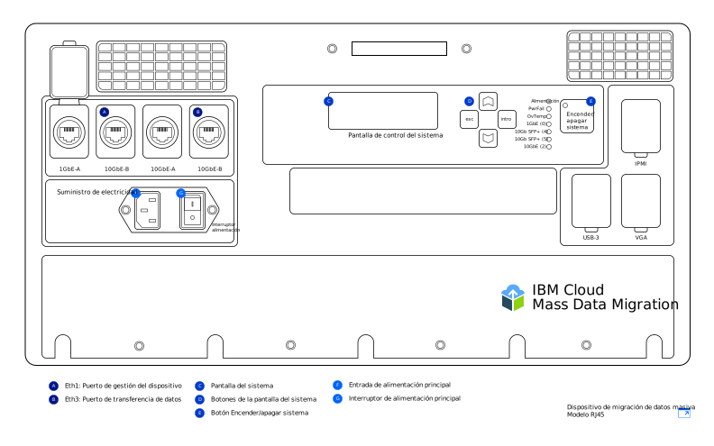
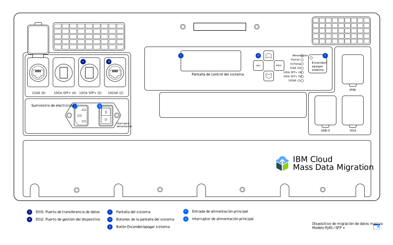

---

copyright:
  years:  2019
lastupdated: "2019-07-10"

keywords: set up device, connect device, cable device

subcollection: mass-data-migration

---

{:shortdesc: .shortdesc}
{:screen: .screen}
{:pre: .pre}
{:table: .aria-labeledby="caption"}
{:external: target="_blank" .external}
{:codeblock: .codeblock}
{:tip: .tip}
{:note: .note}
{:important: .important}
{:download: .download}

# Conexión del dispositivo
{: #connect-device}

Los dispositivos {{site.data.keyword.mdms_full}} llegan preconfigurados y listos para conectarse a la red.
{: shortdesc}

Antes de encender el dispositivo {{site.data.keyword.mdms_short}}:

- Asegúrese de que el dispositivo está a temperatura ambiente.
- Asegúrese de que no haya condensación en el dispositivo.
- Verifique que ha recibido los cables correspondientes a su
[modelo de dispositivo](/docs/infrastructure/mass-data-migration?topic=mass-data-migration-device-overview) revisando la lista de inventario que se encuentra bajo la tapa del maletín de transporte.
- Para evitar daños involuntarios en el dispositivo, guarde el dispositivo en su maletín portátil mientras esté en uso.

## Encendido del dispositivo
{: #power-on-device}

Tras colocar el dispositivo, utilice el cable de alimentación proporcionado para encender el dispositivo.

1. Recupere el cable de alimentación que se encuentra bajo la tapa del maletín de transporte.
2. Conecte el cable de alimentación a la entrada del dispositivo y, a continuación, conecte el enchufe a un socket de alimentación.
3. Establezca el **Interruptor de alimentación** en **Activado**.
4. Encienda el dispositivo utilizando el botón **Encender/Apagar el sistema**.

   Cuando se muestre un valor de ID del sistema en la pantalla _Pantalla de control del sistema_, el dispositivo estará encendido y listo para el siguiente paso.

## Revisión de los valores de red
{: #review-network-settings}

Puede revisar la configuración de red del dispositivo antes de conectarlo a la red. Visualice y gestione los valores de IP de los puertos de red utilizando la pantalla _Pantalla de control del sistema_ del dispositivo. 

Para interactuar con la pantalla _Pantalla de control del sistema_, mueva el cursor utilizando los botones
**△**, **▽**, **esc** e **Intro**. Con el botón **Intro** se accede a un menú y con el botón **esc** se sale de él.
{: tip}

Para editar una dirección IP o máscara de subred:

1. En el menú Configuración de red, utilice los botones **△** y **▽** para seleccionar el puerto que desee modificar. Pulse **Intro**.
2. Seleccione **Dirección IP** y, a continuación, utilice los botones **△** y
**▽** para establecer la nueva dirección IP.

   Pulse **Intro** para moverse un carácter hacia adelante cada vez. Pulse **esc** para moverse un carácter hacia atrás cada vez.
3. Pulse **esc** para volver al menú anterior.
4. Vaya a **Actualizar...** y pulse **Intro** para guardar el valor.

## Conexión del dispositivo a la red
{: #connect-device}

Para conectar el dispositivo a la red, necesita configurar dos conexiones Ethernet. La primera conexión es para la gestión del dispositivo a través de un navegador y la segunda conexión es para mover los datos en la misma subred donde se encuentran los datos de origen.

Configure la conectividad Ethernet para el dispositivo dependiendo del
[modelo de dispositivo {{site.data.keyword.mdms_short}}](/docs/infrastructure/mass-data-migration?topic=mass-data-migration-device-overview#mass-data-migration-device-models) que reciba. 

### Configuración del modelo RJ45
{: #set-up-RJ45-model}

El modelo de dispositivo RJ45 da soporte de forma nativa a la conectividad Ethernet utilizando conectores RJ45.

<a href="https://{DomainName}/docs/api/content/mass-data-migration/images/mdms-device-rj45.svg">
  
</a>

Puede utilizar los cables Ethernet CAT6A proporcionados para conectar su sistema de almacenamiento a los puertos de red RJ45 del dispositivo. Si necesita habilitar el soporte de cobre SFP+, utilice los adaptadores proporcionados. Los adaptadores son compatibles con todos los fabricantes de interruptores. Puede encontrar los adaptadores en un bolsillo de la parte inferior de la tapa del contenedor de envío.

En la tabla siguiente se muestra cómo se correlacionan los puertos físicos del dispositivo con los puertos que aparecen en la interfaz de usuario.

| Puerto de dispositivo | Tipo de Ethernet  |  Descripción |
| --- | --- | --- | --- |
| Eth1 | 1GbE | El puerto Eth1 se utiliza para gestionar el dispositivo y para hacer que la interfaz de usuario basada en web esté disponible fuera de la subred de datos. Puede ver la información de pasarela utilizando la pantalla
_Pantalla de control del sistema_ una vez que el dispositivo esté encendido. |
| Eth3 | 10GbE | El puerto Eth3 se utiliza para transferir datos desde su sistema de almacenamiento al dispositivo
{{site.data.keyword.mdms_short}}. La conexión debe estar en la misma subred que los datos de origen o ser una conexión directa con el servidor. |
{: caption="Tabla 2. Describe cómo se correlacionan los puertos del dispositivo {{site.data.keyword.mdms_short}} con la pantalla de la interfaz de usuario" caption-side="top"}

Para conectar el modelo de dispositivo RJ45 a la red:

1. Recupere el cable CAT6A de la tapa del maletín de transporte.
2. Conecte el cable CAT6A al puerto Eth3 (`10GbE-B`) del dispositivo.
3. Conecte el cable CAT6A al adaptador SFP+.
4. Conecte el cable CAT6A a su conmutador Ethernet de 10Gb.
5. Abra un navegador web y acceda al URL siguiente.

   ```
   https://<your_Eth3_IP_address>
   ```
   {: codeblock}

   Sustituya `<your_Eth3_IP_address>` por la dirección IP configurada para el puerto de red Eth3. Para ver la dirección IP, consulte la pantalla _Pantalla de control del sistema_ del dispositivo.
6. Opcional: si no puede acceder a la dirección IP, conecte el cable CAT6A al puerto Eth1 (`1GbE-B`) del dispositivo y vuelva a intentar acceder al URL siguiente.
   
   ```
   https://<your_Eth1_IP_address>
   ```
   {: codeblock}

   Sustituya `<your_Eth1_IP_address>` por la dirección IP configurada para el puerto de red Eth1. Para ver la dirección IP, consulte la pantalla _Pantalla de control del sistema_ del dispositivo.

   Si necesita modificar los valores de IP para Eth3 o Eth1, consulte
[Revisión de los valores de red](#review-network-settings).
   {: tip}

### Configuración del modelo RJ45 / SFP+
{: #set-up-SFP+-model}

El modelo de dispositivo RJ45 / SFP+ da soporte de forma nativa a conexiones de cobre SFP+ y RJ45. 

<a href="https://{DomainName}/docs/api/content/mass-data-migration/images/mdms-device-sfp.svg">
  
</a>

Puede utilizar los cables CAT6A y SFP+ proporcionados para conectar su sistema de almacenamiento a los puertos de red del dispositivo. 
En la tabla siguiente se muestra cómo se correlacionan los puertos físicos del dispositivo con los puertos que aparecen en la interfaz de usuario.

| Puerto de dispositivo | Tipo de Ethernet  |  Descripción |
| --- | --- | --- | --- |
| Eth5 | 10GbE (SFP+) | El puerto Eth5 se utiliza para transferir datos desde su sistema de almacenamiento al dispositivo
{{site.data.keyword.mdms_short}}. Este puerto se puede utilizar también para gestionar el dispositivo. El puerto solo funciona a una velocidad de 10GbE. |
| Eth2 | 10GbE | El puerto Eth2 se utiliza para gestionar el dispositivo y para hacer que la interfaz de usuario basada en web esté disponible fuera de la subred de datos. Este puerto se puede utilizar también para la transferencia de datos. La conexión debe estar en la misma subred que los datos de origen o ser una conexión directa con el servidor. El puerto puede funcionar a una velocidad de 1GbE o de 10GbE. |
{: caption="Tabla 3. Describe cómo se correlacionan los puertos del dispositivo {{site.data.keyword.mdms_short}} con la pantalla de la interfaz de usuario" caption-side="top"}

Para conectar el modelo de dispositivo RJ45 / SFP+ a la red:

1. Recupere el cable de cobre SFP+ de la tapa del maletín de transporte.
2. Conecte el cable SFP+ al puerto Eth5 (`10GbE (5)`) del dispositivo.
3. Conecte el cable SFP+ a su conmutador Ethernet de 10Gb.
4. Abra un navegador web y acceda al URL siguiente.

   ```
   https://<your_Eth5_IP_address>
   ```
   {: codeblock}

   Sustituya `<your_Eth5_IP_address>` por la dirección IP configurada para el puerto de red Eth5. Para ver la dirección IP, consulte la pantalla _Pantalla de control del sistema_ del dispositivo.
5. Opcional: si no puede acceder a la dirección IP, conecte el cable SFP+ al puerto Eth2 (`10GbE-B` o `1GbE-B`) del dispositivo y vuelva a intentar acceder al URL siguiente.
   
   ```
   https://<your_Eth2_IP_address>
   ```
   {: codeblock}

   Sustituya `<your_Eth2_IP_address>` por la dirección IP configurada para el puerto de red Eth2. Para ver la dirección IP, consulte la pantalla _Pantalla de control del sistema_ del dispositivo.

   Si necesita modificar cualquier valor de IP para Eth3 o Eth1, consulte
[Revisión de los valores de red](/docs/infrastructure/mass-data-migration?topic=mass-data-migration-connect-device#review-network-settings).
   {: tip}

## Siguientes pasos
{: #set-up-device-next-steps}

- Interactúe con el dispositivo [ejecutando la interfaz de usuario basada en web](/docs/infrastructure/mass-data-migration?topic=mass-data-migration-access-ui).
- Para preparar el proceso de copia de datos, empiece por [desbloquear la agrupación de almacenamiento en el dispositivo](/docs/infrastructure/mass-data-migration?topic=mass-data-migration-unlock-storage-pool).
