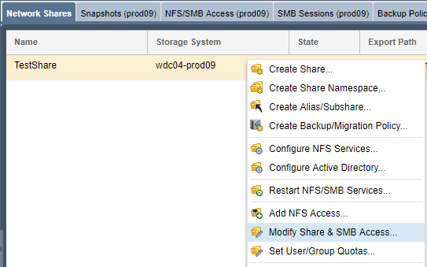

---

copyright:
  years:  2019
lastupdated: "2019-07-10"

keywords: mount SMB share, SMB, Active Directory, AD, access network share, connect to network share

subcollection: mass-data-migration

---

{:shortdesc: .shortdesc}
{:screen: .screen}
{:pre: .pre}
{:table: .aria-labeledby="caption"}
{:external: target="_blank" .external}
{:codeblock: .codeblock}
{:tip: .tip}
{:note: .note}
{:important: .important}
{:download: .download}

# Conexión al recurso compartido de red utilizando SMB
{: #connect-smb-share}

Para preparar la copia de datos, puede acceder al recurso compartido de red en el dispositivo
{{site.data.keyword.mdms_full}} utilizando el protocolo SMB (Server Message Block).
{: shortdesc}

Antes de conectarse al recurso compartido:

- Determine si necesita unir el dispositivo {{site.data.keyword.mdms_short}} a Active Directory. Si va a montar el recurso compartido de red en un servidor Windows que se ha unido a Active Directory, también deberá [unir el dispositivo al dominio de Active Directory](#use-active-directory) para poder conectarse al recurso compartido.
- Determine si el entorno requiere la firma SMB. La unión del dispositivo {{site.data.keyword.mdms_short}} a Active Directory habilita la firma SMB de forma predeterminada. Si el entorno no necesita la firma SMB, puede
[inhabilitar la firma SMB en el cliente](/docs/infrastructure/mass-data-migration?topic=mass-data-migration-troubleshooting#unable-to-mount-smb-share) para evitar problemas de conexión y aumentar el rendimiento de la transferencia de datos.

## Gestión del acceso a la compartición SMB
{: #manage-smb-share-access}

De forma predeterminada, el recurso compartido de red está configurado para tener acceso público. Antes de montar el recurso compartido en el servidor, puede añadir reglas de acceso SMB en el recurso compartido para ajustarse a sus requisitos de entorno o de seguridad. 

Para obtener información detallada acerca de cómo controlar el acceso a los recursos compartidos en el dispositivo de almacenamiento, consulte la
[Documentación de OSNEXUS QuantaStor](https://wiki.osnexus.com/index.php?title=Network_Shares){:external}.
{: tip}

Para modificar el acceso a la compartición SMB:

1. [Inicie sesión en la interfaz de usuario del dispositivo](/docs/infrastructure/mass-data-migration?topic=mass-data-migration-access-ui#log-in-ui).
2. En el asistente Tareas comunes, pulse **Ver recursos compartidos de red** para mostrar la vista de recursos compartidos de red.

   
3. Cierre el asistente Tareas comunes y, a continuación, pulse el botón derecho del ratón sobre el nombre del recurso compartido de red para ver una lista de opciones. 
4. Pulse **Modificar recurso compartido y acceso SMB** para modificar el acceso para la compartición SMB.

    

## Utilización de Active Directory
{: #use-active-directory}

Si utiliza SMB en un servidor Windows, puede gestionar los permisos de acceso, la propiedad de los archivos y los atributos de archivo de los datos uniendo el dispositivo {{site.data.keyword.mdms_short}} a Active Directory. La unión del dispositivo a un dominio de Active Directory habilita el acceso SMB para usuarios de AD y grupos de AD específicos. 

Para obtener más información sobre cómo unir el dispositivo a Active Directory, consulte la
[Documentación de OSNEXUS QuantaStor](https://wiki.osnexus.com/index.php?title=Network_Shares#Joining_an_AD_Domain){:external}.

## Montaje de la compartición SMB en un sistema Windows
{: #mount-smb-share}

Tras desbloquear la agrupación de almacenamiento en el dispositivo, conéctese a la compartición SMB utilizando el cuadro de diálogo
**Correlacionar unidad de red** de su sistema Windows.

Para montar el recurso compartido de red:

1. [Inicie sesión en la interfaz de usuario del dispositivo](/docs/infrastructure/mass-data-migration?topic=mass-data-migration-access-ui#log-in-ui).
2. En el asistente Tareas comunes, pulse **Ver recursos compartidos de red** para mostrar la vista de recursos compartidos de red.
3. Cierre el asistente Tareas comunes y, a continuación, pulse el botón derecho del ratón sobre el nombre del recurso compartido de red para ver una lista de opciones. 
4. Pulse **Ver mandato de montaje** para revisar la información de montaje de la compartición.
5. Haga ping a la dirección IP que aparece en el recuadro de diálogo para probar la conectividad de red entre su sistema y el dispositivo
{{site.data.keyword.mdms_short}}.

   Asegúrese de que la dirección IP corresponda al [puerto de transferencia de datos 10GbE](/docs/infrastructure/mass-data-migration?topic=mass-data-migration-device-overview#network-settings) del dispositivo.
   {: note} 
6. Desde el Explorador de archivos, pulse el botón derecho del ratón sobre **Red** y luego seleccione
**Correlacionar unidad de red** para abrir el diálogo Correlacionar unidad de red.

   
7. Especifique la dirección IP que ha probado en el paso 1 y pulse **Examinar**.

   
8. En la lista de carpetas de red, seleccione el recurso compartido de {{site.data.keyword.mdms_short}}. Pulse **Aceptar** para confirmar.
9. Pulse **Finalizar** para montar la compartición en el servidor de origen.

    Si puede hacer ping a la dirección IP pero no puede montar la compartición, es probable que la firma SMB esté habilitada para su cliente Windows. Plantéese [inhabilitar la firma SMB](/docs/infrastructure/mass-data-migration?topic=mass-data-migration-troubleshooting#unable-to-mount-smb-share) en el cliente y vuelva a intentarlo.
    {: tip} 

## Siguientes pasos
{: #connect-smb-share-next-steps}

- Inicie el [proceso de copia de datos](/docs/infrastructure/mass-data-migration?topic=mass-data-migration-copy-data).
