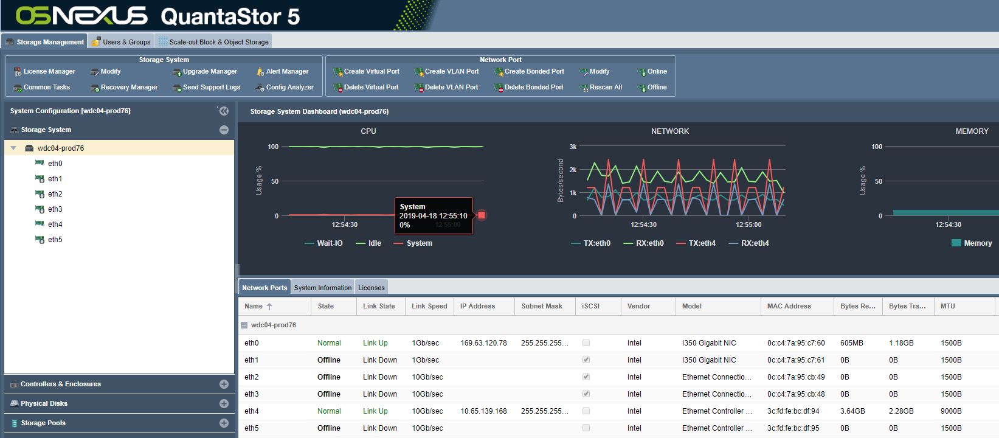

---

copyright:
  years:  2019
lastupdated: "2019-07-10"

keywords: copy data to device, move data to device, 

subcollection: mass-data-migration

---

{:shortdesc: .shortdesc}
{:screen: .screen}
{:pre: .pre}
{:table: .aria-labeledby="caption"}
{:external: target="_blank" .external}
{:codeblock: .codeblock}
{:tip: .tip}
{:note: .note}
{:important: .important}
{:download: .download}

# Copia de datos en el dispositivo
{: #copy-data}

Puede copiar datos en un dispositivo {{site.data.keyword.mdms_full}} utilizando la interfaz de usuario del dispositivo.

## Copia de datos en el dispositivo
{: #copy-data}

Tras conectar el servidor al recurso compartido de red, puede iniciar y supervisar la copia de datos en el dispositivo.

1. Copie datos en el recurso compartido de red utilizando una herramienta de copia de archivos que sea compatible con el sistema principal.
2. En el asistente Tareas comunes, pulse **Ver actividad de red** para mostrar la carga Ethernet de entrada a medida que se transfieren datos al dispositivo en el enlace de 10Gb.
   
    
3. Pulse **Ver agrupación de almacenamiento** para supervisar el uso de almacenamiento y las IOPS en el dispositivo.
   
    

## Siguientes pasos
{: #import-data-next-steps}

- [Apague el dispositivo](/docs/infrastructure/mass-data-migration?topic=mass-data-migration-disconnect-device) de forma adecuada.
- Prepare la etiqueta de envío y [devuelva el dispositivo a {{site.data.keyword.cloud_notm}}](/docs/infrastructure/mass-data-migration?topic=mass-data-migration-ship-device).
