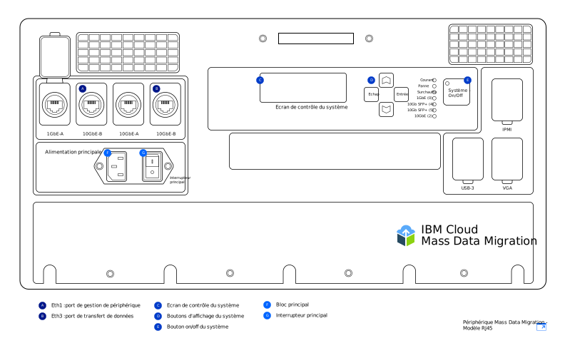
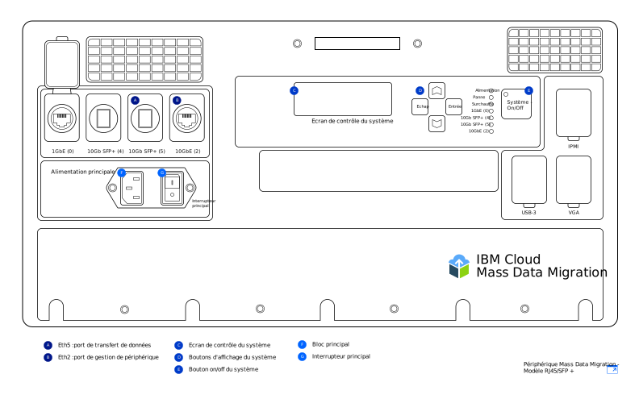

---

copyright:
  years:  2019
lastupdated: "2019-07-10"

keywords: set up device, connect device, cable device

subcollection: mass-data-migration

---

{:shortdesc: .shortdesc}
{:screen: .screen}
{:pre: .pre}
{:table: .aria-labeledby="caption"}
{:external: target="_blank" .external}
{:codeblock: .codeblock}
{:tip: .tip}
{:note: .note}
{:important: .important}
{:download: .download}

# Connexion du périphérique
{: #connect-device}

Les périphériques {{site.data.keyword.mdms_full}} arrivent préconfigurés et prêts à être connectés à votre réseau.
{: shortdesc}

Avant de mettre sous tension le périphérique {{site.data.keyword.mdms_short}} :

- Assurez-vous que le périphérique est à la température de la pièce.
- Vérifiez que le périphérique ne présente aucune condensation.
- Vérifiez que vous avez reçu les câbles correspondant à votre [modèle de périphérique](/docs/infrastructure/mass-data-migration?topic=mass-data-migration-device-overview) en consultant la liste d'inventaire qui se trouve sous le couvercle de la mallette de transport.
- Pour éviter que le périphérique soit endommagé par mégarde, laissez-le dans sa mallette portable quand vous l'utilisez.

## Mise sous tension du périphérique
{: #power-on-device}

Une fois que vous avez positionné le périphérique, utilisez le cordon d'alimentation fourni pour mettre sous tension le périphérique.

1. Sortez le cordon d'alimentation qui se trouve sous  le couvercle de la mallette de transport.
2. Branchez le cordon d'alimentation au périphérique puis connectez la fiche à une prise électrique.
3. Mettez l'**interrupteur principal** en position **On**.
4. Mettez le périphérique sous tension en utilisant le bouton **On/Off** du système.

   L'affichage d'une valeur d'ID système sur l'écran _de contrôle du système_ indique que le périphérique est mis sous tension et prêt pour l'étape suivante.

## Examen de vos paramètres réseau
{: #review-network-settings}

Vous pouvez analyser la configuration réseau sur le périphérique avant de connecter ce dernier à votre réseau. Affichez et gérez les paramètres IP pour vos ports réseau en utilisant l'écran _de contrôle du système_ du périphérique. 

Pour interagir avec cet écran, déplacez le curseur en utilisant les boutons **△**, **▽**, **Echap** et **Entrée**. **Entrée** vous permet d'entrer dans un menu et **Echap**  d'en sortir.
{: tip}

Pour éditer une adresse IP ou un masque de sous-réseau :

1. Dans le menu de configuration du réseau, utilisez les boutons **△** et **▽** pour sélectionner le port que vous voulez modifier. Appuyez sur **Entrée**.
2. Sélectionnez l'**adresse IP** puis utilisez les boutons **△** et **▽** pour définir la nouvelle adresse IP.

   Appuyez sur **Entrée** pour vous déplacer vers l'avant d'un caractère à la fois. Appuyez sur **Echap** pour vous déplacer vers l'arrière d'un caractère à la fois.
3. Appuyez sur **Echap** pour revenir au menu précédent.
4. Accédez à la commande de **mise à jour** et appuyez sur **Entrée** pour enregistrer le paramètre.

## Connexion du périphérique à votre réseau
{: #connect-device}

Pour connecter le périphérique à votre réseau, vous devez configurer deux connexions Ethernet. La première connexion est destinée à la gestion du périphérique via un navigateur tandis que la seconde connexion est réservée au déplacement de données sur le même sous-réseau que celui où se trouvent les données source.

Configurez la connectivité Ethernet pour votre périphérique en fonction du [modèle de périphérique {{site.data.keyword.mdms_short}}](/docs/infrastructure/mass-data-migration?topic=mass-data-migration-device-overview#mass-data-migration-device-models) que vous avez reçu. 

### Configuration du modèle RJ45
{: #set-up-RJ45-model}

Le modèle de périphérique RJ45 prend en charge de façon native la connectivité Ethernet en utilisant des connecteurs RJ45.

<a href="https://{DomainName}/docs/api/content/mass-data-migration/images/mdms-device-rj45.svg">
  
</a>

Vous pouvez utiliser les câbles Ethernet CAT6A fournis pour connecter votre système de stockage aux ports réseau RJ45 sur le périphérique. Si vous devez activer la prise en charge cuivre SFP+, utilisez les adaptateurs fournis. Ces adaptateurs sont compatibles avec tous les fabricants de commutateurs. Ces adaptateurs se trouvent dans une pochette dans la section inférieure du couvercle du carton d'expédition.

Le tableau suivant montre comment les ports physiques du périphérique sont mappés aux ports qui s'affichent dans l'interface utilisateur.

| Port de périphérique | Type Ethernet  |  Description |
| --- | --- | --- | --- |
| Eth1 | 1 GbE | Le port Eth1 est utilisé pour gérer le périphérique et rendre l'interface utilisateur Web disponible en dehors du sous-réseau de données. Vous pouvez afficher les informations de passerelle en utilisant l'écran _de contrôle du système_ une fois le périphérique mis sous tension. |
| Eth3 | 10 GbE | Le port Eth3 est utilisé pour transférer des données depuis votre système de stockage vers le périphérique {{site.data.keyword.mdms_short}}. La connexion  doit se trouver sur le même sous-réseau que celui où résident les données source ou être directement reliée au serveur. |
{: caption="Tableau 2. Description de la façon dont les ports de périphérique {{site.data.keyword.mdms_short}} sont mappés aux ports qui s'affichent dans l'interface utilisateur" caption-side="top"}

Pour connecter le modèle de périphérique RJ45 à votre réseau :

1. Sortez le câble CAT6A qui se trouve sous le couvercle de la mallette de transport.
2. Connectez le câble CAT6A au port Eth3 (`10GbE-B`) sur le périphérique.
3. Connectez le câble CAT6A à l'adaptateur SFP+.
4. Connectez le câble CAT6A à votre commutateur Ethernet 10Gb.
5. Ouvrez un navigateur web et accédez à l'URL suivante.

   ```
   https://<your_Eth3_IP_address>
   ```
   {: codeblock}

   Remplacez `<your_Eth3_IP_address>` par l'adresse IP qui est configurée pour le port réseau Eth3. Pour afficher l'adresse IP, consultez l'écran _de contrôle du système_ sur le périphérique.
6. Facultatif : si vous ne parvenez pas à atteindre l'adresse IP, connectez le câble CAT6A au port Eth1 (`1GbE-B`) sur le périphérique et essayez à nouveau de naviguer jusqu'à l'URL suivante.
   
   ```
   https://<your_Eth1_IP_address>
   ```
   {: codeblock}

   Remplacez `<your_Eth1_IP_address>` par l'adresse IP qui est configurée pour le port réseau Eth1. Pour afficher l'adresse IP, consultez l'écran _de contrôle du système_ sur le périphérique.

   Si vous devez modifier les paramètres IP pour Eth3 ou Eth1, voir [Examen de vos paramètres réseau](#review-network-settings).
   {: tip}

### Configuration du modèle RJ45 / SFP+
{: #set-up-SFP+-model}

Le modèle de périphérique RJ45 / SFP+ prend en charge de façon native aussi bien les connexions RJ45 que les connexions cuivre SFP+. 

<a href="https://{DomainName}/docs/api/content/mass-data-migration/images/mdms-device-sfp.svg">
  
</a>

Vous pouvez utiliser les câbles CAT6A et SFP+ fournis pour connecter votre système de stockage aux ports réseau sur le périphérique.
Le tableau suivant montre comment les ports physiques du périphérique sont mappés aux ports qui s'affichent dans l'interface utilisateur.

| Port de périphérique | Type Ethernet  |  Description |
| --- | --- | --- | --- |
| Eth5 | 10GbE (SFP+) | Le port Eth5 est utilisé pour transférer des données depuis votre système de stockage vers {{site.data.keyword.mdms_short}}. Ce port peut être utilisé pour gérer le périphérique. Le port s'exécute uniquement à une vitesse de 10GbE. |
| Eth2 | 10GbE | Le port Eth2 est utilisé pour gérer le périphérique et rendre l'interface utilisateur Web disponible en dehors du sous-réseau de données. Ce port peut aussi être utilisé pour le transfert de données. La connexion  doit se trouver sur le même sous-réseau que celui où résident les données source ou être directement reliée au serveur. Le port peut s'exécuter à une vitesse de 1GbE ou 10GbE. |
{: caption="Tableau 3. Description de la façon dont les ports de périphérique {{site.data.keyword.mdms_short}} sont mappés aux ports qui s'affichent dans l'interface utilisateur" caption-side="top"}

Pour connecter le modèle de périphérique RJ45 / SFP+ à votre réseau :

1. Sortez le câble cuivre SFP+ qui se trouve sous le couvercle de la mallette de transport.
2. Connectez le câble SFP+ au port Eth5 (`10GbE (5)`) sur le périphérique.
3. Connectez le câble SFP+ à votre commutateur Ethernet 10Gb.
4. Ouvrez un navigateur web et accédez à l'URL suivante.

   ```
   https://<your_Eth5_IP_address>
   ```
   {: codeblock}

   Remplacez `<your_Eth5_IP_address>` par l'adresse IP qui est configurée pour le port réseau Eth5. Pour afficher l'adresse IP, consultez l'écran _de contrôle du système_ sur le périphérique.
5. Facultatif : si vous ne parvenez pas à atteindre l'adresse IP, connectez le câble SFP+ au port Eth2 (`10GbE-B` ou `1GbE-B`) sur le périphérique et essayez à nouveau de naviguer jusqu'à l'URL suivante.
   
   ```
   https://<your_Eth2_IP_address>
   ```
   {: codeblock}

   Remplacez `<your_Eth2_IP_address>`  par l'adresse IP qui est configurée pour le port réseau Eth2. Pour afficher l'adresse IP, consultez l'écran _de contrôle du système_ sur le périphérique.

   Si vous devez modifier des paramètres d'adresse IP pour Eth3 ou Eth1, voir [Examen de vos paramètres réseau](/docs/infrastructure/mass-data-migration?topic=mass-data-migration-connect-device#review-network-settings).
   {: tip}

## Etapes suivantes
{: #set-up-device-next-steps}

- Interagissez avec le périphérique en [exécutant l'interface utilisateur Web](/docs/infrastructure/mass-data-migration?topic=mass-data-migration-access-ui).
- Pour préparer le processus de copie de données, commencez par [déverrouiller le pool de stockage sur le périphérique](/docs/infrastructure/mass-data-migration?topic=mass-data-migration-unlock-storage-pool).
