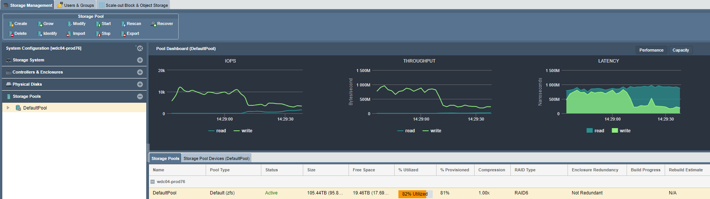

---

copyright:
  years:  2019
lastupdated: "2019-07-10"

keywords: copy data to device, move data to device, 

subcollection: mass-data-migration

---

{:shortdesc: .shortdesc}
{:screen: .screen}
{:pre: .pre}
{:table: .aria-labeledby="caption"}
{:external: target="_blank" .external}
{:codeblock: .codeblock}
{:tip: .tip}
{:note: .note}
{:important: .important}
{:download: .download}

# Copie de données sur un périphérique
{: #copy-data}

Vous pouvez copier des données sur un périphérique {{site.data.keyword.mdms_full}} en vous servant de l'interface utilisateur du périphérique.

## Copie de données sur le périphérique
{: #copy-data}

Une fois que vous avez connecté votre serveur au partage de réseau, vous pouvez démarrer la copie des données sur le périphérique et surveiller le processus.

1. Copiez les données sur le partage de réseau en utilisant un outil de copie de fichiers compatible avec votre ordinateur hôte.
2. Dans l'assistant des tâches communes, cliquez sur **View Network Activity** pour afficher la charge Ethernet dès lors que des données sont transférées vers le périphérique sur la liaison 10Gb.
   
    
3. Cliquez sur **View Storage pool** pour surveiller l'utilisation de l'espace de stockage et les IOPS sur le périphérique.
   
    

## Etapes suivantes
{: #import-data-next-steps}

- [Mettez le périphérique hors tension](/docs/infrastructure/mass-data-migration?topic=mass-data-migration-disconnect-device).
- Préparez l'étiquette d'expédition et [retournez le périphérique à {{site.data.keyword.cloud_notm}}](/docs/infrastructure/mass-data-migration?topic=mass-data-migration-ship-device).
