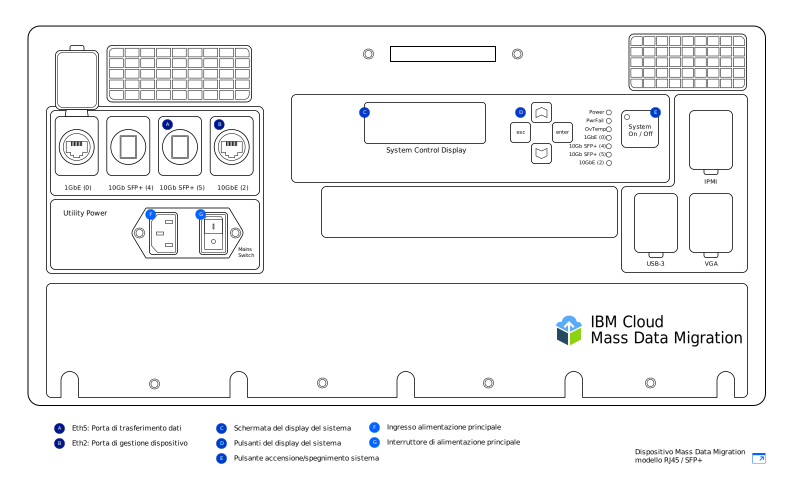

---

copyright:
  years:  2019
lastupdated: "2019-07-10"

keywords: set up device, connect device, cable device

subcollection: mass-data-migration

---

{:shortdesc: .shortdesc}
{:screen: .screen}
{:pre: .pre}
{:table: .aria-labeledby="caption"}
{:external: target="_blank" .external}
{:codeblock: .codeblock}
{:tip: .tip}
{:note: .note}
{:important: .important}
{:download: .download}

# Connessione del dispositivo
{: #connect-device}

I dispositivi {{site.data.keyword.mdms_full}} arrivano preconfigurati e pronti per la connessione alla tua rete.
{: shortdesc}

Prima di accendere il dispositivo {{site.data.keyword.mdms_short}}:

- Assicurati che il dispositivo sia a temperatura ambiente.
- Assicurati che non ci sia condensa sul dispositivo.
- Verifica di aver ricevuto i cavi che corrispondono al tuo [modello di dispositivo](/docs/infrastructure/mass-data-migration?topic=mass-data-migration-device-overview) esaminando l'elenco di inventario che si trova sotto il coperchio del contenitore di trasporto.
- Per evitare di danneggiare accidentalmente il dispositivo, tienilo nel suo contenitore portatile mentre è in uso.

## Accensione del dispositivo
{: #power-on-device}

Dopo che hai posizionato il dispositivo, utilizza il cavo di alimentazione fornito per accenderlo.

1. Recupera il cavo di alimentazione che si trova sotto il coperchio del contenitore di trasporto.
2. Collega il cavo di alimentazione all'ingresso sul dispositivo e collega quindi la spina a una presa di alimentazione.
3. Imposta **Mains Switch** su **On**.
4. Accendi il dispositivo utilizzando il pulsante **System On / Off**.

   Quando un valore di ID sistema viene visualizzato sullo schermo _System Control Display_, il dispositivo è acceso e pronto per il passo successivo.

## Controllo delle tue impostazioni di rete
{: #review-network-settings}

Puoi controllare la configurazione di rete sul dispositivo prima di connetterlo alla tua rete. Visualizza e gestisci le impostazioni IP per le tue porte di rete utilizzando lo schermo _System Control Display_ sul dispositivo. 

Per interagire con lo schermo _System Control Display_, sposta il cursore utilizzando i pulsanti **△**, **▽**, **esc** ed **enter**. **enter** ti porta in un menu e **esc** te ne fa uscire.
{: tip}

Per modificare un indirizzo IP o una maschera di sottorete:

1. Dal menu Network Config, utilizza i pulsanti **△** e **▽** per selezionare la porta che vuoi modificare. Premi **enter**.
2. Seleziona **IP Address** e utilizza quindi i pulsanti **△** e **▽** per impostare il nuovo indirizzo IP.

   Premi **enter** per spostarti in avanti di un carattere alla volta. Premi **esc** per spostarti all'indietro di un carattere alla volta.
3. Premi **esc** per ritornare al menu precedente.
4. Vai a **Update...** e premi **enter** per salvare l'impostazione.

## Connessione del dispositivo alla tua rete
{: #connect-device}

Per connettere il dispositivo alla tua rete, devi configurare due connessioni Ethernet. La prima connessione è per la gestione del dispositivo tramite un browser e la seconda connessione è per lo spostamento dei dati sulla stessa sottorete dove si trovano i dati di origine.

Configura la connettività Ethernet per il tuo dispositivo in base al [modello di dispositivo {{site.data.keyword.mdms_short}}](/docs/infrastructure/mass-data-migration?topic=mass-data-migration-device-overview#mass-data-migration-device-models) che ricevi. 

### Impostazione del modello RJ45
{: #set-up-RJ45-model}

Il modello di dispositivo RJ45 supporta nativamente la connettività Ethernet utilizzando i connettori RJ45.

<a href="https://{DomainName}/docs/api/content/mass-data-migration/images/mdms-device-rj45.svg">
  
</a>

Puoi utilizzare i cavi CAT6A Ethernet forniti per connettere il tuo sistema di archiviazione alle porte di rete RJ45 sul dispositivo. Se devi abilitare il supporto in rame SFP+, utilizza gli adattatori forniti. Gli adattatori sono compatibili con tutti i produttori di interruttori. Puoi trovare gli adattatori in una tasca sul lato inferiore del coperchio del contenitore di spedizione.

La seguente tabella mostra in che modo le porte fisiche sul dispositivo si associano alle porte visualizzate nell'IU.

| Porta dispositivo | Tipo Ethernet |  Descrizione |
| --- | --- | --- | --- |
| Eth1 | 1GbE | La porta Eth1 viene utilizzata per gestire il dispositivo e rendere disponibile l'IU basata sul web al di fuori della sottorete dei dati.Puoi visualizzare le informazioni del gateway utilizzando lo schermo _System Control Display_ dopo che il dispositivo è stato acceso. |
| Eth3 | 10GbE | La porta Eth3 viene utilizzata per trasferire i dati dal tuo sistema di archiviazione al dispositivo {{site.data.keyword.mdms_short}}. La connessione deve essere sulla stessa sottorete dei dati di origine o essere connessa direttamente al server.|
{: caption="Tabella 2. Descrive in che modo le porte del dispositivo {{site.data.keyword.mdms_short}} si associano alla visualizzazione dell'IU" caption-side="top"}

Per connettere il modello di dispositivo RJ45 alla tua rete:

1. Recupera il cavo CAT6A dal coperchio del contenitore di trasporto.
2. Collega il cavo CAT6A alla porta Et3 (`10GbE-B`) sul dispositivo.
3. Collega il cavo CAT6A all'adattatore SFP+.
4. Connetti il cavo CAT6A al tuo interruttore Ethernet da 10Gb.
5. Apri un browser web e vai al seguente URL.

   ```
   https://<your_Eth3_IP_address>
   ```
   {: codeblock}

   Sostituisci `<your_Eth3_IP_address>` con l'indirizzo IP configurato per la porta di rete Eth3. Per visualizzare l'indirizzo IP, controlla lo schermo _System Control Display_ sul dispositivo.
6. Facoltativo: se non riesci a raggiungere l'indirizzo IP, collega il cavo CAT6A alla porta Eth1 (`1GbE-B`) sul dispositivo e prova nuovamente andando al seguente URL.
   
   ```
   https://<your_Eth1_IP_address>
   ```
   {: codeblock}

   Sostituisci `<your_Eth1_IP_address>` con l'indirizzo IP configurato per la porta di rete Eth1. Per visualizzare l'indirizzo IP, controlla lo schermo _System Control Display_ sul dispositivo.

   Se devi modificare le impostazioni IP per Eth3 o Eth1, vedi [Controllo delle tue impostazioni di rete](#review-network-settings).
   {: tip}

### Impostazione del modello RJ45 / SFP+
{: #set-up-SFP+-model}

Il modello del dispositivo RJ45 / SFP+ supporta in modo nativo entrambe le connessioni in rame RJ45 e SFP+. 

<a href="https://{DomainName}/docs/api/content/mass-data-migration/images/mdms-device-sfp.svg">
  
</a>

Puoi utilizzare i cavi CAT6A e SFP+ forniti per connettere il tuo sistema di archiviazione alle porte di rete sul dispositivo.
La seguente tabella mostra in che modo le porte fisiche sul dispositivo si associano alle porte visualizzate nell'IU.

| Porta dispositivo | Tipo Ethernet |  Descrizione |
| --- | --- | --- | --- |
| Eth5 | 10GbE (SFP+) | La porta Eth5 viene utilizzata per trasferire i dati dal tuo sistema di archiviazione a {{site.data.keyword.mdms_short}}. Questa porta può anche essere utilizzata per gestire il dispositivo. La porta viene eseguita solo alla velocità di 10GbE.|
| Eth2 | 10GbE | la porta Eth2 viene utilizzata per gestire il dispositivo e rendere disponibile l'IU basata sul web al di fuori della sottorete dei dati.Questa porta può anche essere utilizzata per il trasferimento dei dati. La connessione deve essere sulla stessa sottorete dei dati di origine o essere connessa direttamente al server. La porta può essere eseguita a velocità di 1GbE o 10GbE. |
{: caption="Tabella 3. Descrive in che modo le porte del dispositivo {{site.data.keyword.mdms_short}} si associano alla visualizzazione dell'IU" caption-side="top"}

Per connettere il modello di dispositivo RJ45 / SFP+ alla tua rete:

1. Recupera il cavo in rame SFP+ dal coperchio del contenitore di trasporto.
2. Collega il cavo SFP+ alla porta Eth5 (`10GbE (5)`) sul dispositivo.
3. Collega il cavo SFP+ al tuo interruttore Ethernet da 10Gb.
4. Apri un browser web e vai al seguente URL.

   ```
   https://<your_Eth5_IP_address>
   ```
   {: codeblock}

   Sostituisci `<your_Eth5_IP_address>` con l'indirizzo IP configurato per la porta di rete Eth5. Per visualizzare l'indirizzo IP, controlla lo schermo _System Control Display_ sul dispositivo.
5. Facoltativo: se non riesci a raggiungere l'indirizzo IP, collega il cavo SFP+ alla porta Eth2 (`10GbE-B` o `1GbE-B`) sul dispositivo e prova nuovamente andando al seguente URL:
   
   ```
   https://<your_Eth2_IP_address>
   ```
   {: codeblock}

   Sostituisci `<your_Eth2_IP_address>` con l'indirizzo IP configurato per la porta di rete Eth2. Per visualizzare l'indirizzo IP, controlla lo schermo _System Control Display_ sul dispositivo.

   Se devi modificare qualche impostazione IP per Eth3 o Eth1, vedi [Controllo delle tue impostazioni di rete](/docs/infrastructure/mass-data-migration?topic=mass-data-migration-connect-device#review-network-settings).
   {: tip}

## Passi successivi
{: #set-up-device-next-steps}

- Interagisci con il dispositivo [eseguendo l'IU basata sul web](/docs/infrastructure/mass-data-migration?topic=mass-data-migration-access-ui).
- Per prepararti per il processo di copia dei dati, inizia [sbloccando il pool di archiviazione sul dispositivo](/docs/infrastructure/mass-data-migration?topic=mass-data-migration-unlock-storage-pool).
