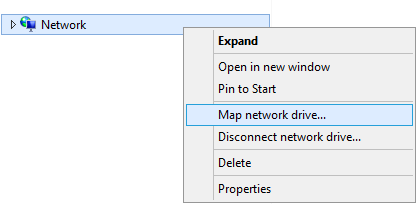

---

copyright:
  years:  2019
lastupdated: "2019-07-10"

keywords: mount SMB share, SMB, Active Directory, AD, access network share, connect to network share

subcollection: mass-data-migration

---

{:shortdesc: .shortdesc}
{:screen: .screen}
{:pre: .pre}
{:table: .aria-labeledby="caption"}
{:external: target="_blank" .external}
{:codeblock: .codeblock}
{:tip: .tip}
{:note: .note}
{:important: .important}
{:download: .download}

# Connessione alla condivisione di rete utilizzando SMB
{: #connect-smb-share}

Per prepararti per la copia dei dati, puoi accedere alla condivisione di rete sul dispositivo {{site.data.keyword.mdms_full}} utilizzando il protocollo SMB (Server Message Block).
{: shortdesc}

Prima di connetterti alla condivisione:

- Determina se hai bisogno di unire il dispositivo {{site.data.keyword.mdms_short}} ad Active Directory. Se stai montando la condivisione di rete su un server Windows che è unito ad Active Directory, devi anche [unire il dispositivo al dominio Active Directory](#use-active-directory) prima di poterti connettere alla condivisione.
- Determina se il tuo ambiente richiede la firma SMB. L'unione del dispositivo {{site.data.keyword.mdms_short}} ad Active Directory abilita la firma SMB per impostazione predefinita. Se il tuo ambiente non ha bisogno della firma SMB, puoi [disabilitare la firma SBM sul client](/docs/infrastructure/mass-data-migration?topic=mass-data-migration-troubleshooting#unable-to-mount-smb-share) per evitare problemi di connessione e aumentare le prestazioni del tuo trasferimento dati.

## Gestione dell'accesso alla condivisione SMB
{: #manage-smb-share-access}

Per impostazione predefinita, la condivisione di rete è impostata per avere un accesso pubblico. Prima di montare la condivisione sul tuo server, puoi aggiungere le regole di accesso SMB sulla condivisione in modo corrispondente ai tuoi requisiti di ambiente o sicurezza. 

Per informazioni dettagliate sul controllo dell'accesso alle condivisioni sul dispositivo di archiviazione, vedi la [documentazione di OSNEXUS QuantaStor](https://wiki.osnexus.com/index.php?title=Network_Shares){:external}.
{: tip}

Per modificare l'accesso alla condivisione SMB:

1. [Accedi all'interfaccia utente del dispositivo](/docs/infrastructure/mass-data-migration?topic=mass-data-migration-access-ui#log-in-ui).
2. Nella procedura guidata Common Tasks, fai clic su **View Network Shares** per visualizzare la vista delle condivisioni di rete.

   
3. Chiudi la procedura guidata Common Tasks e fai quindi clic con il pulsante destro del mouse sul nome della condivisione di rete per visualizzare un elenco di opzioni. 
4. Fai clic su **Modify Share & SMB Access** per modificare l'accesso per la condivisione SMB.

    

## Utilizzo di Active Directory
{: #use-active-directory}

Se stai utilizzando SMB su un server Windows, devi gestire le autorizzazioni di accesso, la proprietà dei file e gli attributi dei file per i tuoi dati unendo il dispositivo {{site.data.keyword.mdms_short}} ad Active Directory. L'unione del dispositivo a un dominio Active Directory abilita l'accesso SMB per specifici utenti AD e gruppi AD. 

Per ulteriori informazioni sull'unione del dispositivo ad Active Directory, consulta la [documentazione di OSNEXUS QuantaStor](https://wiki.osnexus.com/index.php?title=Network_Shares#Joining_an_AD_Domain){:external}.

## Montaggio della condivisione SMB su un sistema Windows
{: #mount-smb-share}

Dopo che hai sbloccato e attivato il pool di archiviazione sul dispositivo, connettiti alla condivisione SMB utilizzando la finestra di dialogo **Connetti unità di rete** sul tuo computer Windows.

Per montare la condivisione di rete:

1. [Accedi all'interfaccia utente del dispositivo](/docs/infrastructure/mass-data-migration?topic=mass-data-migration-access-ui#log-in-ui).
2. Nella procedura guidata Common Tasks, fai clic su **View Network Shares** per visualizzare la vista delle condivisioni di rete.
3. Chiudi la procedura guidata Common Tasks e fai quindi clic con il pulsante destro del mouse sul nome della condivisione di rete per visualizzare un elenco di opzioni. 
4. Fai clic su **View Mount Command** per esaminare le informazioni di montaggio per la condivisione.
5. Esegui il ping dell'indirizzo IP elencato nella finestra di dialogo per testare la connettività di rete tra il tuo computer e il dispositivo {{site.data.keyword.mdms_short}}.

   Assicurati che l'indirizzo IP corrisponda alla [porta di trasferimento dati da 10GbE](/docs/infrastructure/mass-data-migration?topic=mass-data-migration-device-overview#network-settings) sul dispositivo.
   {: note} 
6. Da Esplora file, fai clic con il pulante destro del mouse su **Rete** e seleziona quindi **Connetti unità di rete** per aprire la finestra di dialogo Connetti unità di rete.

   
7. Immetti l'indirizzo IP che hai testato nel passo 1 e fai clic su **Sfoglia**.

   
8. Dall'elenco di cartelle di rete, seleziona la condivisione {{site.data.keyword.mdms_short}}. Fai clic su **OK** per confermare.
9. Fai clic su **Fine** per montare la condivisione sul tuo server di origine.

    Se sei in grado di eseguire il ping dell'indirizzo IP ma non sei in grado di montare la condivisione, è probabile che la firma SMB sia abilitata per il tuo client Windows. Valuta la [disabilitazione della firma SMB](/docs/infrastructure/mass-data-migration?topic=mass-data-migration-troubleshooting#unable-to-mount-smb-share) sul client e riprova.
    {: tip} 

## Passi successivi
{: #connect-smb-share-next-steps}

- Avvia il [processo di copia dei dati](/docs/infrastructure/mass-data-migration?topic=mass-data-migration-copy-data).
