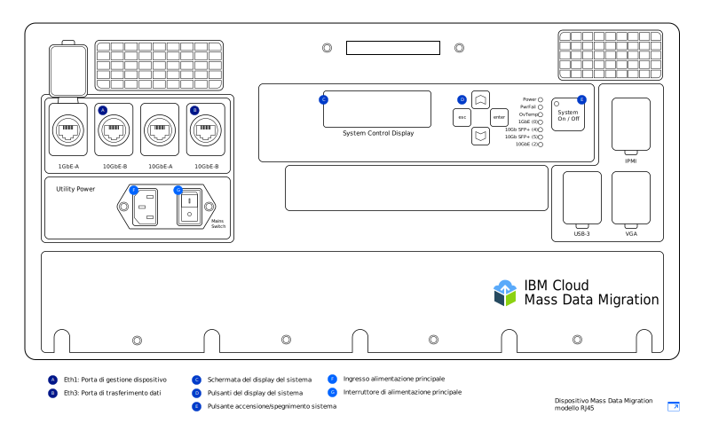

---

copyright:
  years:  2019
lastupdated: "2019-07-10"

keywords: device models, device ports, network settings, configure network  

subcollection: mass-data-migration

---

{:new_window: target="_blank"}
{:shortdesc: .shortdesc}
{:screen: .screen}
{:pre: .pre}
{:external: target="_blank" .external}
{:table: .aria-labeledby="caption"}
{:codeblock: .codeblock}
{:tip: .tip}
{:note: .note}
{:important: .important}
{:download: .download}

# Panoramica del dispositivo
{: #device-overview}

{{site.data.keyword.mdms_full}} fornisce un dispositivo di archiviazione preconfigurato e portatile che viene spedito presso la tua ubicazione per una facile migrazione dei tuoi dati.
{: shortdesc}

Utilizza questa pagina per ulteriori informazioni sulle opzioni di configurazione di rete per il tuo dispositivo {{site.data.keyword.mdms_short}}.

## Modelli di dispositivo
{: #device-models}

Il tuo dispositivo {{site.data.keyword.mdms_short}} arriva preconfigurato e pronto per la connessione alla tua rete. 

La seguente immagine mostra le aree principali del dispositivo.

{{site.data.keyword.cloud_notm}} fornisce due modelli di dispositivo {{site.data.keyword.mdms_short}}. Ogni modello viene fornito con [fibre ottiche e adattatori](/docs/infrastructure/mass-data-migration?topic=mass-data-migration-inventory-checklists) che supportano entrambe le connessioni in rame RJ45 e SFP+. 

<table>
  <tr>
    <th>Modello di dispositivo</th>
    <th>Descrizione</th>
  </tr>
  <tr>
    <td>
<a href="/docs/infrastructure/mass-data-migration?topic=mass-data-migration-connect-device#set-up-RJ45-model">RJ45</a>
</td>
    <td>
      <ul>
        <li>Supporta in modo nativo la connettività Ethernet utilizzando i connettori RJ45.</li>
        <li>Comprende gli adattatori e le fibre ottiche che abilitano il supporto in rame SFP+.</li>
      </ul>
    </td>
  </tr>
  <tr>
    <td>
<a href="/docs/infrastructure/mass-data-migration?topic=mass-data-migration-connect-device#set-up-SFP+-model">RJ45 / SFP+</a>
</td>
    <td>
      <ul>
        <li>Supporta in modo nativo entrambe le connessioni in rame RJ45 e SFP+.</li>
      </ul>
    </td>
  </tr>
  <caption style="caption-side:bottom;">Tabella 1. Descrive i modelli di dispositivo {{site.data.keyword.mdms_short}} supportati</caption>
</table>

Entrambi i modelli dispositivo offrono la stessa funzionalità ma le istruzioni di cablaggio sono differenti per ogni modello. Quando ricevi il tuo dispositivo {{site.data.keyword.mdms_short}}, assicurati di identificare il modello di dispositivo in modo da seguire le istruzioni che corrispondono al tuo tipo di dispositivo.  

I dispositivi {{site.data.keyword.mdms_short}} utilizzano un [cavo di alimentazione C13](https://en.wikipedia.org/wiki/IEC_60320){: external}. Se stai utilizzando il dispositivo al di fuori degli Stati Uniti, potresti aver bisogno di un adattatore di alimentazione aggiuntivo compatibile con il sistema di spine e prese che viene utilizzato nel tuo Paese. I dispositivi {{site.data.keyword.mdms_short}} sono compatibili con tutte le gamme di potenza standard.
{: note}

## Porte dispositivo 
{: #network-settings}

I dispositivi {{site.data.keyword.mdms_short}} sono configurati per due connessioni Ethernet. La prima connessione si occupa della gestione del dispositivo eseguendo un'interfaccia utente basata sul web e la seconda connessione si occupa dello spostamento dei dati tra il dispositivo e il tuo server di origine.

<dl>
    <dt>Porta di gestione del dispositivo</dt>
        <dd>Puoi gestire il dispositivo {{site.data.keyword.mdms_short}} utilizzando un'interfaccia dispositivo locale e basata sul web a cui accedi sul tuo computer remoto. La porta di gestione del dispositivo sul dispositivo {{site.data.keyword.mdms_short}} fornisce l'accesso amministrativo all'IU. Per eseguire l'interfaccia utente, connetti il tuo computer alla porta di gestione del dispositivo sul dispositivo e fai quindi riferimento all'indirizzo IP corrispondente nel tuo browser.</dd>
    <dt>Porta di trasferimento dati</dt>
        <dd>La porta di trasferimento dati gestisce lo spostamento dei dati dal tuo sistema di archiviazione al dispositivo {{site.data.keyword.mdms_short}}. La porta viene eseguita alla velocità di 10GbE.</dd>
        <dd>
La configurazione di un gateway sia sulla porta di gestione del dispositivo che sulla porta di trasferimento dati non è supportata. Se devi configurare l'instradamento sulla porta di trasferimento dati aggiungendo un gateway (non consigliato), devi anche essere in grado di raggiungere l'indirizzo IP per la porta di trasferimento dati dal tuo browser per eseguire l'interfaccia utente del dispositivo.
</dd>
</dl>

## Impostazioni di rete
{: #network-settings}

I dispositivi {{site.data.keyword.mdms_short}} sono configurati per la tua rete in base alle impostazioni che specifichi quando richiedi il dispositivo. Quando richiedi un dispositivo, puoi specificare la tua configurazione di rete in base ai seguenti scenari:

<dl>
    <dt>Configurazione comune</dt>
        <dd>Nella maggior parte dei casi, i dispositivi {{site.data.keyword.mdms_short}} dono configurati designando la porta da 1GbE sul dispositivo per la gestione del dispositivo e utilizzando la porta da 10GbE per il trasferimento dei dati Per la porta di gestione del dispositivo, specifichi l'indirizzo IP statico, la maschera di rete e il gateway predefinito per il tuo computer remoto. Per la porta di trasferimento dati, fornisci l'indirizzo IP statico e la maschera di rete per il server con un gateway e una porta di dati da 10GbE sulla stessa sottorete dell'origine dati. Ciò è rappresentato nel modulo di ordine.</dd>
    <dt>Configurazione facoltativa</dt>
        <dd>Puoi anche utilizzare solo la porta da 10GbE sul dispositivo per entrambe le connessioni di spostamento dei dati e di gestione del dispositivo. Quando richiedi un dispositivo {{site.data.keyword.mdms_short}}, puoi specificare la configurazione nel modulo di ordine fornendo un indirizzo IP statico, una maschera di rete e un indirizzo gateway uguali per entrambe le porte di gestione e di dati. Il dispositivo viene fornito con la porta da 10GbE configurata con le tue informazioni IP, compreso un gateway.</dd>
</dl>
