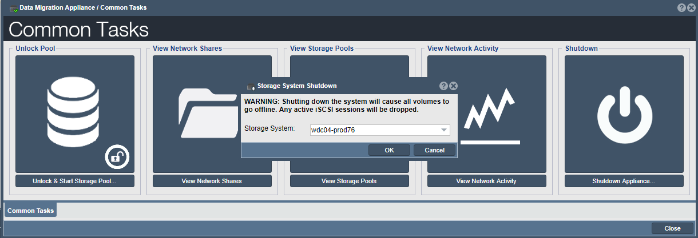

---

copyright:
  years:  2019
lastupdated: "2019-07-10"

keywords: return device, ship device, disconnect device, shipping label

subcollection: mass-data-migration

---
{:new_window: target="_blank"}
{:shortdesc: .shortdesc}
{:screen: .screen}
{:pre: .pre}
{:table: .aria-labeledby="caption"}
{:external: target="_blank" .external}
{:codeblock: .codeblock}
{:tip: .tip}
{:note: .note}
{:important: .important}
{:download: .download}

# Restituzione del dispositivo
{: #return-device}

Per completare il processo di migrazione, spegni e restituisci il tuo dispositivo {{site.data.keyword.mdms_full}} a {{site.data.keyword.cloud_notm}}.
{: shortdesc}

## Disconnessione del dispositivo
{: #disconnect-device}

Una volta completato il processo di copia dei dati, puoi spegnere il sistema normalmente, in modo non forzato.

1. Nella procedura guidata Common Tasks, fai clic su **Shutdown Appliance**.

    

    Fai clic su **OK** per confermare.
2. Spegni il dispositivo utilizzando il pulsante **System On / Off** sul dispositivo. 
3. Imposta **Mains Switch** su **Off**.
4. Avvolgi e rimetti tutti i cavi e i cavi ottici negli appositi spazi all'interno del contenitore di trasporto.

## Spedizione del dispositivo a {{site.data.keyword.cloud_notm}}
{: #ship-device}

Prepara la tua etichetta di spedizione e informa il tuo spedizioniere quando sei pronto a restituire il dispositivo.

1. Recupera l'elenco di inventario e l'etichetta di spedizione di restituzione per il dispositivo. Questi documenti si trovano sotto il coperchio del contenitore di trasporto.

    Se stai spedendo più dispositivi, tieni presente che l'etichetta di spedizione di restituzione fornita in ciascun contenitore è specifica per il dispositivo di archiviazione. Prima di pianificare un ritiro con uno spedizioniere, assicurati che l'etichetta di spedizione di restituzione corrispondente sia apposta al dispositivo appropriato.
    {: note}
2. Utilizza l'elenco di inventario per verificare che tutti i cavi e i cavi ottici siano stati rimessi e conservati nel contenitore di trasporto.
3. Rimetti l'elenco di inventario nel contenitore di trasporto e usa quindi le istruzioni elencate sull'etichetta di spedizione di restituzione per apporre l'etichetta al dispositivo.
4. Pianifica un ritiro con il tuo spedizioniere e restituisci il dispositivo al data center.

    Quando il dispositivo viene restituito a {{site.data.keyword.cloud_notm}}, lo stato dell'ordine viene modificato in _Device received_ nella pagina dei dettagli della richiesta {{site.data.keyword.mdms_short}}.

## Passi successivi
{: #return-device-next-steps}

- Controlla lo stato del tuo ordine [gestendo la tua richiesta {{site.data.keyword.mdms_short}}](/docs/infrastructure/mass-data-migration?topic=mass-data-migration-manage-request).
- Prima di eliminare i dati dal tuo server di origine, [verifica che i dati siano stati caricati correttamente su {{site.data.keyword.cloud_notm}}](/docs/infrastructure/mass-data-migration?topic=mass-data-migration-verify-data).

