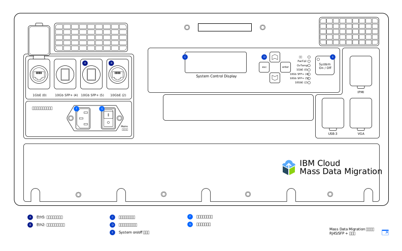

---

copyright:
  years:  2019
lastupdated: "2019-07-10"

keywords: set up device, connect device, cable device

subcollection: mass-data-migration

---

{:shortdesc: .shortdesc}
{:screen: .screen}
{:pre: .pre}
{:table: .aria-labeledby="caption"}
{:external: target="_blank" .external}
{:codeblock: .codeblock}
{:tip: .tip}
{:note: .note}
{:important: .important}
{:download: .download}

# デバイスの接続
{: #connect-device}

{{site.data.keyword.mdms_full}} デバイスは、事前構成され、ネットワークに接続する準備が整った状態で到着します。
{: shortdesc}

{{site.data.keyword.mdms_short}} デバイスの電源を入れる前に、以下のことを行います。

- デバイスが室温の状態であることを確認します。
- デバイスに結露がないことを確認します。
- 配送用ケースの蓋の裏側にあるインベントリー・リストを確認して、[デバイス・モデル](/docs/infrastructure/mass-data-migration?topic=mass-data-migration-device-overview)に対応するケーブルがあることを確認します。
- 不注意による損傷を回避するため、デバイスの使用中はデバイスをポータブル・ケースに入れたままにします。

## デバイスの電源を入れる
{: #power-on-device}

デバイスを配置したら、提供されている電源コードを使用して、デバイスの電源を入れます。

1. 配送用ケースの蓋の裏側にある電源コードを取り出します。
2. 電源コードをデバイスのインレットに接続してから、プラグを電源ソケットに接続します。
3. **Mains スイッチ**を**オン**に設定します。
4. **System On / Off** ボタンを使用して、デバイスの電源を入れます。

   _System Control Display_ 画面にシステム ID 値が表示されたら、デバイスの電源がオンであり、次の手順の準備ができています。

## ネットワーク設定の確認
{: #review-network-settings}

デバイスでネットワーク構成を確認してから、デバイスをネットワークに接続できます。デバイスの _System Control Display_ 画面を使用して、ネットワーク・ポートの IP 設定を表示および管理します。 

_System Control Display_ 画面と対話するには、**△**、**▽**、**esc**、および **enter** の各ボタンを使用してカーソルを移動します。**enter** でメニューが表示され、**esc** で終了します。
{: tip}

IP アドレスまたはサブネット・マスクを編集するには、以下のようにします。

1. 「ネットワーク構成 (Network Config)」メニューで**△**と**▽**の各ボタンを使用して、変更するポートを選択します。**enter** を押します。
2. **「IP アドレス」**を選択し、**△**と**▽**の各ボタンを使用して、新しい IP アドレスを設定します。

   一度に 1 文字進むには、**enter** を押します。一度に 1 文字戻るには、**esc** を押します。
3. **esc** を押して、前のメニューに戻ります。
4. **「更新...」**に移動して **enter** を押すと、設定が保存されます。

## ネットワークへのデバイスの接続
{: #connect-device}

デバイスをネットワークに接続するには、2 つのイーサネット接続を構成する必要があります。 1 つはブラウザーでデバイスを管理するための接続で、もう 1 つはソース・データが配置されている同じサブネットでデータを移動するための接続です。

受け取る [{{site.data.keyword.mdms_short}} デバイス・モデル](/docs/infrastructure/mass-data-migration?topic=mass-data-migration-device-overview#mass-data-migration-device-models)に応じて、デバイスのイーサネット接続を構成します。 

### RJ45 モデルのセットアップ
{: #set-up-RJ45-model}

RJ45 デバイス・モデルは、RJ45 コネクターを使用してイーサネット接続をネイティブにサポートします。

<a href="https://{DomainName}/docs/api/content/mass-data-migration/images/mdms-device-rj45.svg">
  
</a>

提供されている CAT6A イーサネット・ケーブルを使用して、ストレージ・システムをデバイス上の RJ45 ネットワーク・ポートに接続できます。 SFP+ 銅線のサポートを有効にする必要がある場合は、提供されているアダプターを使用します。 このアダプターは、すべてのメーカーのスイッチに対応しています。 このアダプターは、配送用コンテナーの蓋の裏側にあるポケットに入っています。

以下の表は、デバイス上の物理ポートが、UI に表示されるポートにどのようにマップされるかを示しています。

| デバイス・ポート | イーサネット・タイプ  |  説明 |
| --- | --- | --- | --- |
| Eth1 | 1GbE | Eth1 ポートは、デバイスを管理し、Web ベースの UI をデータ・サブネット外で使用できるようにするために使用します。 ゲートウェイ情報を表示するには、デバイスの電源がオンになった後、_System Control Display_ 画面を使用します。 |
| Eth3 | 10GbE | Eth3 ポートは、ストレージ・システムのデータを {{site.data.keyword.mdms_short}} デバイスに転送するために使用します。 この接続は、ソース・データと同じサブネットで行う必要がありますが、サーバーに直接接続することも可能です。 |
{: caption="表 2. {{site.data.keyword.mdms_short}} デバイス・ポートの UI 表示へのマップの説明" caption-side="top"}

RJ45 デバイス・モデルをネットワークに接続するには、以下のようにします。

1. 配送用ケースの蓋から CAT6A ケーブルを取り出します。
2. CAT6A ケーブルをデバイスの Eth3 (`10GbE-B`) ポートに接続します。
3. CAT6A ケーブルを SFP+ アダプターに接続します。
4. CAT6A ケーブルを 10Gb イーサネット・スイッチに接続します。
5. Web ブラウザーを開いて、以下の URL にナビゲートします。

   ```
   https://<your_Eth3_IP_address>
   ```
   {: codeblock}

   `<your_Eth3_IP_address>` を Eth3 ネットワーク・ポート用に構成された IP アドレスで置き換えます。 IP アドレスを確認するには、デバイスの _System Control Display_ 画面を確認します。
6. オプション: IP アドレスに到達できない場合は、CAT6A ケーブルをデバイスの Eth1 (`1GbE-B`) ポートに接続し、以下の URL にナビゲートして再試行します。
   
   ```
   https://<your_Eth1_IP_address>
   ```
   {: codeblock}

   `<your_Eth1_IP_address>` を Eth1 ネットワーク・ポート用に構成された IP アドレスで置き換えます。 IP アドレスを確認するには、デバイスの _System Control Display_ 画面を確認します。

   Eth3 または Eth1 の IP 設定を変更する必要がある場合は、[ネットワーク設定の確認](#review-network-settings)を参照してください。
   {: tip}

### RJ45/SFP+ モデルのセットアップ
{: #set-up-SFP+-model}

RJ45/SFP+ デバイス・モデルは、RJ45 接続と SFP+ 銅線接続の両方をネイティブにサポートします。 

<a href="https://{DomainName}/docs/api/content/mass-data-migration/images/mdms-device-sfp.svg">
  
</a>

提供されている CAT6A ケーブルと SFP+ ケーブルを使用して、ストレージ・システムをデバイス上のネットワーク・ポートに接続できます。
以下の表は、デバイス上の物理ポートが、UI に表示されるポートにどのようにマップされるかを示しています。

| デバイス・ポート | イーサネット・タイプ  |  説明 |
| --- | --- | --- | --- |
| Eth5 | 10GbE (SFP+) | Eth5 ポートは、ストレージ・システムのデータを {{site.data.keyword.mdms_short}} に転送するために使用します。 このポートは、デバイスの管理にも使用できます。 このポートは、10GbE の速度でのみ動作します。 |
| Eth2 | 10GbE | Eth2 ポートは、デバイスを管理し、Web ベースの UI をデータ・サブネット外で使用できるようにするために使用します。 このポートは、データ転送にも使用できます。 この接続は、ソース・データと同じサブネットで行う必要がありますが、サーバーに直接接続することも可能です。 このポートは、1GbE または 10GbE のいずれかの速度で動作します。 |
{: caption="表 3. {{site.data.keyword.mdms_short}} デバイス・ポートの UI 表示へのマップの説明" caption-side="top"}

RJ45/SFP+ デバイス・モデルをネットワークに接続するには、以下のようにします。

1. 配送用ケースの蓋から SFP+ 銅線ケーブルを取り出します。
2. SFP+ ケーブルをデバイスの Eth5 (`10GbE (5)`) ポートに接続します。
3. SFP+ ケーブルを 10Gb イーサネット・スイッチに接続します。
4. Web ブラウザーを開いて、以下の URL にナビゲートします。

   ```
   https://<your_Eth5_IP_address>
   ```
   {: codeblock}

   `<your_Eth5_IP_address>` を Eth5 ネットワーク・ポート用に構成された IP アドレスで置き換えます。 IP アドレスを確認するには、デバイスの _System Control Display_ 画面を確認します。
5. オプション: IP アドレスに到達できない場合は、SFP+ ケーブルをデバイスの Eth2 (`10GbE-B` または `1GbE-B`) ポートに接続し、以下の URL にナビゲートして再試行します。
   
   ```
   https://<your_Eth2_IP_address>
   ```
   {: codeblock}

   `<your_Eth2_IP_address>` を Eth2 ネットワーク・ポート用に構成された IP アドレスで置き換えます。 IP アドレスを確認するには、デバイスの _System Control Display_ 画面を確認します。

   Eth3 または Eth1 の IP 設定を変更する必要がある場合は、[ネットワーク設定の確認](/docs/infrastructure/mass-data-migration?topic=mass-data-migration-connect-device#review-network-settings)を参照してください。
   {: tip}

## 次のステップ
{: #set-up-device-next-steps}

- [Web ベースの UI を実行](/docs/infrastructure/mass-data-migration?topic=mass-data-migration-access-ui)して、デバイスと対話します。
- データ・コピー・プロセスの準備をするには、まず、[デバイス上のストレージ・プールをアンロック](/docs/infrastructure/mass-data-migration?topic=mass-data-migration-unlock-storage-pool)します。
