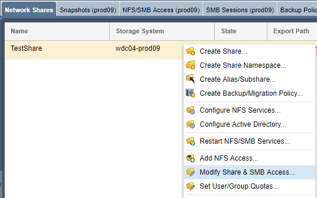

---

copyright:
  years:  2019
lastupdated: "2019-07-10"

keywords: mount SMB share, SMB, Active Directory, AD, access network share, connect to network share

subcollection: mass-data-migration

---

{:shortdesc: .shortdesc}
{:screen: .screen}
{:pre: .pre}
{:table: .aria-labeledby="caption"}
{:external: target="_blank" .external}
{:codeblock: .codeblock}
{:tip: .tip}
{:note: .note}
{:important: .important}
{:download: .download}

# SMB を使用したネットワーク共有への接続
{: #connect-smb-share}

データ・コピーの準備をするには、Server Message Block (SMB) プロトコルを使用して {{site.data.keyword.mdms_full}} デバイス上のネットワーク共有にアクセスします。
{: shortdesc}

共有に接続する前に、以下のことを行います。

- {{site.data.keyword.mdms_short}} デバイスを Active Directory に結合する必要があるかどうかを判別します。 Active Directory に結合された Windows サーバーにネットワーク共有をマウントする場合は、共有に接続する前に[デバイスを Active Directory ドメインに結合する](#use-active-directory)必要もあります。
- ご使用の環境で SMB 署名が必要かどうかを判別します。 {{site.data.keyword.mdms_short}} デバイスを Active Directory に結合すると、デフォルトで SMB 署名が有効になります。 ご使用の環境で SMB 署名が不要な場合は、[クライアントで SMB 署名を無効にして](/docs/infrastructure/mass-data-migration?topic=mass-data-migration-troubleshooting#unable-to-mount-smb-share)、接続の問題を回避し、データ転送のパフォーマンスを向上させることができます。

## SMB 共有アクセスの管理
{: #manage-smb-share-access}

デフォルトでは、ネットワーク共有は公開アクセスを持つように設定されています。 共有をサーバーにマウントする前に、ご使用の環境またはセキュリティー要件に合わせて、共有に SMB アクセス規則を追加できます。 

ストレージ・デバイスの共有へのアクセスの制御について詳しくは、[OSNEXUS QuantaStor の資料](https://wiki.osnexus.com/index.php?title=Network_Shares){:external}を参照してください。
{: tip}

SMB 共有のアクセス権限を変更するには、以下のようにします。

1. [デバイス・ユーザー・インターフェースにログインします](/docs/infrastructure/mass-data-migration?topic=mass-data-migration-access-ui#log-in-ui)。
2. 「共通タスク」ウィザードで**「ネットワーク共有の表示 (View Network Shares)」**をクリックすると、ネットワーク共有のビューが表示されます。

   
3. 「共通タスク」ウィザードを閉じてから、ネットワーク共有名を右クリックすると、オプションのリストが表示されます。 
4. **「共有と SMB アクセスの変更 (Modify Share & SMB Access)」**をクリックして、SMB 共有のアクセス権限を変更します。

    

## Active Directory の使用
{: #use-active-directory}

Windows サーバーで SMB を使用する場合は、{{site.data.keyword.mdms_short}} デバイスを Active Directory に結合すると、データのアクセス許可、ファイル所有権、およびファイル属性を管理できます。デバイスを Active Directory ドメインに結合すると、特定の AD ユーザーおよび AD グループに対する SMB アクセスが可能になります。 

デバイスの Active Directory への結合について詳しくは、[OSNEXUS QuantaStor の資料](https://wiki.osnexus.com/index.php?title=Network_Shares#Joining_an_AD_Domain){:external}を参照してください。

## Windows システムでの SMB 共有のマウント
{: #mount-smb-share}

デバイスのストレージ・プールをアンロックしてアクティブ化した後に、ご使用の Windows コンピューターの**「ネットワーク ドライブの割り当て」**ダイアログを使用して、SMB 共有に接続します。

ネットワーク共有をマウントするには、以下のようにします。

1. [デバイス・ユーザー・インターフェースにログインします](/docs/infrastructure/mass-data-migration?topic=mass-data-migration-access-ui#log-in-ui)。
2. 「共通タスク」ウィザードで**「ネットワーク共有の表示 (View Network Shares)」**をクリックすると、ネットワーク共有のビューが表示されます。
3. 「共通タスク」ウィザードを閉じてから、ネットワーク共有名を右クリックすると、オプションのリストが表示されます。 
4. **「マウント・コマンドの表示 (View Mount Command)」**をクリックして、共有のマウント情報を確認します。
5. ダイアログ・ボックスにリストされている IP アドレスに ping して、ご使用のコンピューターと {{site.data.keyword.mdms_short}} デバイスの間のネットワーク接続をテストします。

   IP アドレスがデバイスの [10GbE データ転送ポート](/docs/infrastructure/mass-data-migration?topic=mass-data-migration-device-overview#network-settings)に対応していることを確認します。
   {: note} 
6. エクスプローラーで**「ネットワーク」**を右クリックし、**「ネットワーク ドライブの割り当て」**を選択して、「ネットワーク ドライブの割り当て」ダイアログを開きます。

   
7. 手順 1 でテストした IP アドレスを入力し、**「参照」**をクリックします。

   
8. ネットワーク・フォルダーのリストから {{site.data.keyword.mdms_short}} 共有を選択します。 **「OK」**をクリックして確認します。
9. **「完了」**をクリックすると、ソース・サーバーに共有がマウントされます。

    IP アドレスに ping できるのに共有をマウントできない場合は、Windows クライアントで SMB 署名が有効になっている可能性があります。 クライアントで [SMB 署名を無効にする](/docs/infrastructure/mass-data-migration?topic=mass-data-migration-troubleshooting#unable-to-mount-smb-share)ことを検討し、再試行してください。
    {: tip} 

## 次のステップ
{: #connect-smb-share-next-steps}

- [データ・コピー・プロセス](/docs/infrastructure/mass-data-migration?topic=mass-data-migration-copy-data)を開始します。
