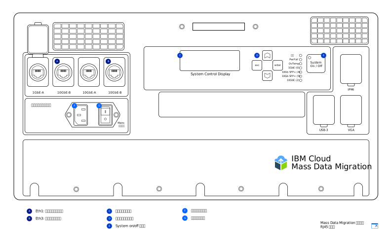

---

copyright:
  years:  2019
lastupdated: "2019-07-10"

keywords: device models, device ports, network settings, configure network  

subcollection: mass-data-migration

---

{:new_window: target="_blank"}
{:shortdesc: .shortdesc}
{:screen: .screen}
{:pre: .pre}
{:external: target="_blank" .external}
{:table: .aria-labeledby="caption"}
{:codeblock: .codeblock}
{:tip: .tip}
{:note: .note}
{:important: .important}
{:download: .download}

# デバイスの概要
{: #device-overview}

{{site.data.keyword.mdms_full}} は、データを簡単にマイグレーションできるように配送場所に輸送される事前構成されたポータブル・ストレージ・デバイスを提供します。
{: shortdesc}

このページでは、{{site.data.keyword.mdms_short}} デバイスのネットワーク構成オプションについて説明します。

## デバイス・モデル
{: #device-models}

{{site.data.keyword.mdms_short}} デバイスは、事前構成され、ネットワークに接続する準備が整った状態で届きます。 

以下の図は、デバイスのメイン領域を示しています。

{{site.data.keyword.cloud_notm}} では、2 つの {{site.data.keyword.mdms_short}} デバイス・モデルを提供しています。 各モデルには、RJ45 接続と SFP+ 銅線接続の両方をサポートする[光学とアダプター](/docs/infrastructure/mass-data-migration?topic=mass-data-migration-inventory-checklists)がパッケージされています。 

<table>
  <tr>
    <th>デバイス・モデル</th>
    <th>説明</th>
  </tr>
  <tr>
    <td>
<a href="/docs/infrastructure/mass-data-migration?topic=mass-data-migration-connect-device#set-up-RJ45-model">RJ45</a>
</td>
    <td>
      <ul>
        <li>RJ45 コネクターを使用してイーサネット接続をネイティブにサポートします。</li>
        <li>SFP+ 銅線サポートを可能にするアダプターおよび光学が含まれています。</li>
      </ul>
    </td>
  </tr>
  <tr>
    <td>
<a href="/docs/infrastructure/mass-data-migration?topic=mass-data-migration-connect-device#set-up-SFP+-model">RJ45/SFP+</a>
</td>
    <td>
      <ul>
        <li>RJ45 接続と SFP+ 銅線接続の両方をネイティブにサポートします。</li>
      </ul>
    </td>
  </tr>
  <caption style="caption-side:bottom;">表 1. サポートされる {{site.data.keyword.mdms_short}} デバイス・モデルの説明</caption>
</table>

どちらのデバイス・モデルも同じ機能を提供しますが、ケーブル接続の手順がモデルごとに異なります。 {{site.data.keyword.mdms_short}} デバイスを受け取ったら、デバイス・モデルを特定して、デバイス・タイプに対応した手順に従います。  

{{site.data.keyword.mdms_short}} デバイスでは、[C13 電源コード](https://en.wikipedia.org/wiki/IEC_60320){: external}を使用します。 米国以外でこのデバイスを使用する場合は、その国で使用されているプラグとソケットのシステムに対応した追加の電源アダプターが必要な場合があります。 {{site.data.keyword.mdms_short}} デバイスは、標準的なすべての電力範囲に対応しています。
{: note}

## デバイス・ポート 
{: #network-settings}

{{site.data.keyword.mdms_short}} デバイスは、2 つのイーサネット接続用に構成されています。1 つの接続では Web ベースのユーザー・インターフェースを実行してデバイス管理を処理し、もう 1 つの接続ではデバイスとソース・サーバーの間のデータ移動を処理します。

<dl>
    <dt>デバイス管理ポート</dt>
        <dd>{{site.data.keyword.mdms_short}} デバイスを管理するには、リモート・コンピューターで使用する Web ベースのローカル・デバイス・インターフェースを使用します。 {{site.data.keyword.mdms_short}} デバイスのデバイス管理ポートは、UI への管理アクセスを提供します。ユーザー・インターフェースを実行するには、コンピューターをデバイスのデバイス管理ポートに接続し、対応する IP アドレスをブラウザーで参照します。</dd>
    <dt>データ転送ポート</dt>
        <dd>データ転送ポートは、ストレージ・システムから {{site.data.keyword.mdms_short}} デバイスへのデータ移動を処理します。 このポートは、10GbE の速度で動作します。 </dd>
        <dd>
デバイス管理ポートとデータ転送ポートの両方でのゲートウェイの構成は、サポートされていません。 ゲートウェイを追加してデータ転送ポートでルーティングを構成する必要がある場合 (非推奨)、デバイス・ユーザー・インターフェースを実行するには、ブラウザーからデータ転送ポートの IP アドレスにもアクセスできる必要があります。
</dd>
</dl>

## ネットワーク設定
{: #network-settings}

{{site.data.keyword.mdms_short}} デバイスは、デバイスを要求するときに指定した設定に従って、ご使用のネットワーク用に構成されます。デバイスを要求するとき、以下のシナリオに従ってネットワーク構成を指定できます。

<dl>
    <dt>一般的な構成</dt>
        <dd>ほとんどの場合、{{site.data.keyword.mdms_short}} デバイスは、デバイス管理のためにデバイス上に 1GbE ポートを指定し、データ転送に 10GbE ポートを使用することによって構成されます。 デバイス管理ポートには、静的 IP アドレス、ネットマスク、およびリモート・コンピューターのデフォルト・ゲートウェイを指定します。 データ転送ポートには、ゲートウェイを持つサーバーの静的 IP アドレスとネットマスク、およびデータ・ソースと同じサブネット上の 10GbE データ・ポートを指定します。 これは注文フォームで表されます。</dd>
    <dt>オプション構成</dt>
        <dd>データ移動接続とデバイス管理接続の両方で、デバイスの 10GbE ポートのみを使用することもできます。{{site.data.keyword.mdms_short}} > デバイスを要求するとき、この構成を注文フォームで指定する場合は、管理ポートとデータ・ポートの両方に、同じ静的 IP アドレス、ネットマスク、およびゲートウェイ・アドレスを指定します。デバイスは、到着時点で、ゲートウェイを含め、ご使用の IP 情報で構成された 10GbE ポートを備えています。</dd>
</dl>
