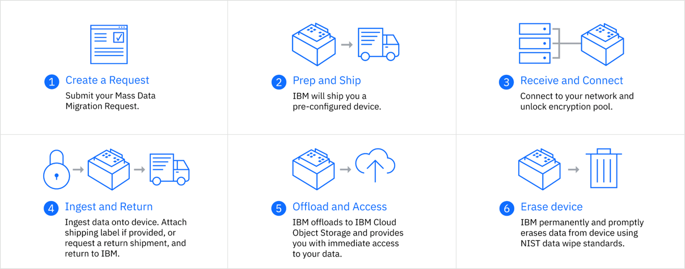

---

copyright:
  years: 2017, 2019
lastupdated: "2019-07-10"

keywords: data transfer, data migration, transfer data to cloud, migrate data, migrate data to cloud, Mass Data Migration

subcollection: mass-data-migration

---

{:shortdesc: .shortdesc}
{:screen: .screen}
{:pre: .pre}
{:table: .aria-labeledby="caption"}
{:external: target="_blank" .external}
{:codeblock: .codeblock}
{:tip: .tip}
{:note: .note}
{:important: .important}
{:download: .download}

# {{site.data.keyword.mdms_short}} 정보
{: #about}

{{site.data.keyword.mdms_full}}은 테라바이트에서 페타바이트에 이르는 데이터를 {{site.data.keyword.cloud_notm}}로 실제로 전송하는 빠르고 간단하며 안전한 방법입니다.
{: shortdesc}

## {{site.data.keyword.mdms_short}}을 사용해야 하는 이유
{: #use-cases}

{{site.data.keyword.mdms_short}}은 데이터를 쉽게 마이그레이션할 수 있도록 사전 구성된 휴대용 스토리지 디바이스를 제공하므로 이 서비스를 사용하면 클라우드 탐색을 단순화할 수 있습니다. 다음 동영상에서 {{site.data.keyword.mdms_short}} 기능 및 유스 케이스에 대한 자세한 정보를 볼 수 있습니다. 

<iframe class="embed-responsive-item" id="youtubeplayer" title="대량 데이터 마이그레이션은 데이터를 IBM Cloud로 전송할 수 있는 빠르고 간단하며 안전한 방법을 제공합니다." type="text/html" width="100%" height="390" src="//www.youtube.com/embed/eNSlUoswvss?rel=0" frameborder="0" webkitallowfullscreen mozallowfullscreen allowfullscreen> </iframe>

| 유스 케이스 |설명 |
| --- | --- |
|클라우드로 데이터 마이그레이션 | 온프레미스 저장 공간 해제를 원하든, 비활성 데이터의 아카이브를 원하든 또는 중복성과 복구를 위한 데이터 백업을 원하든, 이 모든 경우에 {{site.data.keyword.mdms_short}}은 사용자의 데이터를 클라우드로 빠르고 안전하게 이동시킬 수 있습니다. |
|데이터 센터 해체 | 데이터 센터의 크기를 줄이거나 확장하거나 재배치할 때 데이터 센터 변환을 시작하고 {{site.data.keyword.mdms_short}}을 사용하여 민감한 데이터를 클라우드로 안전하게 이동합니다. |
|제한된 대역폭 | {{site.data.keyword.mdms_short}}은 원격 위치에 있거나 네트워크상 데이터 전송 옵션이 너무 비싸거나 너무 느리거나 사용할 수 없을 경우 훌륭한 대안이 됩니다. |
{: caption="표 1. {{site.data.keyword.mdms_short}} 유스 케이스 설명" caption-side="top"}

[당사의 데이터 마이그레이션 솔루션을 탐색](https://www.ibm.com/cloud/data-migration)하여 {{site.data.keyword.cloud_notm}}에서 데이터 마이그레이션 옵션을 비교할 수 있습니다. {{site.data.keyword.mdms_short}} 기능 및 이점에 대한 자세한 정보는 [{{site.data.keyword.mdms_short}} 제품 페이지](https://www.ibm.com/cloud/mass-data-migration){: external}를 확인하십시오.
{: tip}

## 작동 방식
{: #how-it-works}

{{site.data.keyword.mdms_short}}은 120TB 가용 용량의 스토리지 디바이스를 사용하여 클라우드로의 데이터 이동을 신속하게 처리하고 높은 비용, 긴 전송 시간, 보안 문제와 같은 일반적인 전송 문제를 해결합니다. 

다음 그림은 {{site.data.keyword.mdms_short}} 프로세스에 대해 설명합니다. 

## 서비스 컴포넌트
{: #service-componenets}

{{site.data.keyword.mdms_short}}은 다음과 같은 서비스 컴포넌트로 구성됩니다. 

<dl>
   <dt>{{site.data.keyword.mdms_short}} 대시보드</dt>
      <dd>{{site.data.keyword.mdms_short}} 주문은 <a href="https://control.softlayer.com/" target="_blank" class="external">{{site.data.keyword.slportal}}</a>의 서비스 대시보드에서 작성하고 추적할 수 있습니다. {{site.data.keyword.mdms_short}} 요청 페이지에서는 디바이스에 대한 네트워크 구성 설정을 지정하고, 디바이스 로그인에 필요한 인증 정보를 검색하며, 주문 상태를 추적할 수 있습니다. </dd>
   <dt>{{site.data.keyword.mdms_short}} 디바이스</dt>
      <dd>{{site.data.keyword.mdms_short}}은 사용자의 지역으로 배송되는 <a href="/docs/infrastructure/mass-data-migration?topic=mass-data-migration-device-overview">휴대용 스토리지 디바이스</a>를 제공합니다. {{site.data.keyword.mdms_short}} 디바이스는 사전 구성되고 네트워크에 연결할 준비가 된 상태로 제공됩니다. </dd>
   <dt>디바이스 사용자 인터페이스</dt>
      <dd><a href="/docs/infrastructure/mass-data-migration?topic=mass-data-migration-access-ui">디바이스 사용자 인터페이스</a>는 {{site.data.keyword.mdms_short}} 디바이스에서 네트워크 공유에 액세스하는 데 사용되는 웹 기반의 로컬 UI입니다. 이 UI는 많은 대용량 파일을 {{site.data.keyword.cloud_notm}}에 복사 및 전송할 수 있도록 하는 다양한 기능의 파일 및 네트워크 소프트웨어를 기반으로 합니다. </dd>
</dl>

