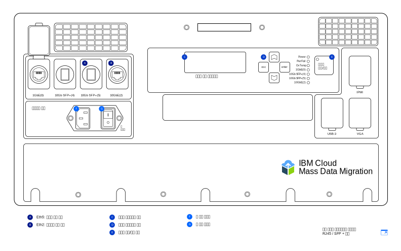

---

copyright:
  years:  2019
lastupdated: "2019-07-10"

keywords: set up device, connect device, cable device

subcollection: mass-data-migration

---

{:shortdesc: .shortdesc}
{:screen: .screen}
{:pre: .pre}
{:table: .aria-labeledby="caption"}
{:external: target="_blank" .external}
{:codeblock: .codeblock}
{:tip: .tip}
{:note: .note}
{:important: .important}
{:download: .download}

# 디바이스 연결
{: #connect-device}

{{site.data.keyword.mdms_full}} 디바이스는 사전 구성되고 네트워크에 연결할 준비가 된 상태로 제공됩니다.
{: shortdesc}

{{site.data.keyword.mdms_short}} 디바이스를 켜기 전에 다음을 수행하십시오. 

- 디바이스가 실온에 있는지 확인하십시오. 
- 디바이스에 응결 현상이 없는지 확인하십시오. 
- 운송용 케이스 덮개 아래에 있는 인벤토리 목록을 검토하여 [디바이스 모델](/docs/infrastructure/mass-data-migration?topic=mass-data-migration-device-overview)과 일치하는 케이블을 받았는지 확인하십시오. 
- 디바이스가 부주의하게 손상되는 것을 방지하려면 디바이스가 사용 중인 동안 디바이스를 휴대용 케이스에 보관하십시오. 

## 디바이스 켜기
{: #power-on-device}

디바이스를 배치한 후 제공된 전원 코드를 사용하여 디바이스를 켜십시오. 

1. 운송용 케이스 덮개 아래에 있는 전원 코드를 꺼내십시오. 
2. 디바이스의 유입구에 전원 코드를 연결한 후 플러그를 전원 소켓에 연결하십시오. 
3. **주 스위치**를 **켜짐**으로 설정하십시오. 
4. **시스템 켜기/끄기** 단추를 사용하여 디바이스를 켜십시오. 

   _시스템 제어 디스플레이_ 화면에 시스템 ID 값이 표시되면 디바이스 전원이 켜지고 다음 단계를 수행할 준비가 된 것입니다. 

## 네트워크 설정 검토
{: #review-network-settings}

디바이스를 네트워크에 연결하기 전에 디바이스의 네트워크 구성을 검토할 수 있습니다. 디바이스의 _시스템 제어 디스플레이_ 화면을 사용하여 네트워크 포트의 IP 설정을 확인하고 관리하십시오.  

_시스템 제어 디스플레이_ 화면과 상호작용하려면 **△**, **▽**, **esc** 및 **Enter** 단추를 사용하여 커서를 이동하십시오. **Enter**를 누르면 메뉴가 시작되며 **esc**를 누르면 메뉴가 종료됩니다.
{: tip}

IP 주소 또는 서브넷 마스크를 편집하려면 다음을 수행하십시오. 

1. 네트워크 구성 메뉴에서 **△** 및 **▽** 단추를 사용하여 수정할 포트를 선택하십시오. **Enter** 키를 누르십시오. 
2. **IP 주소**를 선택한 후 **△** 및 **▽** 단추를 사용하여 새 IP 주소를 설정하십시오. 

   한 번에 한 문자 앞으로 이동하려면 **Enter** 키를 누르십시오. 한 번에 한 문자 뒤로 이동하려면 **esc** 키를 누르십시오. 
3. **esc** 키를 눌러 이전 메뉴로 돌아가십시오. 
4. **업데이트...**로 이동한 후 **Enter** 키를 눌러 설정을 저장하십시오. 

## 네트워크에 디바이스 연결
{: #connect-device}

네트워크에 디바이스를 연결하려면 이더넷 연결을 두 개 구성해야 합니다. 첫 번째 연결은 브라우저를 통한 디바이스 관리용으로 사용되고, 두 번째 연결은 소스 데이터가 있는 동일한 서브넷에서 데이터 이동용으로 사용됩니다.

받은 [{{site.data.keyword.mdms_short}} 디바이스 모델](/docs/infrastructure/mass-data-migration?topic=mass-data-migration-device-overview#mass-data-migration-device-models)에 따라 디바이스에 대한 이더넷 연결을 구성하십시오.  

### RJ45 모델 설정
{: #set-up-RJ45-model}

RJ45 디바이스 모델은 기본적으로 RJ45 커넥터를 사용하여 이더넷 연결을 지원합니다. 

<a href="https://{DomainName}/docs/api/content/mass-data-migration/images/mdms-device-rj45.svg">
  
</a>

제공된 CAT6A 이더넷 케이블을 사용하여 디바이스의 RJ45 네트워크 포트에 스토리지 시스템을 연결할 수 있습니다. SFP+ 구리선 지원을 사용해야 하는 경우 제공된 어댑터를 사용하십시오. 어댑터는 모든 스위치 제조업체와 호환 가능합니다. 어댑터는 운송 컨테이너 덮개의 아래쪽 포켓에 있습니다. 

다음 표는 디바이스의 실제 포트가 UI에 표시되는 포트에 맵핑되는 방식을 보여줍니다. 

| 디바이스 포트 | 이더넷 유형 |설명 |
| --- | --- | --- | --- |
| Eth1 | 1GbE | Eth1 포트는 디바이스를 관리하고 웹 기반 UI를 데이터 서브넷 외부에서 사용할 수 있도록 설정하는 데 사용됩니다. 게이트웨이 정보는 디바이스 전원이 켜진 후 _시스템 제어 디스플레이_ 화면에서 확인할 수 있습니다. |
| Eth3 | 10GbE | Eth3 포트는 스토리지 시스템의 데이터를 {{site.data.keyword.mdms_short}} 디바이스로 전송하는 데 사용됩니다. 연결은 소스 데이터와 동일한 서브넷에 있거나 서버에 직접 연결되어 있어야 합니다. |
{: caption="표 2. {{site.data.keyword.mdms_short}} 디바이스 포트가 UI 디스플레이에 맵핑되는 방식을 설명합니다. " caption-side="top"}

RJ45 디바이스 모델을 네트워크에 연결하려면 다음을 수행하십시오. 

1. 운송용 케이스 덮개에서 CAT6A 케이블을 꺼내십시오. 
2. CAT6A 케이블을 디바이스의 Eth3(`10GbE-B`) 포트에 연결하십시오. 
3. CAT6A 케이블을 SFP+ 어댑터에 연결하십시오. 
4. CAT6A 케이블을 10Gb 이더넷 스위치에 연결하십시오. 
5. 웹 브라우저를 열고 다음 URL로 이동하십시오. 

   ```
   https://<your_Eth3_IP_address>
   ```
   {: codeblock}

   `<your_Eth3_IP_address>`를 Eth3 네트워크 포트에 대해 구성된 IP 주소로 대체하십시오. IP 주소를 보려면 디바이스에서 _시스템 제어 디스플레이_ 화면을 확인하십시오. 
6. 선택사항: 해당 IP 주소에 연결할 수 없는 경우, CAT6A 케이블을 디바이스의 Eth1(`1GbE-B`) 포트에 연결한 후 다음 URL로 이동하여 다시 시도하십시오. 
   
   ```
   https://<your_Eth1_IP_address>
   ```
   {: codeblock}

   `<your_Eth1_IP_address>`를 Eth1 네트워크 포트에 대해 구성된 IP 주소로 대체하십시오. IP 주소를 보려면 디바이스에서 _시스템 제어 디스플레이_ 화면을 확인하십시오. 

   Eth3 또는 Eth1의 IP 설정을 수정해야 하는 경우 [네트워크 설정 검토](#review-network-settings)를 참조하십시오.
   {: tip}

### RJ45 / SFP+ 모델 설정
{: #set-up-SFP+-model}

RJ45 / SFP+ 디바이스 모델은 기본적으로 RJ45 및 SFP+ 구리선 연결을 모두 지원합니다.  

<a href="https://{DomainName}/docs/api/content/mass-data-migration/images/mdms-device-sfp.svg">
  
</a>

제공된 CAT6A 및 SFP+ 케이블을 사용하여 디바이스의 네트워크 포트에 스토리지 시스템을 연결할 수 있습니다.
다음 표는 디바이스의 실제 포트가 UI에 표시되는 포트에 맵핑되는 방식을 보여줍니다. 

| 디바이스 포트 | 이더넷 유형 |설명 |
| --- | --- | --- | --- |
| Eth5 | 10GbE(SFP+) | Eth5 포트는 스토리지 시스템의 데이터를 {{site.data.keyword.mdms_short}}으로 전송하는 데 사용됩니다. 이 포트는 또한 디바이스를 관리하는 데도 사용할 수 있습니다. 이 포트는 10GbE 속도로만 실행됩니다. |
| Eth2 | 10GbE | Eth2 포트는 디바이스를 관리하고 웹 기반 UI를 데이터 서브넷 외부에서 사용할 수 있도록 설정하는 데 사용됩니다. 이 포트는 데이터 전송에도 사용할 수 있습니다. 연결은 소스 데이터와 동일한 서브넷에 있거나 서버에 직접 연결되어 있어야 합니다. 이 포트는 1GbE 또는 10GbE의 속도로 실행할 수 있습니다. |
{: caption="표 3. {{site.data.keyword.mdms_short}} 디바이스 포트가 UI 디스플레이에 맵핑되는 방식을 설명합니다. " caption-side="top"}

RJ45 / SFP+ 디바이스 모델을 네트워크에 연결하려면 다음을 수행하십시오. 

1. 운송용 케이스 덮개에서 SFP+ 구리선 케이블을 꺼내십시오. 
2. SFP+ 케이블을 디바이스의 Eth5(`10GbE (5)`) 포트에 연결하십시오. 
3. SFP+ 케이블을 10Gb 이더넷 스위치에 연결하십시오. 
4. 웹 브라우저를 열고 다음 URL로 이동하십시오. 

   ```
   https://<your_Eth5_IP_address>
   ```
   {: codeblock}

   `<your_Eth5_IP_address>`를 Eth5 네트워크 포트에 대해 구성된 IP 주소로 대체하십시오. IP 주소를 보려면 디바이스에서 _시스템 제어 디스플레이_ 화면을 확인하십시오. 
5. 선택사항: 해당 IP 주소에 연결할 수 없는 경우, SFP+ 케이블을 디바이스의 Eth2(`10GbE-B` 또는 `1GbE-B`) 포트에 연결한 후 다음 URL로 이동하여 다시 시도하십시오. 
   
   ```
   https://<your_Eth2_IP_address>
   ```
   {: codeblock}

   `<your_Eth2_IP_address>`를 Eth2 네트워크 포트에 대해 구성된 IP 주소로 대체하십시오. IP 주소를 보려면 디바이스에서 _시스템 제어 디스플레이_ 화면을 확인하십시오. 

   Eth3 또는 Eth1의 IP 설정을 변경해야 하는 경우 [네트워크 설정 검토](/docs/infrastructure/mass-data-migration?topic=mass-data-migration-connect-device#review-network-settings)를 참조하십시오.
   {: tip}

## 다음 단계
{: #set-up-device-next-steps}

- [웹 기반 UI를 실행](/docs/infrastructure/mass-data-migration?topic=mass-data-migration-access-ui)하여 디바이스와 상호작용합니다. 
- 데이터 복사 프로세스를 준비하기 위해 먼저 [디바이스에서 스토리지 풀을 잠금 해제](/docs/infrastructure/mass-data-migration?topic=mass-data-migration-unlock-storage-pool)합니다. 
