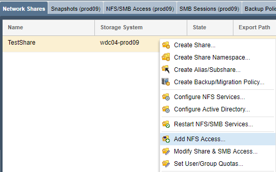

---

copyright:
  years:  2019
lastupdated: "2019-07-10"

keywords: mount NFS share, NFS, access network share, connect to network share

subcollection: mass-data-migration

---

{:shortdesc: .shortdesc}
{:screen: .screen}
{:pre: .pre}
{:table: .aria-labeledby="caption"}
{:external: target="_blank" .external}
{:codeblock: .codeblock}
{:tip: .tip}
{:note: .note}
{:important: .important}
{:download: .download}

# NFS를 사용하여 네트워크 공유에 연결
{: #connect-nfs-share}

데이터 복사를 준비하기 위해 NFS(Network File System) 프로토콜을 사용하여 {{site.data.keyword.mdms_full}} 디바이스에서 네트워크 공유에 액세스할 수 있습니다.
{: shortdesc}

공유에 연결하기 전에 다음을 수행하십시오. 

- NFS 소프트웨어(예: `nfs-common`)가 클라이언트에 설치되어 있는지 확인하십시오. 터미널 세션에서 `sudo apt install nfs-common`을 실행하면 `nfs-common` 패키지를 설치할 수 있습니다. 

## NFS 공유에 대한 액세스 관리
{: #manage-nfs-share-access}

기본적으로 네트워크 공유는 공용 액세스 권한을 갖도록 설정됩니다. 공유를 서버에 마운트하기 전에 사용자의 환경 또는 보안 요구사항에 맞도록 공유에 대한 NFS 액세스 규칙을 추가할 수 있습니다.  

스토리지 디바이스에서 공유 액세스 제어에 대한 자세한 정보는 [OSNEXUS QuantaStor 문서](https://wiki.osnexus.com/index.php?title=Network_Shares){:external}를 참조하십시오.
{: tip}

NFS 공유 액세스를 수정하려면 다음을 수행하십시오. 

1. [디바이스 사용자 인터페이스에 로그인하십시오](/docs/infrastructure/mass-data-migration?topic=mass-data-migration-access-ui#log-in-ui). 
2. 공통 태스크 마법사에서 **네트워크 공유 보기**를 클릭하여 네트워크 공유 보기를 표시하십시오. 

   
3. 공통 태스크 마법사를 닫은 후 네트워크 공유 이름을 마우스 오른쪽 단추로 클릭하여 옵션 목록을 확인하십시오.  
4. **NFS 액세스 추가**를 클릭하여 NFS 공유에 대한 액세스를 수정하십시오. 

    

## Unix 시스템에서 NFS 공유 마운트
{: #mount-nfs-share}

디바이스에서 스토리지 풀을 잠금 해제하고 활성화한 후에는 {{site.data.keyword.mdms_short}} 디바이스 사용자 인터페이스를 사용하여 Unix 기반 시스템에서 NFS 공유에 연결할 수 있습니다. 

네트워크 공유를 마운트하려면 다음을 수행하십시오.  

1. [디바이스 사용자 인터페이스에 로그인하십시오](/docs/infrastructure/mass-data-migration?topic=mass-data-migration-access-ui#log-in-ui). 
2. 공통 태스크 마법사에서 **네트워크 공유 보기**를 클릭하여 네트워크 공유 보기를 표시하십시오. 
3. 공통 태스크 마법사를 닫은 후 네트워크 공유 이름을 마우스 오른쪽 단추로 클릭하여 옵션 목록을 확인하십시오.  
4. **마운트 명령 보기**를 클릭하여 공유에 대한 마운트 정보를 검토하십시오. 

    다음 그림은 예제 값이 포함된 마운트 명령 보기 대화 상자를 보여줍니다. 

    

    _네트워크 포트_ 값은 {{site.data.keyword.mdms_short}} 디바이스의 데이터 전송 포트와 일치합니다. _마운트 명령_ 값은 공유를 마운트하고 공유에 연결하는 데 사용되는 명령을 지정합니다.
5. 대화 상자에 나열된 IP 주소에 대해 ping을 실행하여 컴퓨터와 {{site.data.keyword.mdms_short}} 디바이스 간 네트워크 연결을 테스트하십시오. 

   IP 주소가 디바이스의 [10GbE 데이터 전송 포트](/docs/infrastructure/mass-data-migration?topic=mass-data-migration-device-overview#network-settings)와 일치하는지 확인하십시오.
   {: note}  
6. 대화 상자에 나열된 마운트 명령을 복사한 후 컴퓨터의 터미널 세션에 붙여넣으십시오. 
7. 명령을 실행하여 공유를 서버에 마운트하십시오. 

## 다음 단계
{: #connect-nfs-share-next-steps}

- [데이터 복사 프로세스](/docs/infrastructure/mass-data-migration?topic=mass-data-migration-copy-data)를 시작하십시오. 
