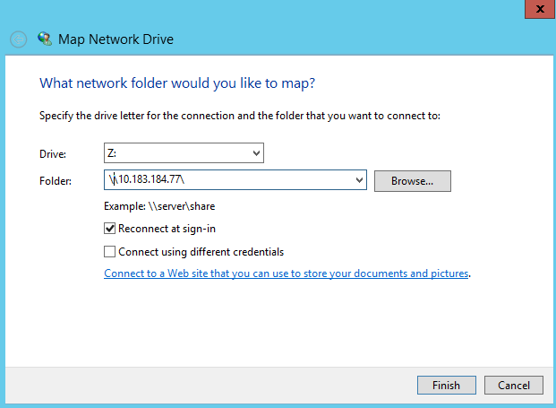

---

copyright:
  years:  2019
lastupdated: "2019-07-10"

keywords: mount SMB share, SMB, Active Directory, AD, access network share, connect to network share

subcollection: mass-data-migration

---

{:shortdesc: .shortdesc}
{:screen: .screen}
{:pre: .pre}
{:table: .aria-labeledby="caption"}
{:external: target="_blank" .external}
{:codeblock: .codeblock}
{:tip: .tip}
{:note: .note}
{:important: .important}
{:download: .download}

# SMB를 사용하여 네트워크 공유에 연결
{: #connect-smb-share}

데이터 복사를 준비하기 위해 SMB(Server Message Block) 프로토콜을 사용하여 {{site.data.keyword.mdms_full}} 디바이스에서 네트워크 공유에 액세스할 수 있습니다.
{: shortdesc}

공유에 연결하기 전에 다음을 수행하십시오. 

- {{site.data.keyword.mdms_short}} 디바이스를 Active Directory에 가입시켜야 하는지 판별하십시오. 네트워크 공유를 Active Directory에 가입된 Windows 서버에 마운트하는 경우 먼저 [디바이스를 Active Directory 도메인에 가입시켜야](#use-active-directory) 공유에 연결할 수 있습니다. 
- 사용 환경에 SMB 서명이 필요한지 여부를 판별하십시오. {{site.data.keyword.mdms_short}} 디바이스를 Active Directory에 가입시키면 기본적으로 SMB 서명을 사용할 수 있습니다. 사용자 환경에 SMB 서명이 필요하지 않은 경우 [클라이언트에서 SMB 서명을 사용 안함으로 설정](/docs/infrastructure/mass-data-migration?topic=mass-data-migration-troubleshooting#unable-to-mount-smb-share)하면 연결 문제를 방지하고 데이터 전송 성능을 높일 수 있습니다. 

## SMB 공유 액세스 관리
{: #manage-smb-share-access}

기본적으로 네트워크 공유는 공용 액세스 권한을 갖도록 설정됩니다. 공유를 서버에 마운트하기 전에 사용자의 환경 또는 보안 요구사항에 맞도록 공유에 대한 SMB 액세스 규칙을 추가할 수 있습니다.  

스토리지 디바이스에서 공유 액세스 제어에 대한 자세한 정보는 [OSNEXUS QuantaStor 문서](https://wiki.osnexus.com/index.php?title=Network_Shares){:external}를 참조하십시오.
{: tip}

SMB 공유 액세스를 수정하려면 다음을 수행하십시오. 

1. [디바이스 사용자 인터페이스에 로그인하십시오](/docs/infrastructure/mass-data-migration?topic=mass-data-migration-access-ui#log-in-ui). 
2. 공통 태스크 마법사에서 **네트워크 공유 보기**를 클릭하여 네트워크 공유 보기를 표시하십시오. 

   
3. 공통 태스크 마법사를 닫은 후 네트워크 공유 이름을 마우스 오른쪽 단추로 클릭하여 옵션 목록을 확인하십시오.  
4. **공유 및 SMB 액세스 수정**을 클릭하여 SMB 공유에 대한 액세스를 수정하십시오. 

    

## Active Directory 사용
{: #use-active-directory}

Windows 서버에서 SMB를 사용하는 경우 {{site.data.keyword.mdms_short}} 디바이스를 Active Directory에 가입시켜 액세스 권한, 파일 소유권 및 데이터에 대한 파일 속성을 관리할 수 있습니다. 디바이스를 Active Directory 도메인에 가입시키면 특정 AD 사용자와 AD 그룹에 SMB 액세스를 사용할 수 있습니다.  

디바이스를 Active Directory에 가입시키는 방법에 대해 자세히 알아보려면 [OSNEXUS QuantaStor 문서](https://wiki.osnexus.com/index.php?title=Network_Shares#Joining_an_AD_Domain){:external}를 참조하십시오. 

## Windows 시스템에서 SMB 공유 마운트
{: #mount-smb-share}

디바이스에서 스토리지 풀을 잠금 해제하고 활성화한 후에는 Windows 컴퓨터에서 **네트워크 드라이브 연결** 대화 상자를 사용하여 SMB 공유에 연결하십시오. 

네트워크 공유를 마운트하려면 다음을 수행하십시오. 

1. [디바이스 사용자 인터페이스에 로그인하십시오](/docs/infrastructure/mass-data-migration?topic=mass-data-migration-access-ui#log-in-ui). 
2. 공통 태스크 마법사에서 **네트워크 공유 보기**를 클릭하여 네트워크 공유 보기를 표시하십시오. 
3. 공통 태스크 마법사를 닫은 후 네트워크 공유 이름을 마우스 오른쪽 단추로 클릭하여 옵션 목록을 확인하십시오.  
4. **마운트 명령 보기**를 클릭하여 공유에 대한 마운트 정보를 검토하십시오. 
5. 대화 상자에 나열된 IP 주소에 대해 ping을 실행하여 컴퓨터와 {{site.data.keyword.mdms_short}} 디바이스 간 네트워크 연결을 테스트하십시오. 

   IP 주소가 디바이스의 [10GbE 데이터 전송 포트](/docs/infrastructure/mass-data-migration?topic=mass-data-migration-device-overview#network-settings)와 일치하는지 확인하십시오.
   {: note} 
6. 파일 탐색기에서 **네트워크**를 마우스 오른쪽 단추로 클릭한 후 **네트워크 드라이브 연결**을 선택하여 네트워크 드라이브 연결 대화 상자를 여십시오. 

   
7. 1단계에서 테스트한 IP 주소를 입력하고 **찾아보기**를 클릭하십시오. 

   
8. 네트워크 폴더 목록에서 {{site.data.keyword.mdms_short}} 공유를 선택하십시오. **확인**을 클릭하여 확인하십시오. 
9. **완료**를 클릭하여 공유를 소스 서버에 마운트하십시오. 

    IP 주소에 대해 ping을 실행할 수 있지만 공유를 마운트할 수는 없는 경우 Windows 클라이언트에 대해 SMB 서명이 사용으로 설정되어 있을 수 있습니다. 클라이언트에서 [SMB 서명을 사용 안함으로 설정](/docs/infrastructure/mass-data-migration?topic=mass-data-migration-troubleshooting#unable-to-mount-smb-share)한 후 다시 시도하십시오.
    {: tip} 

## 다음 단계
{: #connect-smb-share-next-steps}

- [데이터 복사 프로세스](/docs/infrastructure/mass-data-migration?topic=mass-data-migration-copy-data)를 시작하십시오. 
