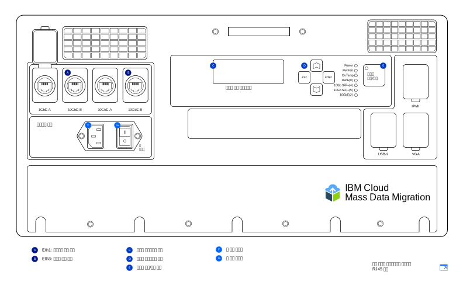

---

copyright:
  years:  2019
lastupdated: "2019-07-10"

keywords: device models, device ports, network settings, configure network  

subcollection: mass-data-migration

---

{:new_window: target="_blank"}
{:shortdesc: .shortdesc}
{:screen: .screen}
{:pre: .pre}
{:external: target="_blank" .external}
{:table: .aria-labeledby="caption"}
{:codeblock: .codeblock}
{:tip: .tip}
{:note: .note}
{:important: .important}
{:download: .download}

# 디바이스 개요
{: #device-overview}

{{site.data.keyword.mdms_full}}은 데이터를 쉽게 마이그레이션할 수 있도록 사용자의 지역으로 배송되는 사전 구성된 휴대용 스토리지 디바이스를 제공합니다.
{: shortdesc}

이 페이지에서는 {{site.data.keyword.mdms_short}} 디바이스의 네트워크 구성 옵션에 대해 학습할 수 있습니다. 

## 디바이스 모델
{: #device-models}

{{site.data.keyword.mdms_short}} 디바이스는 사전 구성되고 네트워크에 연결할 준비가 된 상태로 제공됩니다.  

다음 그림은 디바이스의 주요 부분을 보여줍니다. 

{{site.data.keyword.cloud_notm}}는 두 가지 {{site.data.keyword.mdms_short}} 디바이스 모델을 제공합니다. 각 모델은 RJ45 및 SFP+ 구리선 연결을 모두 지원하는 [광학장치 및 어댑터](/docs/infrastructure/mass-data-migration?topic=mass-data-migration-inventory-checklists)와 함께 패키징된 상태로 제공됩니다.  

<table>
  <tr>
    <th>디바이스 모델</th>
    <th>설명</th>
  </tr>
  <tr>
    <td>
<a href="/docs/infrastructure/mass-data-migration?topic=mass-data-migration-connect-device#set-up-RJ45-model">RJ45</a>
</td>
    <td>
      <ul>
        <li>기본적으로 RJ45 커넥터를 사용하여 이더넷 연결을 지원합니다. </li>
        <li>SFP+ 구리선 지원을 가능하게 하는 어댑터 및 광학장치를 포함하고 있습니다. </li>
      </ul>
    </td>
  </tr>
  <tr>
    <td>
<a href="/docs/infrastructure/mass-data-migration?topic=mass-data-migration-connect-device#set-up-SFP+-model">RJ45 / SFP+</a>
</td>
    <td>
      <ul>
        <li>기본적으로 RJ45 및 SFP+ 구리선 연결을 모두 지원합니다. </li>
      </ul>
    </td>
  </tr>
  <caption style="caption-side:bottom;">표 1. 지원되는 {{site.data.keyword.mdms_short}} 디바이스 모델 설명</caption>
</table>

두 디바이스 모델 모두 동일한 기능을 제공하지만, 케이블링 지시사항은 모델마다 다릅니다. {{site.data.keyword.mdms_short}} 디바이스를 수령할 때 디바이스 유형에 해당하는 지시사항을 따를 수 있도록 디바이스 모델을 식별해야 합니다.   

{{site.data.keyword.mdms_short}} 디바이스는 [C13 전원 코드](https://en.wikipedia.org/wiki/IEC_60320){: external}를 사용합니다. 미국 이외의 지역에서 디바이스를 사용하는 경우 해당 국가에서 사용하는 플러그 및 소켓 시스템에 맞는 전원 어댑터가 추가로 필요할 수도 있습니다. {{site.data.keyword.mdms_short}} 디바이스는 모든 표준 전원 범위와 호환 가능합니다.
{: note}

## 디바이스 포트 
{: #network-settings}

{{site.data.keyword.mdms_short}} 디바이스는 두 개의 이더넷 연결에 사용하도록 구성되었습니다. 첫 번째 연결은 웹 기반 사용자 인터페이스를 실행하여 디바이스 관리를 처리하고, 두 번째 연결은 디바이스와 소스 서버 간 데이터 이동을 처리합니다. 

<dl>
    <dt>디바이스 관리 포트</dt>
        <dd>{{site.data.keyword.mdms_short}} 디바이스는 원격 컴퓨터에서 제공하는 웹 기반의 로컬 디바이스 인터페이스를 사용하여 관리할 수 있습니다. {{site.data.keyword.mdms_short}} 디바이스의 디바이스 관리 포트는 UI에 대한 관리 액세스를 제공합니다. 사용자 인터페이스를 실행하려면 디바이스의 디바이스 관리 포트에 컴퓨터를 연결한 후 브라우저에서 해당 IP 주소를 참조하십시오. </dd>
    <dt>데이터 전송 포트</dt>
        <dd>데이터 전송 포트는 스토리지 시스템에서 {{site.data.keyword.mdms_short}} 디바이스로의 데이터 이동을 처리하는 데 사용됩니다. 이 포트는 10GbE 속도로 실행됩니다.</dd>
        <dd>
디바이스 관리 포트 및 데이터 전송 포트 모두에서 게이트웨이를 구성하는 것은 지원되지 않습니다. 게이트웨이를 추가하여 데이터 전송 포트에 대한 라우팅을 구성해야 하는 경우(권장되지 않음), 브라우저에서 데이터 전송 포트에 대한 IP 주소에 연결하여 디바이스 사용자 인터페이스를 실행할 수도 있어야 합니다. 
</dd>
</dl>

## 네트워크 설정
{: #network-settings}

{{site.data.keyword.mdms_short}} 디바이스는 사용자가 디바이스를 요청할 때 지정한 설정에 따라 네트워크용으로 구성됩니다. 디바이스를 요청할 때 다음 시나리오에 따라 네트워크 구성을 지정할 수 있습니다. 

<dl>
    <dt>공통 구성</dt>
        <dd>대부분의 경우 {{site.data.keyword.mdms_short}} 디바이스는 디바이스 관리를 위해 디바이스에 대해 1GbE 포트를 지정하고 데이터 전송을 위해 10GbE 포트를 사용하는 방식으로 구성됩니다. 디바이스 관리 포트의 경우 원격 컴퓨터의 정적 IP 주소, 넷마스크, 기본 게이트웨이를 지정하십시오. 데이터 전송 포트의 경우, 데이터 소스와 동일한 서브넷의 게이트웨이 및 10GbE 데이터 포트를 사용하는 서버의 정적 IP 주소 및 넷마스크를 제공하십시오. 이 정보는 주문 양식에 표시됩니다. </dd>
    <dt>선택적 구성</dt>
        <dd>데이터 이동 및 디바이스 관리 연결을 위해 디바이스에서 10GbE 포트만 사용할 수도 있습니다. {{site.data.keyword.mdms_short}} 디바이스를 요청할 때 관리 및 데이터 포트에 대해 동일한 정적 IP 주소, 넷마스크 및 게이트웨이 주소를 제공하여 주문 양식에 이 구성을 지정할 수 있습니다. 디바이스는 게이트웨이를 비롯한 IP 정보로 구성된 10GbE 포트가 포함된 상태로 제공됩니다. </dd>
</dl>
