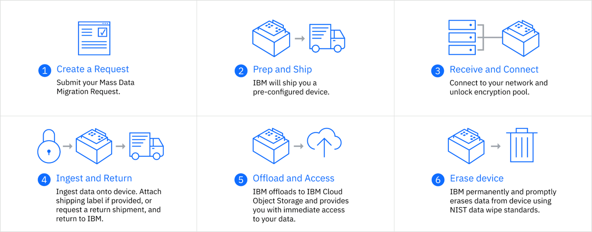

---

copyright:
  years: 2017, 2019
lastupdated: "2019-07-10"

keywords: data transfer, data migration, transfer data to cloud, migrate data, migrate data to cloud, Mass Data Migration

subcollection: mass-data-migration

---

{:shortdesc: .shortdesc}
{:screen: .screen}
{:pre: .pre}
{:table: .aria-labeledby="caption"}
{:external: target="_blank" .external}
{:codeblock: .codeblock}
{:tip: .tip}
{:note: .note}
{:important: .important}
{:download: .download}

# Sobre o {{site.data.keyword.mdms_short}}
{: #about}

O {{site.data.keyword.mdms_full}} é uma maneira rápida, simples e segura de transferir fisicamente de terabytes até petabytes de dados para o {{site.data.keyword.cloud_notm}}.
{: shortdesc}

## Por que escolher o {{site.data.keyword.mdms_short}}?
{: #use-cases}

O {{site.data.keyword.mdms_short}} ajuda a simplificar sua jornada para a nuvem, fornecendo um dispositivo de armazenamento pré-configurado e móvel para uma migração fácil de dados. Saiba mais sobre os recursos e os casos de uso do {{site.data.keyword.mdms_short}} no vídeo a seguir.

<iframe class="embed-responsive-item" id="youtubeplayer" title="O Mass Data Migration fornece uma maneira rápida, simples e segura de transferir dados para o IBM Cloud" type="text/html" width="100%" height="390" src="//www.youtube.com/embed/eNSlUoswvss?rel=0" frameborder="0" webkitallowfullscreen mozallowfullscreen allowfullscreen> </iframe>

| Casos de uso| Descrição |
| --- | --- |
| Migrando dados para a nuvem | Caso deseje liberar espaço de armazenamento local, arquivar dados inativos ou fazer backup de dados para a redundância e a recuperação, o {{site.data.keyword.mdms_short}} pode mover seus dados com rapidez e segurança para a nuvem. |
| Desatribuição do data center | Comece rapidamente a transformação de seu data center e use o {{site.data.keyword.mdms_short}} para mover seus dados confidenciais com segurança para a nuvem, à medida que você reduz, expande ou realoca seu data center. |
| Largura da banda limitada | O {{site.data.keyword.mdms_short}} é uma ótima alternativa se você está em um local remoto ou acha que as opções de transferência de dados pela rede são muito caras, lentas ou indisponíveis. |
{: caption="Tabela 1. Descreve os casos de uso do {{site.data.keyword.mdms_short}} " caption-side="top"}

É possível comparar suas opções de migração de dados no {{site.data.keyword.cloud_notm}} [explorando nossas soluções de migração de dados](https://www.ibm.com/cloud/data-migration). Para saber mais sobre os recursos e os benefícios do {{site.data.keyword.mdms_short}}, confira a [Página do produto {{site.data.keyword.mdms_short}}](https://www.ibm.com/cloud/mass-data-migration){: external}.
{: tip}

## Como ele funciona
{: #how-it-works}

O {{site.data.keyword.mdms_short}} usa dispositivos de armazenamento com capacidade utilizável de 120 TB para acelerar a movimentação de dados para a nuvem e superar desafios comuns de transferência, tais como altos custos, tempos de transferência longos e preocupações com segurança.

A imagem a seguir descreve o processo do {{site.data.keyword.mdms_short}}.

## Componentes de serviço
{: #service-componenets}

O {{site.data.keyword.mdms_short}} engloba os componentes de serviço a seguir.

<dl>
   <dt>Painel do {{site.data.keyword.mdms_short}}</dt>
      <dd>É possível criar e rastrear pedidos do {{site.data.keyword.mdms_short}} no painel de serviços no <a href="https://control.softlayer.com/" target="_blank" class="external">{{site.data.keyword.slportal}}</a>. Na página de solicitação do {{site.data.keyword.mdms_short}}, você especifica suas definições de configuração de rede para o dispositivo, recupera as credenciais para efetuar login no dispositivo e rastreia o status do seu pedido. </dd>
   <dt>Dispositivo {{site.data.keyword.mdms_short}}</dt>
      <dd>O {{site.data.keyword.mdms_short}} fornece um <a href="/docs/infrastructure/mass-data-migration?topic=mass-data-migration-device-overview">dispositivo de armazenamento móvel</a> que é enviado para o seu local. O dispositivo {{site.data.keyword.mdms_short}} é fornecido já pré-configurado e pronto para a conexão com sua rede.</dd>
   <dt>Interface com o usuário do dispositivo</dt>
      <dd>A <a href="/docs/infrastructure/mass-data-migration?topic=mass-data-migration-access-ui">interface com o usuário do dispositivo</a> é uma IU local baseada na web usada para acessar o compartilhamento de rede no dispositivo {{site.data.keyword.mdms_short}}. A IU é baseada em um software maduro de rede e arquivo que permite que muitos arquivos grandes sejam copiados e transportados para o {{site.data.keyword.cloud_notm}}.</dd>
</dl>

