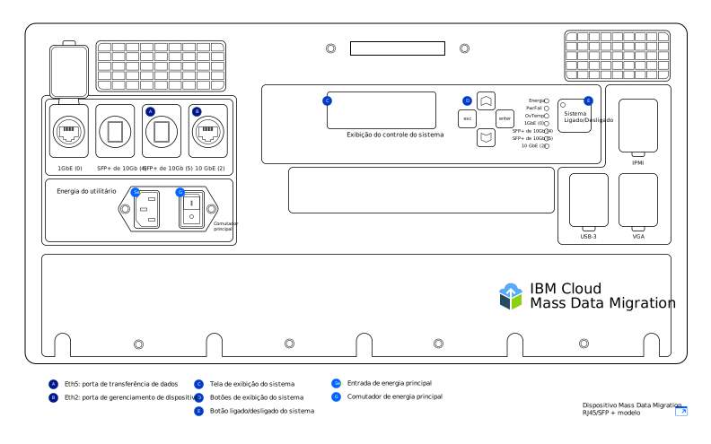

---

copyright:
  years:  2019
lastupdated: "2019-07-10"

keywords: set up device, connect device, cable device

subcollection: mass-data-migration

---

{:shortdesc: .shortdesc}
{:screen: .screen}
{:pre: .pre}
{:table: .aria-labeledby="caption"}
{:external: target="_blank" .external}
{:codeblock: .codeblock}
{:tip: .tip}
{:note: .note}
{:important: .important}
{:download: .download}

# Conectando o dispositivo
{: #connect-device}

Os dispositivos {{site.data.keyword.mdms_full}} são fornecidos já pré-configurados e prontos para a conexão com sua rede.
{: shortdesc}

Antes de ligar o dispositivo {{site.data.keyword.mdms_short}}:

- Certifique-se de que o dispositivo esteja na temperatura ambiente.
- Certifique-se de que não haja condensação no dispositivo.
- Verifique se você recebeu os cabos que correspondem ao seu [modelo de dispositivo](/docs/infrastructure/mass-data-migration?topic=mass-data-migration-device-overview) revendo a lista de inventário localizada sob a tampa do estojo de transporte.
- Para evitar danos inesperados ao dispositivo, mantenha-o em seu estojo móvel enquanto ele estiver em uso.

## Ligando o dispositivo
{: #power-on-device}

Depois de posicionar o dispositivo, use o cabo de energia fornecido para ligá-lo.

1. Recupere o cabo de energia localizado sob a tampa do estojo de transporte.
2. Conecte-o à entrada do dispositivo e conecte o plugue a um soquete de energia.
3. Configure o **Comutador principal** como **Ligado**.
4. Ligue o dispositivo usando o botão **Sistema ligado/desligado**.

   Quando um valor de ID do sistema é exibido na tela _Exibição do controle do sistema_, o dispositivo está ligado e pronto para a próxima etapa.

## Revisando as configurações de rede
{: #review-network-settings}

É possível revisar a configuração da rede no dispositivo antes de conectá-lo à sua rede. Visualize e gerencie as configurações de IP para suas portas de rede usando a tela _Exibição do controle do sistema_ no dispositivo. 

Para interagir com a tela _Exibição do controle do sistema_, mova o cursor usando os botões **△**, **▽**, **esc** e **enter**. **Enter** leva você a um menu e **esc** tira você dele.
{: tip}

Para editar um endereço IP ou uma máscara de sub-rede:

1. No menu Configuração de rede, use os botões **△** e **▽** para selecionar a porta que deseja modificar. Pressione **enter**.
2. Selecione **Endereço IP** e, em seguida, use os botões **△** e **▽** para configurar o novo endereço IP.

   Pressione **enter** para avançar um caractere por vez. Pressione **esc** para retroceder um caractere por vez.
3. Pressione **esc** para retornar ao menu anterior.
4. Acesse **Atualizar...** e pressione **enter** para salvar a configuração.

## Conectando o dispositivo à sua rede
{: #connect-device}

Para conectar o dispositivo à sua rede, é necessário configurar duas conexões Ethernet. A primeira conexão destina-se a gerenciar o dispositivo por meio de um navegador e a segunda destina-se a mover dados pela mesma sub-rede na qual os dados de origem estão localizados.

Configure a conectividade Ethernet para seu dispositivo com base no [modelo de dispositivo do {{site.data.keyword.mdms_short}}](/docs/infrastructure/mass-data-migration?topic=mass-data-migration-device-overview#mass-data-migration-device-models) recebido. 

### Configurando o modelo RJ45
{: #set-up-RJ45-model}

O modelo de dispositivo RJ45 suporta nativamente a conectividade Ethernet usando conectores RJ45.

<a href="https://{DomainName}/docs/api/content/mass-data-migration/images/mdms-device-rj45.svg">
  
</a>

É possível usar os cabos Ethernet CAT6A fornecidos para conectar seu sistema de armazenamento às portas de rede RJ45 no dispositivo. Se precisar ativar o suporte de cobre SFP+, use os adaptadores fornecidos. Os adaptadores são compatíveis com todos os fabricantes de comutadores. É possível localizar os adaptadores em um bolso na parte de baixo da tampa do contêiner de remessa.

A tabela a seguir mostra como as portas físicas no dispositivo são mapeadas para as portas exibidas na IU.

| Porta do dispositivo | Tipo de Ethernet  |  Descrição |
| --- | --- | --- | --- |
| Eth1 | 1 GbE | A porta Eth1 é usada para gerenciar o dispositivo e disponibilizar a IU baseada na web fora da sub-rede de dados. É possível visualizar as informações do gateway usando a tela _Exibição do controle do sistema_ depois de ligar o dispositivo. |
| Eth3 | 10 GbE | A porta Eth3 é usada para transferir dados de seu sistema de armazenamento para o dispositivo {{site.data.keyword.mdms_short}}. A conexão deve estar na mesma sub-rede que os dados de origem ou diretamente conectada ao servidor. |
{: caption="Tabela 2. Descreve como as portas do dispositivo {{site.data.keyword.mdms_short}} são mapeadas para a exibição da IU" caption-side="top"}

Para conectar o modelo de dispositivo RJ45 à sua rede:

1. Recupere o cabo CAT6A na tampa do estojo de transporte.
2. Conecte o cabo CAT6A à porta Eth3 (`10GbE-B`) no dispositivo.
3. Conecte o cabo CAT6A ao adaptador SFP+.
4. Conecte o cabo CAT6A ao seu comutador de Ethernet de 10 Gb.
5. Abra um navegador da web e navegue até a URL a seguir.

   ```
   https://<your_Eth3_IP_address>
   ```
   {: codeblock}

   Substitua `<your_Eth3_IP_address>` pelo endereço IP configurado para a porta de rede Eth3. Para visualizar o endereço IP, verifique a tela _Exibição do controle do sistema_ no dispositivo.
6. Opcional: se não conseguir acessar o endereço IP, conecte o cabo CAT6A à porta Eth1 (`1GbE-B`) no dispositivo e tente novamente navegando para a URL a seguir.
   
   ```
   https://<your_Eth1_IP_address>
   ```
   {: codeblock}

   Substitua `<your_Eth1_IP_address>` pelo endereço IP configurado para a porta de rede Eth1. Para visualizar o endereço IP, verifique a tela _Exibição do controle do sistema_ no dispositivo.

   Se for necessário modificar as configurações de IP para Eth3 ou Eth1, consulte [Revisando suas configurações de rede](#review-network-settings).
   {: tip}

### Configurando o modelo RJ45/SFP+
{: #set-up-SFP+-model}

O modelo de dispositivo RJ45/SFP+ suporta nativamente as conexões de cobre RJ45 e SFP+. 

<a href="https://{DomainName}/docs/api/content/mass-data-migration/images/mdms-device-sfp.svg">
  
</a>

É possível usar os cabos CAT6A e SFP+ fornecidos para conectar seu sistema de armazenamento às portas de rede no dispositivo.
A tabela a seguir mostra como as portas físicas no dispositivo são mapeadas para as portas exibidas na IU.

| Porta do dispositivo | Tipo de Ethernet  |  Descrição |
| --- | --- | --- | --- |
| Eth5 | 10 GbE (SFP+) | A porta Eth5 é usada para transferir dados de seu sistema de armazenamento para o {{site.data.keyword.mdms_short}}. Essa porta também pode ser usada para gerenciar o dispositivo. A porta é executada apenas na velocidade de 10 GbE. |
| Eth2 | 10 GbE | A porta Eth2 é usada para gerenciar o dispositivo e disponibilizar a IU baseada na web fora da sub-rede de dados. Essa porta também pode ser usada para a transferência de dados. A conexão deve estar na mesma sub-rede que os dados de origem ou diretamente conectada ao servidor. A porta pode funcionar em velocidades de 1 GbE ou 10 GbE. |
{: caption="Tabela 3. Descreve como as portas do dispositivo {{site.data.keyword.mdms_short}} são mapeadas para a exibição da IU" caption-side="top"}

Para conectar o modelo de dispositivo RJ45/SFP+ à sua rede:

1. Recupere o cabo de cobre SFP+ na tampa do estojo de transporte.
2. Conecte o cabo SFP+ à porta Eth5 (`10 GbE (5)`) no dispositivo.
3. Conecte o cabo SFP+ ao seu comutador de Ethernet de 10 Gb.
4. Abra um navegador da web e navegue até a URL a seguir.

   ```
   https://<your_Eth5_IP_address>
   ```
   {: codeblock}

   Substitua `<your_Eth5_IP_address>` pelo endereço IP configurado para a porta de rede Eth5. Para visualizar o endereço IP, verifique a tela _Exibição do controle do sistema_ no dispositivo.
5. Opcional: se não conseguir acessar o endereço IP, conecte o cabo SFP+ à porta Eth2 (`10GbE-B` ou `1GbE-B`) no dispositivo e tente novamente navegando para a URL a seguir.
   
   ```
   https://<your_Eth2_IP_address>
   ```
   {: codeblock}

   Substitua `<your_Eth2_IP_address>` pelo endereço IP configurado para a porta de rede Eth2. Para visualizar o endereço IP, verifique a tela _Exibição do controle do sistema_ no dispositivo.

   Se precisar mudar qualquer configuração de IP para Eth3 ou Eth1, consulte [Revisando suas configurações de rede](/docs/infrastructure/mass-data-migration?topic=mass-data-migration-connect-device#review-network-settings).
   {: tip}

## Etapas Seguintes
{: #set-up-device-next-steps}

- Interaja com o dispositivo [executando a IU baseada na web](/docs/infrastructure/mass-data-migration?topic=mass-data-migration-access-ui).
- Para se preparar para o processo de cópia de dados, comece [desbloqueando o conjunto de armazenamentos no dispositivo](/docs/infrastructure/mass-data-migration?topic=mass-data-migration-unlock-storage-pool).
