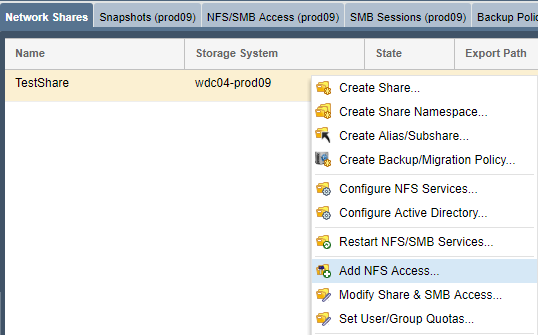

---

copyright:
  years:  2019
lastupdated: "2019-07-10"

keywords: mount NFS share, NFS, access network share, connect to network share

subcollection: mass-data-migration

---

{:shortdesc: .shortdesc}
{:screen: .screen}
{:pre: .pre}
{:table: .aria-labeledby="caption"}
{:external: target="_blank" .external}
{:codeblock: .codeblock}
{:tip: .tip}
{:note: .note}
{:important: .important}
{:download: .download}

# Conectando-se ao compartilhamento de rede usando o NFS
{: #connect-nfs-share}

Para se preparar para a cópia de dados, é possível acessar o compartilhamento de rede no dispositivo {{site.data.keyword.mdms_full}} usando o protocolo Network File System (NFS).
{: shortdesc}

Antes de se conectar ao compartilhamento:

- Verifique se você possui o software NFS, como `nfs-common`, instalado em seu cliente. É possível instalar o pacote `nfs-common` executando `sudo apt install nfs-common` em sua sessão de terminal.

## Gerenciando o acesso ao compartilhamento do NFS
{: #manage-nfs-share-access}

Por padrão, o compartilhamento de rede está configurado para ter acesso público. Antes de montar o compartilhamento em seu servidor, é possível incluir nele regras de acesso do NFS para corresponder aos seus requisitos de ambiente ou segurança. 

Para obter informações detalhadas sobre como controlar o acesso a compartilhamentos no dispositivo de armazenamento, consulte a [documentação do OSNEXUS QuantaStor](https://wiki.osnexus.com/index.php?title=Network_Shares){:external}.
{: tip}

Para modificar o acesso ao compartilhamento do NFS:

1. [Efetue login na interface com o usuário do dispositivo](/docs/infrastructure/mass-data-migration?topic=mass-data-migration-access-ui#log-in-ui).
2. No assistente Tarefas comuns, clique em **Visualizar compartilhamentos de rede** para exibir a visualização dos compartilhamentos de rede.

   
3. Feche o assistente Tarefas comuns e, em seguida, clique com o botão direito no nome do compartilhamento de rede para visualizar uma lista de opções. 
4. Clique em **Incluir acesso do NFS** para modificar o acesso para o compartilhamento do NFS.

    

## Montando o compartilhamento do NFS em um sistema Unix
{: #mount-nfs-share}

Depois de desbloquear e ativar o conjunto de armazenamentos no dispositivo, é possível se conectar ao compartilhamento do NFS em um sistema baseado em Unix usando a interface com o usuário do dispositivo {{site.data.keyword.mdms_short}}.

Para montar o compartilhamento de rede: 

1. [Efetue login na interface com o usuário do dispositivo](/docs/infrastructure/mass-data-migration?topic=mass-data-migration-access-ui#log-in-ui).
2. No assistente Tarefas comuns, clique em **Visualizar compartilhamentos de rede** para exibir a visualização dos compartilhamentos de rede.
3. Feche o assistente Tarefas comuns e, em seguida, clique com o botão direito no nome do compartilhamento de rede para visualizar uma lista de opções. 
4. Clique em **Visualizar comando de montagem** para revisar as informações de montagem do compartilhamento.

    A imagem a seguir mostra a caixa de diálogo Visualizar comando de montagem com valores de exemplo.

    

    O valor da _Porta de rede_ corresponde à porta de transferência de dados no dispositivo {{site.data.keyword.mdms_short}}. O valor do _Comando de montagem_ especifica o comando usado para montar e se conectar ao compartilhamento.
5. Faça ping do endereço IP listado na caixa de diálogo para testar a conectividade de rede entre o seu computador e o dispositivo {{site.data.keyword.mdms_short}}.

   Certifique-se de que o endereço IP corresponda à [porta de transferência de dados de 10 GbE](/docs/infrastructure/mass-data-migration?topic=mass-data-migration-device-overview#network-settings) no dispositivo.
   {: note}  
6. Copie o comando de montagem listado na caixa de diálogo e cole-o em uma sessão de terminal de seu computador.
7. Execute o comando para montar o compartilhamento para o seu servidor.

## Etapas Seguintes
{: #connect-nfs-share-next-steps}

- Inicie o [processo de cópia de dados](/docs/infrastructure/mass-data-migration?topic=mass-data-migration-copy-data).
