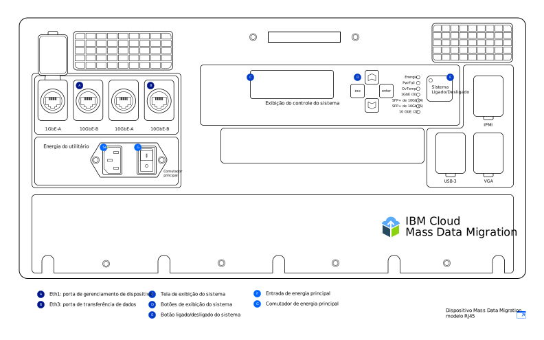

---

copyright:
  years:  2019
lastupdated: "2019-07-10"

keywords: device models, device ports, network settings, configure network  

subcollection: mass-data-migration

---

{:new_window: target="_blank"}
{:shortdesc: .shortdesc}
{:screen: .screen}
{:pre: .pre}
{:external: target="_blank" .external}
{:table: .aria-labeledby="caption"}
{:codeblock: .codeblock}
{:tip: .tip}
{:note: .note}
{:important: .important}
{:download: .download}

# Visão geral do dispositivo
{: #device-overview}

O {{site.data.keyword.mdms_full}} fornece um dispositivo de armazenamento móvel e pré-configurado que é enviado para seu local para a migração fácil de seus dados.
{: shortdesc}

Use esta página para saber mais sobre as opções de configuração de rede de seu dispositivo {{site.data.keyword.mdms_short}}.

## Modelos de dispositivo
{: #device-models}

Seu dispositivo {{site.data.keyword.mdms_short}} é fornecido já pré-configurado e pronto para a conexão com sua rede. 

A imagem a seguir mostra as principais áreas do dispositivo.

O {{site.data.keyword.cloud_notm}} fornece dois modelos de dispositivo {{site.data.keyword.mdms_short}}. Cada modelo é fornecido no pacote com [lentes e adaptadores](/docs/infrastructure/mass-data-migration?topic=mass-data-migration-inventory-checklists) que suportam as conexões de cobre RJ45 e SFP+. 

<table>
  <tr>
    <th>Modelo do dispositivo</th>
    <th>Descrição</th>
  </tr>
  <tr>
    <td>
<a href="/docs/infrastructure/mass-data-migration?topic=mass-data-migration-connect-device#set-up-RJ45-model">RJ45</a>
</td>
    <td>
      <ul>
        <li>Suporta nativamente a conectividade Ethernet usando conectores RJ45.</li>
        <li>Inclui adaptadores e lentes que permitem o suporte de cobre do SFP+.</li>
      </ul>
    </td>
  </tr>
  <tr>
    <td>
<a href="/docs/infrastructure/mass-data-migration?topic=mass-data-migration-connect-device#set-up-SFP+-model">RJ45/SFP+</a>
</td>
    <td>
      <ul>
        <li>Suporta nativamente conexões de cobre RJ45 e SFP+.</li>
      </ul>
    </td>
  </tr>
  <caption style="caption-side:bottom;">Tabela 1. Descreve os modelos de dispositivo {{site.data.keyword.mdms_short}} suportados</caption>
</table>

Os dois modelos de dispositivo oferecem a mesma funcionalidade, mas as instruções de cabeamento são diferentes para cada um. Ao receber seu dispositivo {{site.data.keyword.mdms_short}}, certifique-se de identificar o modelo de dispositivo para seguir as instruções correspondentes ao tipo de dispositivo.  

Os dispositivos {{site.data.keyword.mdms_short}} usam um [cabo de energia C13](https://en.wikipedia.org/wiki/IEC_60320){: external}. Se estiver usando o dispositivo fora dos Estados Unidos, talvez seja necessário um adaptador de energia adicional que acomode o sistema de plugue e soquete usado em seu país. Os dispositivos {{site.data.keyword.mdms_short}} são compatíveis com todos os intervalos de energia padrão.
{: note}

## Portas do dispositivo 
{: #network-settings}

Os dispositivos {{site.data.keyword.mdms_short}} são configurados para duas conexões Ethernet. A primeira conexão lida com o gerenciamento de dispositivos executando uma interface com o usuário baseada na web e a segunda lida com a movimentação de dados entre o dispositivo e seu servidor de origem.

<dl>
    <dt>Porta de gerenciamento de dispositivo</dt>
        <dd>É possível gerenciar o dispositivo {{site.data.keyword.mdms_short}} usando uma interface de dispositivo local baseada na web que é exibida em seu computador remoto. A porta de gerenciamento de dispositivo no dispositivo {{site.data.keyword.mdms_short}} fornece acesso administrativo à IU. Para executar a interface com o usuário, conecte seu computador à porta de gerenciamento de dispositivo no dispositivo e, em seguida, faça referência ao endereço IP correspondente no seu navegador.</dd>
    <dt>Porta de transferência de dados</dt>
        <dd>A porta de transferência de dados manipula a movimentação de dados de seu sistema de armazenamento para o dispositivo {{site.data.keyword.mdms_short}}. A porta é executada na velocidade de 10 GbE.</dd>
        <dd>
A configuração de um gateway na porta de gerenciamento de dispositivos e na porta de transferência de dados não é suportada. Se você precisar configurar o roteamento na porta de transferência de dados incluindo um gateway (não recomendado), também deverá acessar o endereço IP da porta de transferência de dados do navegador para executar a interface com o usuário do dispositivo.
</dd>
</dl>

## Configurações de rede
{: #network-settings}

Os dispositivos {{site.data.keyword.mdms_short}} são configurados para sua rede de acordo com as configurações especificadas ao solicitar o dispositivo. Ao solicitar um dispositivo, é possível especificar sua configuração de rede de acordo com os seguintes cenários:

<dl>
    <dt>Configuração comum</dt>
        <dd>Na maioria dos casos, os dispositivos {{site.data.keyword.mdms_short}} são configurados designando a porta de 1 GbE no dispositivo para o gerenciamento de dispositivo e usando a porta de 10 GbE para transferência de dados. Para a porta de gerenciamento de dispositivos, você especifica o endereço IP estático, a máscara de rede e o gateway padrão para o seu computador remoto. Para a porta de transferência de dados, você fornece o endereço IP estático e a máscara de rede para o servidor com um gateway e uma porta de dados de 10 GbE na mesma sub-rede que a origem de dados. Isso é representado no formulário de pedido.</dd>
    <dt>Configuração opcional</dt>
        <dd>Também é possível usar apenas a porta de 10 GbE no dispositivo para conexões de movimentação de dados e gerenciamento de dispositivos. Ao solicitar um dispositivo {{site.data.keyword.mdms_short}}, é possível especificar essa configuração no formulário de pedido fornecendo o mesmo endereço IP estático, a máscara de rede e o endereço de gateway para as portas de gerenciamento e de dados. O dispositivo é fornecido com a porta de 10 GbE configurada com suas informações de IP, incluindo um gateway.</dd>
</dl>
