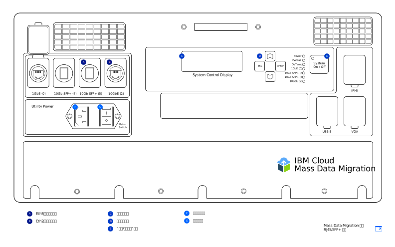

---

copyright:
  years:  2019
lastupdated: "2019-07-10"

keywords: set up device, connect device, cable device

subcollection: mass-data-migration

---

{:shortdesc: .shortdesc}
{:screen: .screen}
{:pre: .pre}
{:table: .aria-labeledby="caption"}
{:external: target="_blank" .external}
{:codeblock: .codeblock}
{:tip: .tip}
{:note: .note}
{:important: .important}
{:download: .download}

# 连接设备
{: #connect-device}

{{site.data.keyword.mdms_full}} 设备到达时已预先配置，可随时连接到网络。
{: shortdesc}

打开 {{site.data.keyword.mdms_short}} 设备的电源之前，请注意以下事项：

- 确保设备处于室温环境。
- 确保设备上没有冷凝水。
- 通过查看位于运输箱箱盖内侧的清单列表，验证是否已收到与[设备型号](/docs/infrastructure/mass-data-migration?topic=mass-data-migration-device-overview)对应的电缆。
- 为了避免无意中损坏设备，请在设备使用期间，使设备保留在便携式机箱中。

## 打开设备电源
{: #power-on-device}

设备安置到位后，请使用提供的电源线来打开设备电源。

1. 获取位于运输箱箱盖内侧的电源线。
2. 将电源线连接到设备上的插入口，然后将插头连接到电源插座。
3. 将 **Mains Switch** 设置为 **On**。
4. 使用 **System On / Off** 按钮来打开设备电源。

   _System Control Display_ 屏幕上显示“系统标识”值时，说明设备已打开电源并准备就绪，可以执行下一步。

## 查看网络设置
{: #review-network-settings}

在将设备连接到网络之前，可以先查看设备上的网络配置。使用设备上的 _System Control Display_ 屏幕来查看和管理网络端口的 IP 设置。 

要与 _System Control Display_ 屏幕进行交互，请使用 **△**、**▽**、**ESC** 键和 **Enter** 键来移动光标。按 **Enter** 键可进入菜单，按 **ESC** 键将退出。
{: tip}

要编辑 IP 地址或子网掩码，请执行以下操作：

1. 在“网络配置”菜单中，使用 **△** 和 **▽** 键来选择要修改的端口。按 **Enter** 键。
2. 选择 **IP 地址**，然后使用 **△** 和 **▽** 键来设置新的 IP 地址。

   按 **Enter** 键一次向前移动一个字符。按 **ESC** 键一次向后移动一个字符。
3. 按 **ESC** 键可返回到前一个菜单。
4. 转至**更新...**，然后按 **Enter** 键以保存设置。

## 将设备连接到网络
{: #connect-device}

要将设备连接到网络，需要配置两个以太网连接。第一个连接用于通过浏览器来管理设备，第二个连接用于在源数据所在的同一子网上移动数据。

根据收到的 [{{site.data.keyword.mdms_short}} 设备型号](/docs/infrastructure/mass-data-migration?topic=mass-data-migration-device-overview#mass-data-migration-device-models)，为设备配置以太网连接。 

### 设置 RJ45 型号
{: #set-up-RJ45-model}

RJ45 设备型号使用 RJ45 接口以本机方式支持以太网连接。

<a href="https://{DomainName}/docs/api/content/mass-data-migration/images/mdms-device-rj45.svg">
  
</a>

可以使用提供的 CAT6A 以太网电缆将存储系统连接到设备上的 RJ45 网络端口。如果需要启用 SFP+ 铜缆支持，请使用提供的适配器。适配器兼容所有交换机制造商的产品。您可以在运输箱箱盖内侧的小袋中找到适配器。

下表显示了设备上的物理端口与 UI 中所显示端口的映射关系。

|设备端口|以太网类型|描述|
| --- | --- | --- | --- |
|Eth1|1 GbE|Eth1 端口用于管理设备以及使基于 Web 的 UI 在数据子网之外可用。可以在打开设备电源后使用 _System Control Display_ 屏幕来查看网关信息。|
|Eth3|10 GbE|Eth3 端口用于将存储系统中的数据传输到 {{site.data.keyword.mdms_short}} 设备。连接必须与源数据位于同一子网上，或者必须直接连接到服务器。|
{: caption="表 2. 描述 {{site.data.keyword.mdms_short}} 设备端口与 UI 显示的映射关系" caption-side="top"}

要将 RJ45 设备型号连接到网络，请执行以下操作：

1. 从运输箱箱盖中获取 CAT6A 电缆。
2. 将 CAT6A 电缆连接到设备上的 Eth3 (`10GbE-B`) 端口。
3. 将 CAT6A 电缆连接到 SFP+ 适配器。
4. 将 CAT6A 电缆连接到 10 Gb 以太网交换机。
5. 打开 Web 浏览器，并导航至以下 URL。

   ```
   https://<your_Eth3_IP_address>
   ```
   {: codeblock}

   将 `<your_Eth3_IP_address>` 替换为针对 Eth3 网络端口配置的 IP 地址。要查看 IP 地址，请查看设备上的 _System Control Display_ 屏幕。
6. 可选：如果无法获取 IP 地址，请将 CAT6A 电缆连接到设备上的 Eth1 (`1GbE-B`) 端口，然后通过导航至以下 URL 来重试。
   
   ```
   https://<your_Eth1_IP_address>
   ```
   {: codeblock}

   将 `<your_Eth1_IP_address>` 替换为针对 Eth1 网络端口配置的 IP 地址。要查看 IP 地址，请查看设备上的 _System Control Display_ 屏幕。

   如果需要修改 Eth3 或 Eth1 的 IP 设置，请参阅[查看网络设置](#review-network-settings)。
   {: tip}

### 设置 RJ45/SFP+ 型号
{: #set-up-SFP+-model}

RJ45/SFP+ 设备型号以本机方式支持 RJ45 和 SFP+ 铜缆连接。 

<a href="https://{DomainName}/docs/api/content/mass-data-migration/images/mdms-device-sfp.svg">
  
</a>

可以使用提供的 CAT6A 和 SFP+ 电缆将存储系统连接到设备上的网络端口。下表显示了设备上的物理端口与 UI 中所显示端口的映射关系。

|设备端口|以太网类型|描述|
| --- | --- | --- | --- |
|Eth5|10 GbE (SFP+)|Eth5 端口用于将存储系统中的数据传输到 {{site.data.keyword.mdms_short}}。此端口还可用于管理设备。此端口仅以 10 GbE 速度运行。|
|Eth2|10 GbE|Eth2 端口用于管理设备以及使基于 Web 的 UI 在数据子网之外可用。此端口还可用于数据传输。连接必须与源数据位于同一子网上，或者必须直接连接到服务器。此端口能以 1 GbE 或 10 GbE 速度运行。|
{: caption="表 3. 描述 {{site.data.keyword.mdms_short}} 设备端口与 UI 显示的映射关系" caption-side="top"}

要将 RJ45/SFP+ 设备型号连接到网络，请执行以下操作：

1. 从运输箱箱盖中获取 SFP+ 铜缆。
2. 将 SFP+ 电缆连接到设备上的 Eth5 (`10GbE (5)`) 端口。
3. 将 SFP+ 电缆连接到 10 Gb 以太网交换机。
4. 打开 Web 浏览器，并导航至以下 URL。

   ```
   https://<your_Eth5_IP_address>
   ```
   {: codeblock}

   将 `<your_Eth5_IP_address>` 替换为针对 Eth5 网络端口配置的 IP 地址。要查看 IP 地址，请查看设备上的 _System Control Display_ 屏幕。
5. 可选：如果无法获取 IP 地址，请将 SFP+ 电缆连接到设备上的 Eth2（`10GbE-B` 或 `1GbE-B`）端口，然后通过导航至以下 URL 来重试。
   
   ```
   https://<your_Eth2_IP_address>
   ```
   {: codeblock}

   将 `<your_Eth2_IP_address>` 替换为针对 Eth2 网络端口配置的 IP 地址。要查看 IP 地址，请查看设备上的 _System Control Display_ 屏幕。

   如果需要更改 Eth3 或 Eth1 的任何 IP 设置，请参阅[查看网络设置](/docs/infrastructure/mass-data-migration?topic=mass-data-migration-connect-device#review-network-settings)。
   {: tip}

## 后续步骤
{: #set-up-device-next-steps}

- 通过[运行基于 Web 的 UI](/docs/infrastructure/mass-data-migration?topic=mass-data-migration-access-ui) 与设备进行交互。
- 要准备数据复制过程，请首先[解锁设备上的存储池](/docs/infrastructure/mass-data-migration?topic=mass-data-migration-unlock-storage-pool)。
