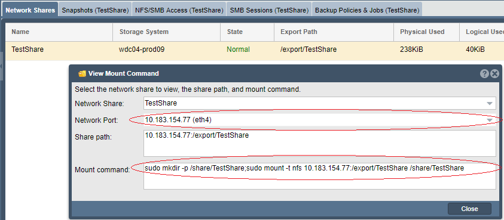

---

copyright:
  years:  2019
lastupdated: "2019-07-10"

keywords: mount NFS share, NFS, access network share, connect to network share

subcollection: mass-data-migration

---

{:shortdesc: .shortdesc}
{:screen: .screen}
{:pre: .pre}
{:table: .aria-labeledby="caption"}
{:external: target="_blank" .external}
{:codeblock: .codeblock}
{:tip: .tip}
{:note: .note}
{:important: .important}
{:download: .download}

# 使用 NFS 连接到网络共享
{: #connect-nfs-share}

要准备数据复制过程，可以使用网络文件系统 (NFS) 协议来访问 {{site.data.keyword.mdms_full}} 设备上的网络共享。
{: shortdesc}

连接到共享之前，请注意以下事项：

- 确保在客户机上安装了 NFS 软件，例如 `nfs-common`。可以通过在终端会话中运行 `sudo apt install nfs-common` 来安装 `nfs-common` 软件包。

## 管理对 NFS 共享的访问权
{: #manage-nfs-share-access}

缺省情况下，网络共享设置为具有公共访问权。在将共享安装到服务器之前，可以在共享上添加 NFS 访问规则，以匹配您的环境或安全需求。 

有关控制对存储设备上共享的访问权的详细信息，请参阅 [OSNEXUS QuantaStor 文档](https://wiki.osnexus.com/index.php?title=Network_Shares){:external}。
{: tip}

要修改 NFS 共享访问权，请执行以下操作：

1. [登录到设备用户界面](/docs/infrastructure/mass-data-migration?topic=mass-data-migration-access-ui#log-in-ui)。
2. 在“常用任务”向导中，单击**查看网络共享**以显示网络共享视图。

   
3. 关闭“常用任务”向导，然后右键单击网络共享名称以查看选项列表。 
4. 单击**添加 NFS 访问权**，以修改 NFS 共享的访问权。

    

## 在 UNIX 系统上安装 NFS 共享
{: #mount-nfs-share}

解锁并激活设备上的存储池后，可以使用 {{site.data.keyword.mdms_short}} 设备用户界面来连接到基于 UNIX 的系统上的 NFS 共享。

要安装网络共享，请执行以下操作： 

1. [登录到设备用户界面](/docs/infrastructure/mass-data-migration?topic=mass-data-migration-access-ui#log-in-ui)。
2. 在“常用任务”向导中，单击**查看网络共享**以显示网络共享视图。
3. 关闭“常用任务”向导，然后右键单击网络共享名称以查看选项列表。 
4. 单击**查看安装命令**以查看共享的安装信息。

    下图显示了具有示例值的“查看安装命令”对话框。

    

    _网络端口_值对应于 {{site.data.keyword.mdms_short}} 设备上的数据传输端口。_安装命令_值指定用于安装和连接到共享的命令。
5. 对该对话框中列出的 IP 地址执行 ping 操作，以测试计算机与 {{site.data.keyword.mdms_short}} 设备之间的网络连接。

   确保 IP 地址对应于设备上的 [10 GbE 数据传输端口](/docs/infrastructure/mass-data-migration?topic=mass-data-migration-device-overview#network-settings)。
   {: note}  
6. 复制对话框中列出的安装命令，并将该命令粘贴到计算机上的终端会话中。
7. 运行该命令以将共享安装到服务器。

## 后续步骤
{: #connect-nfs-share-next-steps}

- 启动[数据复制过程](/docs/infrastructure/mass-data-migration?topic=mass-data-migration-copy-data)。
