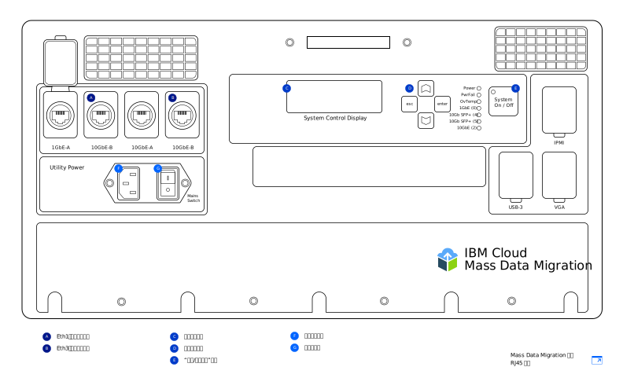

---

copyright:
  years:  2019
lastupdated: "2019-07-10"

keywords: device models, device ports, network settings, configure network  

subcollection: mass-data-migration

---

{:new_window: target="_blank"}
{:shortdesc: .shortdesc}
{:screen: .screen}
{:pre: .pre}
{:external: target="_blank" .external}
{:table: .aria-labeledby="caption"}
{:codeblock: .codeblock}
{:tip: .tip}
{:note: .note}
{:important: .important}
{:download: .download}

# 设备概述
{: #device-overview}

{{site.data.keyword.mdms_full}} 提供了预先配置的便携式存储设备，可运送到您所在位置，以用于轻松迁移数据。
{: shortdesc}

使用此页面可了解 {{site.data.keyword.mdms_short}} 设备的网络配置选项。

## 设备型号
{: #device-models}

{{site.data.keyword.mdms_short}} 设备到达时已预先配置，可随时连接到网络。 

下图显示了设备的主要区域。

{{site.data.keyword.cloud_notm}} 提供了两种 {{site.data.keyword.mdms_short}} 设备型号。每种型号都随附支持 RJ45 和 SFP+ 铜缆连接的[光学设备和适配器](/docs/infrastructure/mass-data-migration?topic=mass-data-migration-inventory-checklists)。 

<table>
  <tr>
    <th>设备型号</th>
    <th>描述</th>
  </tr>
  <tr>
    <td>
<a href="/docs/infrastructure/mass-data-migration?topic=mass-data-migration-connect-device#set-up-RJ45-model">RJ45</a>
</td>
    <td>
      <ul>
        <li>使用 RJ45 接口以本机方式支持以太网连接。</li>
        <li>包含支持 SFP+ 铜缆的适配器和光学设备。</li>
      </ul>
    </td>
  </tr>
  <tr>
    <td>
<a href="/docs/infrastructure/mass-data-migration?topic=mass-data-migration-connect-device#set-up-SFP+-model">RJ45/SFP+</a>
</td>
    <td>
      <ul>
        <li>以本机方式支持 RJ45 和 SFP+ 铜缆连接。</li>
      </ul>
    </td>
  </tr>
  <caption style="caption-side:bottom;">表 1. 描述支持的 {{site.data.keyword.mdms_short}} 设备型号</caption>
</table>

这两种设备型号提供的功能相同，但每种型号的连线指示信息不同。收到 {{site.data.keyword.mdms_short}} 设备时，请确保识别设备型号，以便遵循对应于设备类型的指示信息进行操作。  

{{site.data.keyword.mdms_short}} 设备使用 [C13 电源线](https://en.wikipedia.org/wiki/IEC_60320){: external}。如果是在美国之外使用设备，那么可能需要额外的电源适配器，以适应您所在国家/地区使用的插头和插座系统。{{site.data.keyword.mdms_short}} 设备兼容所有标准功率范围。
{: note}

## 设备端口 
{: #network-settings}

{{site.data.keyword.mdms_short}} 设备配置用于两个以太网连接。第一个连接用于通过运行基于 Web 的用户界面来处理设备管理，第二个连接用于处理设备与源服务器之间的数据移动。

<dl>
    <dt>设备管理端口</dt>
        <dd>可以使用在远程计算机上提供的基于 Web 的本地设备接口来管理 {{site.data.keyword.mdms_short}} 设备。{{site.data.keyword.mdms_short}} 设备上的设备管理端口提供对 UI 的管理访问权。要运行用户界面，可将计算机连接到设备上的设备管理端口，然后在浏览器中引用相应的 IP 地址。</dd>
    <dt>数据传输端口</dt>
        <dd>数据传输端口用于处理从存储系统到 {{site.data.keyword.mdms_short}} 设备的数据移动过程。此端口以 10 GbE 速度运行。</dd>
        <dd>
不支持在设备管理端口和数据传输端口上配置网关。如果需要通过添加网关来配置数据传输端口上的路由（不推荐），那么还必须能够在浏览器中访问数据传输端口的 IP 地址，才可运行设备用户界面。
</dd>
</dl>

## 网络设置
{: #network-settings}

根据请求设备时指定的设置，{{site.data.keyword.mdms_short}} 设备已针对网络进行配置。请求设备时，可以根据以下场景指定网络配置：

<dl>
    <dt>常用配置</dt>
        <dd>在大多数情况下，{{site.data.keyword.mdms_short}} 设备配置为在设备上指定 1 GbE 端口用于设备管理，并将 10 GbE 端口用于数据传输。对于设备管理端口，请指定远程计算机的静态 IP 地址、网络掩码和缺省网关。对于数据传输端口，请提供具有数据源所在子网上网关和 10 GbE 数据端口的服务器的静态 IP 地址和网络掩码。这将在订购表单上显示。</dd>
    <dt>可选配置</dt>
        <dd>还可以仅将设备上的 10 GbE 端口同时用于数据移动和设备管理连接。请求 {{site.data.keyword.mdms_short}} 设备时，可以在订购表单上为管理和数据端口提供相同的静态 IP 地址、网络掩码和网关地址，以指定此配置。设备到达时，10 GbE 端口已使用您的 IP 信息进行配置，包括网关。</dd>
</dl>
