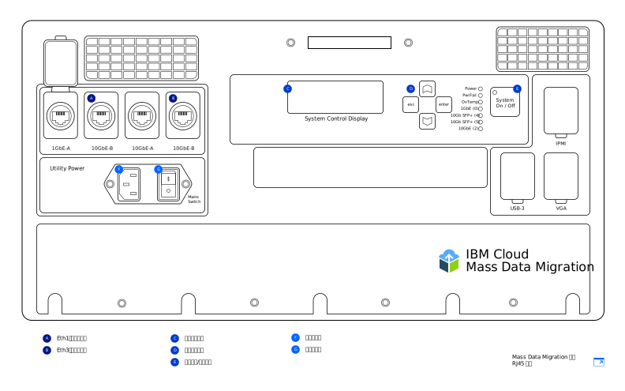
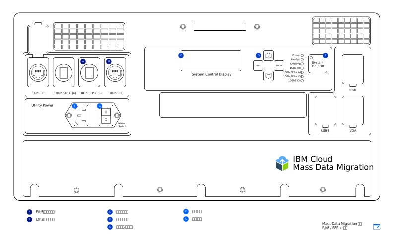

---

copyright:
  years:  2019
lastupdated: "2019-07-10"

keywords: set up device, connect device, cable device

subcollection: mass-data-migration

---

{:shortdesc: .shortdesc}
{:screen: .screen}
{:pre: .pre}
{:table: .aria-labeledby="caption"}
{:external: target="_blank" .external}
{:codeblock: .codeblock}
{:tip: .tip}
{:note: .note}
{:important: .important}
{:download: .download}

# 連接裝置
{: #connect-device}

{{site.data.keyword.mdms_full}} 裝置在送達時已預先配置，並準備好連接至您的網路。
{: shortdesc}

開啟 {{site.data.keyword.mdms_short}} 裝置電源之前，請執行下列動作：

- 確定裝置處於室溫。
- 確定裝置未凝結。
- 檢查位於運輸箱蓋下的庫存清單，確認您收到與[裝置型號](/docs/infrastructure/mass-data-migration?topic=mass-data-migration-device-overview)相應的纜線。
- 為避免裝置不慎損壞，請在裝置使用過程中，將裝置存放在其可攜式外殼中。

## 開啟裝置電源
{: #power-on-device}

裝置定位之後，請使用提供的電源線來開啟裝置電源。

1. 取出位於運輸箱蓋下的電源線。
2. 將電源線連接至裝置的入口，然後將插頭連接至電源插座。
3. 將**主開關**設為**開啟**。
4. 使用**系統開啟/關閉**按鈕，來開啟裝置電源。

   當「系統 ID」值顯示在_系統控制顯示_ 畫面上時，即會開啟裝置電源，並準備好進行下一步。

## 檢閱網路設定
{: #review-network-settings}

您可以先檢閱裝置上的網路配置，再將它連接至網路。使用裝置上的_系統控制顯示_ 畫面，來檢視及管理網路埠的 IP 設定。 

若要與_系統控制顯示_ 畫面互動，請使用 **△**、**▽**、**Esc** 及 **Enter** 按鈕來移動游標。**Enter** 鍵會將您帶入功能表，而 **Esc** 鍵則會讓您退出功能表。
{: tip}

若要編輯 IP 位址或子網路遮罩，請執行下列動作：

1. 從「網路配置」功能表中，使用 **△** 及 **▽** 按鈕來選取您要修改的埠。按 **Enter** 鍵。
2. 選取 **IP 位址**，然後使用 **△** 及 **▽** 按鈕來設定新的 IP 位址。

   按 **Enter** 鍵，一次向前移動一個字元。按 **Esc** 鍵，一次往回移動一個字元。
3. 按 **Esc** 鍵，回到前一個功能表。
4. 移至**更新...**，然後按 **Enter** 鍵來儲存設定。

## 將裝置連接至網路
{: #connect-device}

若要將裝置連接至網路，您需要配置兩個乙太網路連線。第一個連線是透過瀏覽器來管理裝置，第二個連線則是用來將資料移至來源資料所在的相同子網路。

根據您接收的 [{{site.data.keyword.mdms_short}} 裝置型號](/docs/infrastructure/mass-data-migration?topic=mass-data-migration-device-overview#mass-data-migration-device-models)，配置裝置的乙太網路連線功能。 

### 設定 RJ45 型號
{: #set-up-RJ45-model}

RJ45 裝置型號原本就使用 RJ45 接頭來支援乙太網路連線功能。

<a href="https://{DomainName}/docs/api/content/mass-data-migration/images/mdms-device-rj45.svg">
  
</a>

您可以使用所提供的 CAT6A 乙太網路纜線，將儲存空間系統連接至裝置上的 RJ45 網路埠。如果您需要啟用 SFP+ 銅纜支援，則請使用提供的配接器。配接器可與所有交換器製造商相容。您可以在運送貨櫃蓋下方的口袋中找到配接器。

下表顯示裝置上的實體埠與使用者介面中顯示的埠的對映情況。

| 裝置埠 | 乙太網路類型 | 說明 |
| --- | --- | --- | --- |
| Eth1 | 1GbE | Eth1 埠用來管理裝置，並且讓 Web 型使用者介面可在資料子網路外部使用。開啟裝置電源之後，即可使用_系統控制顯示_ 畫面來檢視閘道資訊。|
| Eth3 | 10GbE | Eth3 埠用來將資料從儲存空間系統傳送至 {{site.data.keyword.mdms_short}} 裝置。連線必須位於與來源資料相同的子網路上，或直接連接至伺服器。|
{: caption="表 2. 說明 {{site.data.keyword.mdms_short}} 裝置埠與使用者介面顯示埠的對映情況 " caption-side="top"}

若要將 RJ45 裝置型號連接至網路，請執行下列動作：

1. 從運輸箱蓋中取出 CAT6A 纜線。
2. 將 CAT6A 纜線連接至裝置上的 Eth3 (`10GbE-B`) 埠。
3. 將 CAT6A 纜線連接至 SFP+ 配接器。
4. 將 CAT6A 纜線連接至 10Gb 乙太網路交換器。
5. 開啟 Web 瀏覽器，並導覽至下列 URL。

   ```
   https://<your_Eth3_IP_address>
   ```
   {: codeblock}

   將 `<your_Eth3_IP_address>` 取代為針對 Eth3 網路埠所配置的 IP 位址。若要檢視 IP 位址，請檢查裝置上的_系統控制顯示_ 畫面。
6. 選用項目：如果您無法呼叫到 IP 位址，請將 CAT6A 纜線連接至裝置上的 Eth1 (`1GbE-B`) 埠，然後透過導覽至下列 URL 再試一次。
   
   ```
   https://<your_Eth1_IP_address>
   ```
   {: codeblock}

   將 `<your_Eth1_IP_address>` 取代為針對 Eth1 網路埠所配置的 IP 位址。若要檢視 IP 位址，請檢查裝置上的_系統控制顯示_ 畫面。

   如果您需要修改 Eth3 或 Eth1 的 IP 設定，請參閱[檢閱網路設定](#review-network-settings)。
   {: tip}

### 設定 RJ45/SFP+ 型號
{: #set-up-SFP+-model}

RJ45/SFP+ 裝置型號原本就支援 RJ45 和 SFP+ 銅纜連線。 

<a href="https://{DomainName}/docs/api/content/mass-data-migration/images/mdms-device-sfp.svg">
  
</a>

您可以使用所提供的 CAT6A 和 SFP+ 纜線，將儲存空間系統連接至裝置上的網路埠。下表顯示裝置上的實體埠與使用者介面中顯示的埠的對映情況。

| 裝置埠 | 乙太網路類型 | 說明 |
| --- | --- | --- | --- |
| Eth5 | 10GbE (SFP+) | Eth5 埠用來將資料從儲存空間系統傳送至 {{site.data.keyword.mdms_short}}。此埠也可以用來管理裝置。此埠僅以 10GbE 速度執行。|
| Eth2 | 10GbE | Eth2 埠用來管理裝置，並且讓 Web 型使用者介面可在資料子網路外部使用。此埠也可以用於資料傳送。連線必須位於與來源資料相同的子網路上，或直接連接至伺服器。此埠可以 1GbE 或 10GbE 速度執行。|
{: caption="表 3. 說明 {{site.data.keyword.mdms_short}} 裝置埠與使用者介面顯示埠的對映情況 " caption-side="top"}

若要將 RJ45/SFP+ 裝置型號連接至網路，請執行下列動作：

1. 從運輸箱蓋中取出 SFP+ 銅纜。
2. 將 SFP+ 纜線連接至裝置上的 Eth5 (`10GbE (5)`) 埠。
3. 將 SFP+ 纜線連接至 10Gb 乙太網路交換器。
4. 開啟 Web 瀏覽器，並導覽至下列 URL。

   ```
   https://<your_Eth5_IP_address>
   ```
   {: codeblock}

   將 `<your_Eth5_IP_address>` 取代為針對 Eth5 網路埠所配置的 IP 位址。若要檢視 IP 位址，請檢查裝置上的_系統控制顯示_ 畫面。
5. 選用項目：如果您無法呼叫到 IP 位址，請將 SFP+ 纜線連接至裝置上的 Eth2（`10GbE-B` 或 `1GbE-B`）埠，然後透過導覽至下列 URL 再試一次。
   
   ```
   https://<your_Eth2_IP_address>
   ```
   {: codeblock}

   將 `<your_Eth2_IP_address>` 取代為針對 Eth2 網路埠所配置的 IP 位址。若要檢視 IP 位址，請檢查裝置上的_系統控制顯示_ 畫面。

   如果您需要變更 Eth3 或 Eth1 的任何 IP 設定，請參閱[檢閱網路設定](/docs/infrastructure/mass-data-migration?topic=mass-data-migration-connect-device#review-network-settings)。
   {: tip}

## 後續步驟
{: #set-up-device-next-steps}

- [執行 Web 型使用者介面](/docs/infrastructure/mass-data-migration?topic=mass-data-migration-access-ui)以與裝置互動。
- 若要準備資料複製處理程序，請從[解除鎖定裝置上的儲存區](/docs/infrastructure/mass-data-migration?topic=mass-data-migration-unlock-storage-pool)開始。
