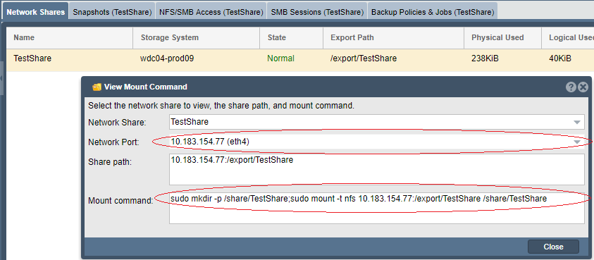

---

copyright:
  years:  2019
lastupdated: "2019-07-10"

keywords: mount NFS share, NFS, access network share, connect to network share

subcollection: mass-data-migration

---

{:shortdesc: .shortdesc}
{:screen: .screen}
{:pre: .pre}
{:table: .aria-labeledby="caption"}
{:external: target="_blank" .external}
{:codeblock: .codeblock}
{:tip: .tip}
{:note: .note}
{:important: .important}
{:download: .download}

# 使用 NFS 連接至網路共用
{: #connect-nfs-share}

若要準備資料複製，您可以使用「網路檔案系統 (NFS)」通訊協定，在 {{site.data.keyword.mdms_full}} 裝置上存取網路共用。
{: shortdesc}

連接至共用之前，請執行下列動作：

- 確定用戶端上已安裝 NFS 軟體，例如 `nfs-common`。您可以藉由從終端機階段作業執行 `sudo apt install nfs-common` 來安裝 `nfs-common` 套件。

## 管理對 NFS 共用的存取
{: #manage-nfs-share-access}

依預設，網路共用會設為具有公用存取權。在將共用裝載至伺服器之前，您可以在共用上新增 NFS 存取規則，以符合您的環境或安全需求。 

如需控制儲存裝置上共用存取權的詳細資訊，請參閱 [OSNEXUS QuantaStor 文件](https://wiki.osnexus.com/index.php?title=Network_Shares){:external}。
{: tip}

若要修改 NFS 共用存取權，請執行下列動作：

1. [登入裝置使用者介面](/docs/infrastructure/mass-data-migration?topic=mass-data-migration-access-ui#log-in-ui)。
2. 在「一般作業」精靈中，按一下**檢視網路共用**，以顯示網路共用視圖。

   

3. 關閉「一般作業」精靈，然後在網路共用名稱上按一下滑鼠右鍵來檢視選項清單。 
4. 按一下**新增 NFS 存取**，來修改 NFS 共用的存取權。

    

## 在 Unix 系統上裝載 NFS 共用
{: #mount-nfs-share}

在您解除鎖定並啟動裝置上的儲存區之後，可以使用 {{site.data.keyword.mdms_short}} 裝置使用者介面來連接至 UNIX 型系統上的 NFS 共用。

若要裝載網路共用，請執行下列動作： 

1. [登入裝置使用者介面](/docs/infrastructure/mass-data-migration?topic=mass-data-migration-access-ui#log-in-ui)。
2. 在「一般作業」精靈中，按一下**檢視網路共用**，以顯示網路共用視圖。
3. 關閉「一般作業」精靈，然後在網路共用名稱上按一下滑鼠右鍵來檢視選項清單。 
4. 按一下**檢視裝載指令**，來檢閱共用的裝載資訊。

    下圖顯示含有範例值的「檢視裝載指令」對話框。

    

    _網路埠_ 值對應至 {{site.data.keyword.mdms_short}} 裝置上的資料傳送埠。_裝載指令_ 值指定用來裝載及連接至共用的指令。
5. 對對話框中列出的 IP 位址進行連線測試，以測試電腦與 {{site.data.keyword.mdms_short}} 裝置之間的網路連線功能。

   請確定 IP 位址對應至裝置上的 [10GbE 資料傳送埠](/docs/infrastructure/mass-data-migration?topic=mass-data-migration-device-overview#network-settings)。
   {: note}  
6. 複製對話框中列出的裝載指令，並將指令貼入電腦上的終端機階段作業。
7. 執行指令，以將共用裝載至伺服器。

## 後續步驟
{: #connect-nfs-share-next-steps}

- 啟動[資料複製處理程序](/docs/infrastructure/mass-data-migration?topic=mass-data-migration-copy-data)。
