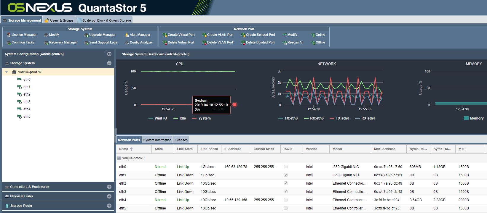

---

copyright:
  years:  2019
lastupdated: "2019-07-10"

keywords: copy data to device, move data to device, 

subcollection: mass-data-migration

---

{:shortdesc: .shortdesc}
{:screen: .screen}
{:pre: .pre}
{:table: .aria-labeledby="caption"}
{:external: target="_blank" .external}
{:codeblock: .codeblock}
{:tip: .tip}
{:note: .note}
{:important: .important}
{:download: .download}

# 將資料複製到裝置
{: #copy-data}

您可以使用裝置使用者介面，將資料複製到 {{site.data.keyword.mdms_full}} 裝置。

## 將資料複製到裝置
{: #copy-data}

在將伺服器連接至網路共用之後，您可以啟動並監視該裝置的資料複製。

1. 使用與主機相容的檔案複製工具，將資料複製到網路共用。
2. 在「一般作業」精靈中，按一下**檢視網路活動**，以在資料透過 10Gb 鏈結傳送至裝置時顯示入埠乙太網路負載。
   
    
3. 按一下**檢視儲存區**，以監視裝置上的儲存空間用量及 IOPS。
   
    

## 後續步驟
{: #import-data-next-steps}

- 溫和地[關閉裝置電源](/docs/infrastructure/mass-data-migration?topic=mass-data-migration-disconnect-device)。
- 準備運送標籤，並[將裝置送回至 {{site.data.keyword.cloud_notm}}](/docs/infrastructure/mass-data-migration?topic=mass-data-migration-ship-device)。
