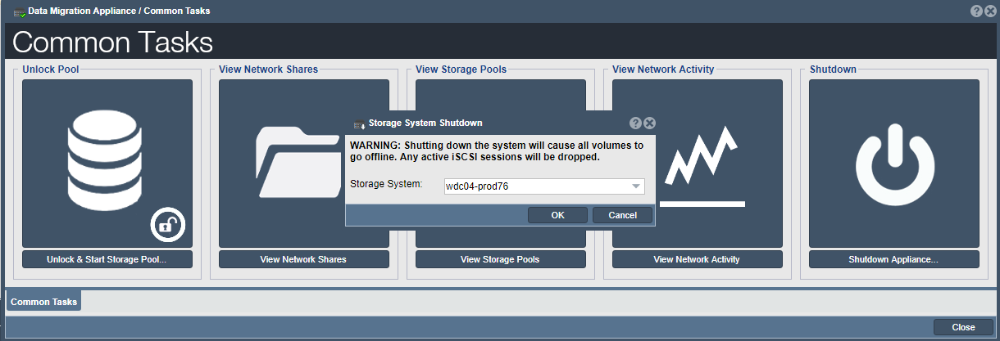

---

copyright:
  years:  2019
lastupdated: "2019-07-10"

keywords: return device, ship device, disconnect device, shipping label

subcollection: mass-data-migration

---
{:new_window: target="_blank"}
{:shortdesc: .shortdesc}
{:screen: .screen}
{:pre: .pre}
{:table: .aria-labeledby="caption"}
{:external: target="_blank" .external}
{:codeblock: .codeblock}
{:tip: .tip}
{:note: .note}
{:important: .important}
{:preview: .preview}
{:term: .term}

# Returning the device
{: #return-device}

Power down and return your {{site.data.keyword.mdms_full}} device to {{site.data.keyword.cloud_notm}} to complete the migration process.
{: shortdesc}

## Disconnecting the device
{: #disconnect-device}

When the data copy process is complete, you can gracefully power down the system.

1. In the Common Tasks wizard, click **Shutdown Appliance**.

    

    Click **OK** to confirm.
2. Power off the device by using the **System On / Off** button on the device. 
3. Set the **Mains Switch** to **Off**.
4. Spool and return all cables and optics to their storage locations inside the transport case.

## Shipping the device to IBM
{: #ship-device}

Prepare your shipping label and notify your carrier when you're ready to return the device.

1. Retrieve the inventory list and the return shipping label for the device. These documents are located under the lid of the transport case.

    If you are shipping multiple devices, keep in mind that the return shipping label that is provided in each case is specific to the storage device. Before you schedule a pickup with the carrier, ensure that the corresponding return shipping label is affixed to the appropriate device. 
    {: note}
2. Use the inventory list to verify that all cables and optics are returned and stored in the transport case.
3. Return the inventory list to the transport case, and then use the instructions that are listed on the return shipping label to affix the label to the device.
4. Schedule a pickup with your carrier, and return the device to the data center.

    When the device is returned to {{site.data.keyword.cloud_notm}}, the order status changes to _Device received_ in the {{site.data.keyword.mdms_short}} request details page.

## Next steps
{: #return-device-next-steps}

- Check the status of your order by [managing your {{site.data.keyword.mdms_short}} request](/docs/infrastructure/mass-data-migration?topic=mass-data-migration-manage-request).
- Before you delete data from your source server, [verify that the data was uploaded successfully to {{site.data.keyword.cloud_notm}}](/docs/infrastructure/mass-data-migration?topic=mass-data-migration-verify-data).

