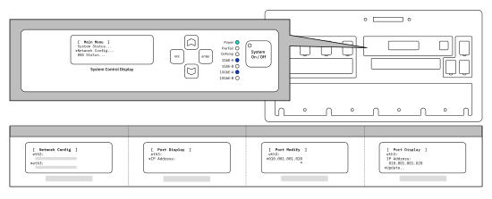

---

copyright:
  years:  2019
lastupdated: "2019-12-11"

keywords: change IP address, update IP address, configure IP address, verify IP address

subcollection: mass-data-migration

---

{:shortdesc: .shortdesc}
{:screen: .screen}
{:pre: .pre}
{:table: .aria-labeledby="caption"}
{:external: target="_blank" .external}
{:codeblock: .codeblock}
{:tip: .tip}
{:note: .note}
{:important: .important}
{:preview: .preview}
{:term: .term}

# Updating network settings
{: #ip-settings}

You can review or change network settings for the device before you connect it to your local network.
{: shortdesc} 

Configuring the device manually? Use the [LCD screen](#use-lcd-screen) to manually set IP addrsses for the device after it's delivered to your location.
{: tip}

## Using the LCD screen
{: #use-lcd-screen}

Use the _System Control Display_ screen to manage the IP settings for the network ports on the device.

{: caption="Figure 1. Shows a top-down view of the LCD screen on the Mass Data Migration device" caption-side="bottom"}

To interact with the _System Control Display_ screen, move the cursor by using the **△**, **▽**, **esc**, and **enter** buttons. **Enter** takes you into a menu and **esc** takes you out.
{: tip}

## Updating IP addresses
{: #update-IP-addresses}

After you receive the {{site.data.keyword.mdms_short}} device, you can review or modify network preferences for the device.

To find out more about device ports and configuration options, see [Network configuration](/docs/mass-data-migration?topic=mass-data-migration-device-overview#network-settings).
{: tip}

To edit an IP address or subnet mask:

1. From the Main menu, use the directional buttons to enter the Network Config menu.
2. Select the port that you want to modify. Press **enter**.
3. Select **IP Address**, and then use the **△** and **▽** buttons to set the new IP address.

   Press **enter** to move forward one character at a time. Press **esc** to move backwards one character at a time.
4. Press **esc** to return to the previous menu.
5. Go to **Update...** and press **enter** to save the setting.
