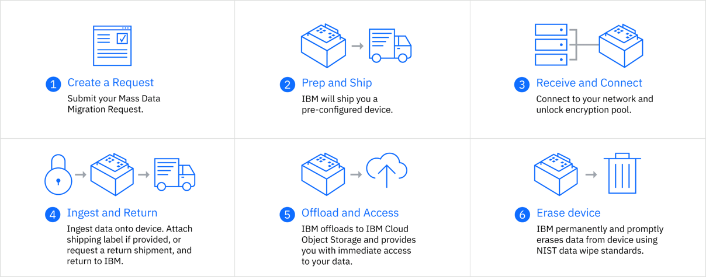

---

copyright:
  years: 2017, 2020
lastupdated: "2020-02-28"

keywords: data transfer, data migration, transfer data to cloud, migrate data, migrate data to cloud, Mass Data Migration

subcollection: mass-data-migration

---

{:shortdesc: .shortdesc}
{:screen: .screen}
{:pre: .pre}
{:table: .aria-labeledby="caption"}
{:external: target="_blank" .external}
{:codeblock: .codeblock}
{:tip: .tip}
{:note: .note}
{:important: .important}
{:preview: .preview}
{:term: .term}

# {{site.data.keyword.mdms_short}} overview
{: #overview}

{{site.data.keyword.mdms_full}} provides a portable, pre-configured storage device that is shipped to your location for easy migration of your data.
{: shortdesc}

## How it works
{: #how-it-works}

When you request a {{site.data.keyword.mdms_short}} device, IBM ships a pre-configured storage appliance to your data center. You connect the device to your network, and copy data to the device. After the copy process is complete, you return the device to IBM. IBM uploads a copy of your data to the Cloud Object Storage bucket that you specify, and then erases data from the device. 

The following image describes the {{site.data.keyword.mdms_short}} process.

{: caption="Figure 1. Describes the Mass Data Migration workflow." caption-side="bottom"}

You can compare your data migration options on {{site.data.keyword.cloud_notm}} by [exploring our data migration solutions](https://www.ibm.com/cloud/data-migration). To learn more about {{site.data.keyword.mdms_short}} use cases, check out the [{{site.data.keyword.mdms_short}} product page](https://www.ibm.com/cloud/mass-data-migration){: external}.
{: tip}

{{site.data.keyword.mdms_short}} encrypts all data with AES 256-bit encryption and provides a strong password to unlock the storage pool for each device. You can access the data only by using an assigned storage pool password, which is uniquely generated for each order. {{site.data.keyword.mdms_short}} devices are wiped securely between orders.
{: note}

## Service components
{: #components}

{{site.data.keyword.mdms_short}} comprises the following service components.

<dl>
   <dt>{{site.data.keyword.mdms_short}} dashboard</dt>
      <dd>You can create and track {{site.data.keyword.mdms_short}} orders from the service dashboard in the {{site.data.keyword.cloud_notm}} console. In the <a href="http://{DomainName}/mdms" target="_blank">{{site.data.keyword.mdms_short}} catalog page</a>, you specify your network configuration settings for the device, retrieve credentials to log in to the device, and track the status of your order. </dd>
   <dt>{{site.data.keyword.mdms_short}} device</dt>
      <dd>{{site.data.keyword.mdms_short}} provides a <a href="/docs/infrastructure/mass-data-migration?topic=mass-data-migration-device-overview">portable storage device</a> that is shipped to your location. The {{site.data.keyword.mdms_short}} device arrives pre-configured and ready to connect to your network.</dd>
   <dt>Device user interface</dt>
      <dd>The <a href="/docs/infrastructure/mass-data-migration?topic=mass-data-migration-access-ui">device user interface</a> is a local, web-based UI that you use to access the network share on the {{site.data.keyword.mdms_short}} device. The UI is based on a mature file and network software that enables large numbers of large files to be copied and transported to {{site.data.keyword.cloud_notm}}.</dd>
</dl>

## Your workflow
{: #your-workflow}

Ready to set up your device? Use the following checklist to complete your data transfer.

1. [Connect the device](/docs/mass-data-migration?topic=mass-data-migration-connect-device)
2. [Log in to the device user interface](/docs/mass-data-migration?topic=mass-data-migration-access-ui)
3. [Unlock the storage pool for the device](/docs/mass-data-migration?topic=mass-data-migration-unlock-storage-pool)
4. [Mount the network share](/docs/mass-data-migration?topic=mass-data-migration-connect-nfs-share)
5. [Copy data to the device](/docs/mass-data-migration?topic=mass-data-migration-copy-data)
6. [Return the device](/docs/mass-data-migration?topic=mass-data-migration-return-device)  
7. [Access your data](/docs/mass-data-migration?topic=mass-data-migration-verify-data)

